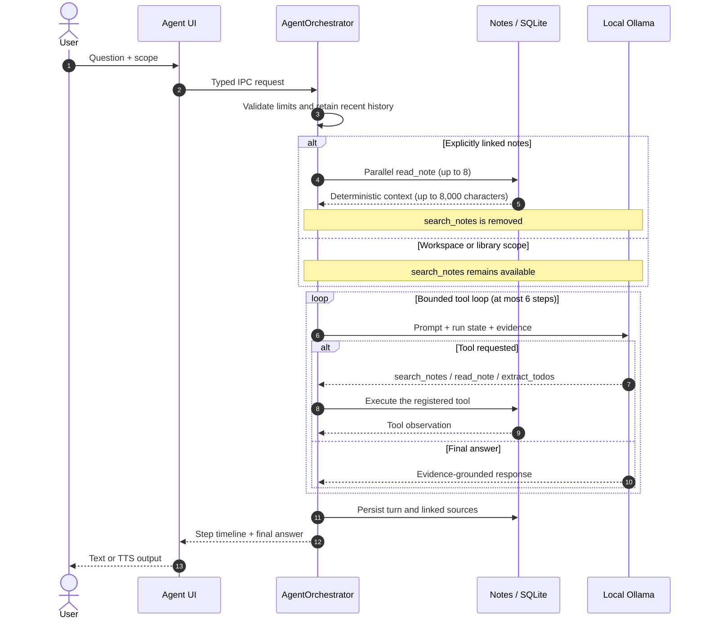
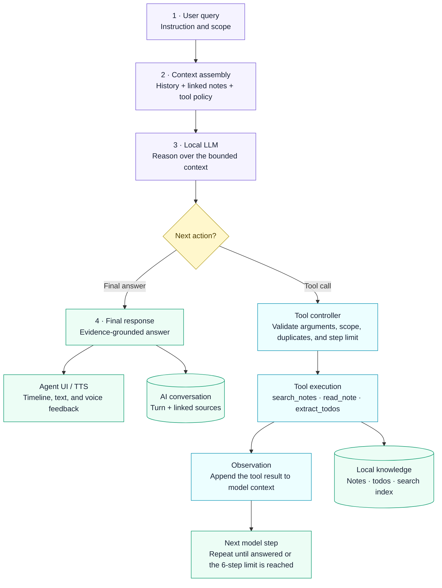

<p align="center">
  <strong>English</strong> · <a href="README.zh-CN.md">简体中文</a>
</p>

<p align="center">
  
</p>

<h1 align="center">SpeakSpace Local</h1>

<p align="center">
  Local-first voice intelligence for desktop and mobile
</p>

<p align="center">
  <a href="https://github.com/dhebhxh/speakspace-local-electron/actions/workflows/test.yml">
    
  </a>
  <a href="https://github.com/dhebhxh/speakspace-local-electron/actions/workflows/mobile.yml">
    
  </a>
  <a href="https://github.com/dhebhxh/speakspace-local-electron/actions/workflows/codeql-analysis.yml">
    
  </a>
  <a href="LICENSE">
    
  </a>
</p>

<p align="center">
  
  
  
  
  
</p>

<p align="center">
  <a href="https://github.com/dhebhxh/speakspace-local-electron/releases"><strong>Desktop releases</strong></a>
  ·
  <a href="mobile/README.md"><strong>Mobile setup</strong></a>
  ·
  <a href="docs/README.md"><strong>Documentation</strong></a>
</p>

This repository contains two independently built local-first applications. **SpeakSpace Local** is the Electron desktop workspace at the repository root. **LetsVoice** is the Expo / React Native application under `mobile/`. Both turn speech into searchable notes and local AI workflows, but they do not form one shared binary or one synchronised database.

## Two applications, one repository

| Application              | Location        | Stack                                        | Target                                                                      |
| ------------------------ | --------------- | -------------------------------------------- | --------------------------------------------------------------------------- |
| SpeakSpace Local desktop | Repository root | Electron 35, React 19, TypeScript 5.8        | Windows is the primary target; macOS and Linux packaging is also configured |
| LetsVoice mobile         | `mobile/`       | Expo SDK 57, React Native 0.86, TypeScript 6 | Android phones and iPhone; iOS 16.4 or later                                |

Each application has its own package manifest, lockfile, dependencies, data store, model directory, tests, build process, and release path. The repository is not an npm workspace, and neither application imports runtime source from the other.

The mobile display name is **LetsVoice**. Technical identifiers such as the repository slug, bundle/package identifier, URL scheme, and database filename retain their earlier names to preserve links, installations, and local data.

## Latest mobile integration

This README revision is based on the repository difference from `1c180c2` to `eff6f3f`. That range changes 69 paths with 3,716 insertions and 513 deletions: 68 paths are under `mobile/`, and the remaining path records integration provenance. Desktop product code is unchanged.

The update brings these mobile changes into the combined repository:

- **Language-aware transcription.** Live recording and imported audio share a persisted selector for Auto, Chinese, English, Japanese, Korean, Spanish, French, German, and Portuguese. Parakeet remains English-only; Whisper supports multilingual recognition, and Whisper Small is recommended for Chinese.
- **More reliable recording finalisation.** Finishing waits for queued transcription work. For Whisper sessions up to 45 seconds, finalisation attempts one complete-audio pass when retained PCM context is available and falls back to the queued final slice if needed. A session keeps the STT model with which it started.
- **Safer audio import.** Android providers can supply an M4A file without a display extension when they provide a supported audio MIME type. Preparation and transcription now show progress, and the active operation can be cancelled.
- **Streaming local AI output.** Structured Notes and Knowledge show live partial previews while generation is active. Structured extraction tries one completion first and retains adaptive recovery for long or invalid output; final key points and Knowledge sections are capped at six items.
- **Shared cancellation and runtime reuse.** Queued and active LLM/TTS work can be cancelled without leaving the scheduler locked, while shared model contexts remain reusable across compatible operations. The interface also exposes cancellation for imported STT, translation, Knowledge, and template proposals.
- **Bounded Ask AI sessions.** Mobile Ask AI uses a 3,072-token context window, reserves 320 tokens for the answer, applies a 90-second completion deadline, and prepares available local LLM and TTS runtimes when the screen is focused.
- **Immediate speech stop.** A dedicated iOS and Android PCM player owns playback so Stop can silence and release the active player directly.
- **Better note and task controls.** Notes can be pinned from search or note detail. Task extraction rejects more negated or advisory clauses, normalises grounded dates, and keeps completed history out of the active task view.
- **Updated model guidance.** The mobile catalog contains seven downloadable LLMs. Qwen2.5 1.5B Q4_K_M is the recommended option for Chinese and mixed-language notes.
- **Native reliability patches.** Three new locked patch scripts are applied at install time; they make Whisper WAV writes serial, harden Android PCM capture, and avoid oversized Windows llama CMake target names. Mobile installation now applies seven postinstall patches in total.
- **Nested mobile tooling.** Generated `artifacts/` and `outputs/` stay outside Git, and mobile ESLint resolves TypeScript and Node modules from the nested project.

The mobile source revision is `0fd7903`. It entered this repository through the history-preserving subtree merge `006dcf1`, so all 439 tracked mobile files and 111 reachable mobile commits remain inspectable. See [Mobile Integration](docs/mobile-integration.md) for full hashes and the two intentional integration-only differences.

## Capabilities

### SpeakSpace Local desktop

- Record live audio or import files, transcribe locally, review the result, and save it as a note.
- Generate Structured Notes, tasks and calendar intents, classifications, and template-driven Scenario Knowledge with a local LLM.
- Search note titles, transcripts, related knowledge, tasks, and AI conversations with full-text and semantic retrieval.
- Ask questions over a note, selected notes, or a workspace; Agent mode adds a bounded search/read/task-extraction tool loop.
- Organise notes in workspaces, pin important content, use Trash for recoverable deletion, and export complete notes to Word or PDF.
- Download and manage STT, LLM, embedding, and TTS models together with their local runtimes, without placing models in Git or the installer.

<p align="center">
  
</p>
<p align="center"><em>Figure 1. Desktop recording-to-knowledge pipeline.</em></p>

### LetsVoice mobile

- Record or import up to two hours of WAV, MP3, M4A, AAC, or FLAC audio and transcribe it on the device.
- Use multilingual Whisper or English-only Parakeet models, with an explicit language choice for better short-recording accuracy.
- Organise local notes and workspaces, search related content, pin notes and tasks, schedule local task notifications, and restore items from Trash.
- Generate streaming Structured Notes and template-based Knowledge, translate saved note sections, and export one note at a time to PDF.
- Ask AI over local note context and listen with downloadable on-device voices.
- Download STT, LLM, and TTS models from the AI screens; large operations check available storage and remain foreground-bound.

The mobile UI is currently English. Multilingual transcription, content processing, and speech do not imply a translated interface.

## Local-first boundaries

User data remains on the device. Once the required models are installed, core STT, LLM, and TTS inference also runs locally. Model downloads still require network access.

- Desktop data lives under Electron's `userData` directory, including `speakspace.db`, recordings, settings, models, runtimes, and inference cache.
- Mobile data lives in the operating system's application sandbox, including SQLite data, recordings, chats, preferences, and downloaded models.
- The applications provide no built-in cross-device sync or database transfer. Their user-initiated exports create supported document or share formats, not a complete migration between the two apps.
- Models are not committed to Git and are not bundled with either installer.
- Notes, workspaces, AI conversations, and custom Knowledge templates use Trash before permanent deletion. Temporary content, installed models, and individual Knowledge results follow their own explicit removal flows.

<p align="center">
  
</p>
<p align="center"><em>Figure 2. Desktop SQLite relationship model.</em></p>

## Architecture

The desktop application enforces an Electron process boundary:

| Layer                 | Responsibility                                                                           |
| --------------------- | ---------------------------------------------------------------------------------------- |
| `src/renderer/`       | React UI and presentation state; no direct filesystem, database, or model-process access |
| `src/main/preload.ts` | Small typed bridge exposed through `contextBridge`                                       |
| `src/main/ipc/`       | Cross-process input validation and domain-service dispatch                               |
| `src/main/<domain>/`  | SQLite, files, models, inference, and operating-system integration                       |
| `src/shared/`         | Pure cross-process types and data contracts                                              |

<p align="center">
  
</p>
<p align="center"><em>Figure 3. SpeakSpace Local desktop process-boundary architecture.</em></p>

<p align="center">
  
</p>
<p align="center"><em>Figure 4. Current desktop technical implementation overview.</em></p>

LetsVoice follows a separate mobile path: Expo Router screens call application services, services coordinate repositories and local model runtimes, repositories own Expo SQLite persistence, and custom Expo modules provide native audio behaviour. Native projects are generated from the checked-in Expo configuration and `mobile/modules/`.



<p align="center"><em>Figure 5. Agent request sequence.</em></p>



<p align="center"><em>Figure 6. Bounded Agent controller workflow.</em></p>

## Repository layout

```text
assets/             Desktop logo and platform assets
config/             Desktop model catalogs
docs/               Architecture, integration, evaluation, and acceptance documentation
mobile/             Independent LetsVoice app, native modules, tests, assets, and source history
scripts/            Desktop benchmarks, smoke tests, and integration checks
src/
├─ main/            Electron main process, IPC, persistence, models, and domain services
├─ renderer/        Desktop React pages, components, and styles
└─ shared/          Cross-process pure types and data contracts
.erb/               Electron React Boilerplate and Webpack tooling
release/
├─ app/             Desktop packaging manifest, native dependencies, and build output
├─ build/           Regenerable electron-builder output; not committed
└─ installers/      Local acceptance artifacts; not committed
```

See [Project Structure](docs/project-structure.md) and [AGENTS.md](AGENTS.md) for ownership and code-placement rules.

## Quick start

Clone the combined repository once:

```bash
git clone https://github.com/dhebhxh/speakspace-local-electron.git
cd speakspace-local-electron
```

### Desktop development

Use Node.js 22 and npm:

```bash
npm ci
npm start
```

`npm start` launches the Electron main process, preload, and Renderer development builds. If generated main-process output is absent before a Jest run, build it first with `npm run build:main`.

### Mobile development

Use Node.js 24 and run commands from the repository root:

```bash
npm run mobile:install
npm run mobile:start
```

LetsVoice includes custom native modules and cannot be validated completely in Expo Go. Create a native development build with `npm run mobile:ios` on macOS with Xcode, or `npm run mobile:android` with the Android SDK installed. The limited Web target is available through `npm run mobile:web`.

For device requirements and signing, use the [iPhone installation guide](mobile/docs/ios-local-install.md), [Windows + SideStore guide](mobile/docs/ios-sidestore-windows.md), and [physical-device acceptance checklist](mobile/docs/ios-device-acceptance.md).

## Commands

| Scope      | Command                              | Purpose                                                         |
| ---------- | ------------------------------------ | --------------------------------------------------------------- |
| Desktop    | `npm start`                          | Start the Electron development environment                      |
| Desktop    | `npm run build`                      | Build the main process and Renderer                             |
| Desktop    | `npm exec tsc -- --noEmit`           | Run desktop TypeScript checks                                   |
| Desktop    | `npm run lint`                       | Run desktop ESLint                                              |
| Desktop    | `npm test`                           | Run desktop Jest tests                                          |
| Desktop    | `npm run package`                    | Create an internal package for the current platform             |
| Desktop    | `npm run package:release`            | Run release naming and platform signing checks, then package    |
| Desktop    | `npm run bench -- --machine <label>` | Run and archive hardware-sensitive benchmarks                   |
| Mobile     | `npm run mobile:install`             | Install the locked mobile dependency tree and apply patches     |
| Mobile     | `npm run mobile:start`               | Start Expo / Metro                                              |
| Mobile     | `npm run mobile:ios`                 | Generate and run the iOS native project                         |
| Mobile     | `npm run mobile:android`             | Generate and run the Android native project                     |
| Mobile     | `npm run mobile:web`                 | Start the limited Web debugging target                          |
| Mobile     | `npm run mobile:test`                | Run mobile Node tests                                           |
| Mobile     | `npm run mobile:typecheck`           | Run mobile TypeScript checks                                    |
| Mobile     | `npm run mobile:lint`                | Run Expo / ESLint checks                                        |
| Repository | `npm run check:apps`                 | Verify that desktop and mobile build boundaries remain separate |

Root `npm test`, TypeScript, lint, and build commands check only the desktop application. The `mobile:*` commands execute inside `mobile/`.

## Validation status

The mobile subtree sync was validated on 2026-09-03 with Node.js 24.16.0 and npm 11.13.0:

| Check                  | Result                                                      |
| ---------------------- | ----------------------------------------------------------- |
| Source integrity       | 439 tracked mobile files and 111 reachable commits retained |
| Locked installation    | `npm ci` applied all seven postinstall patches              |
| Mobile tests           | 187 passed, 0 failed                                        |
| Mobile TypeScript      | Passed                                                      |
| Mobile ESLint          | 0 errors; 12 existing React Hook dependency warnings        |
| Application boundaries | 4 passed, 0 failed                                          |
| Whitespace check       | Passed                                                      |

The locked mobile dependency audit reported 18 moderate advisories and one high advisory. Dependencies were not upgraded during the source sync.

This validation does not replace Xcode or Android native compilation, signing, microphone, notification, model-download, and physical-device testing. The desktop implementation did not change in the compared range and remains covered by the separate Desktop CI workflow.

## Packaging and releases

### Desktop

`npm run package` creates an internal package whose filename is marked `internal-unsigned`. Windows uses NSIS, macOS uses electron-builder's default targets with a configured DMG layout, and Linux AppImage packaging is configured. Windows x64 is the most complete current desktop target; model/runtime setup and published artifacts can differ on macOS and Linux. A macOS release build requires a Developer ID certificate and notarisation credentials. A Windows release can proceed without CSC credentials, but the release check warns that the result will trigger SmartScreen.

Download published desktop builds from [speakspace-local-electron releases](https://github.com/dhebhxh/speakspace-local-electron/releases).

### Mobile

Native projects and release artifacts are generated and remain outside Git. The app has no iPad target and is not distributed through the App Store. A locally built iPhone app can be installed through Xcode; Android requires a native development or release build.

Mobile release assets remain in the original [speakspace-local-mobile releases](https://github.com/dhebhxh/speakspace-local-mobile/releases). The published `ios-v1.6.2` SideStore IPA was built from `218a6be`; it does not contain the post-release changes in source revision `0fd7903`. Build the synced source with Xcode or the Android SDK to test the new features. Do not uninstall LetsVoice merely to refresh or downgrade a SideStore build: uninstalling removes its local sandbox data.

## Evaluation evidence

Desktop evaluation covers TTS, STT, local LLM task extraction, embedding retrieval, and step-limited Agent behaviour. Reports include raw inputs, fixed development/holdout splits, reproducible charts, and hardware snapshots. These measurements describe the tested models, prompts, datasets, and machines; they are not universal rankings.

Start with the [testing and evaluation index](docs/testing/README.md), then read the [coverage and limitations ledger](docs/testing/test-coverage-gaps.md) before quoting results. Cross-machine collection is documented in the [benchmark guide](docs/testing/multi-machine-benchmark-guide.md), with generated results in the [cross-machine aggregate](docs/testing/cross-machine-benchmark.md).

Mobile's 187 deterministic tests verify application behaviour and native patch contracts. They do not measure model quality or replace device acceptance.

<p align="center">
  
</p>
<p align="center"><em>Figure 7. TTS synthesis speed across the tested engines.</em></p>

<p align="center">
  
</p>
<p align="center"><em>Figure 8. STT evaluation on human recordings.</em></p>

<p align="center">
  
</p>
<p align="center"><em>Figure 9. Local LLM accuracy and speed trade-off.</em></p>

<p align="center">
  
</p>
<p align="center"><em>Figure 10. Embedding-based hybrid retrieval evaluation.</em></p>

<p align="center">
  
</p>
<p align="center"><em>Figure 11. Agent end-to-end evaluation.</em></p>

<p align="center">
  
</p>
<p align="center"><em>Figure 12. Jest regression coverage by feature area.</em></p>

## Mobile source updates

The mobile history is preserved with a non-squashed Git subtree. Future reviewed updates use a clean working tree:

```bash
git subtree pull --prefix=mobile https://github.com/dhebhxh/speakspace-local-mobile.git main
```

Resolve any conflicts and preserve the documented `typecheck` and nested static-check adjustments. Then reinstall the locked mobile dependencies and run the integration checks:

```bash
npm run check:apps
npm run mobile:install
npm run mobile:test
npm run mobile:typecheck
npm run mobile:lint
```

Do not copy a local mobile working directory over `mobile/`; doing so would mix uncommitted files into the integration and lose source provenance.

## Documentation

- [Documentation index](docs/README.md)
- [Desktop project structure and process boundaries](docs/project-structure.md)
- [Desktop/mobile integration and source provenance](docs/mobile-integration.md)
- [Mobile README and iPhone installation](mobile/README.md)
- [Mobile changelog](mobile/CHANGELOG.md)
- [Testing and evaluation](docs/testing/README.md)
- [Cross-platform manual acceptance](docs/testing/manual-acceptance.md)
- [Detailed development logs](docs/changelog/)

## License

The desktop application is released under the root [MIT License](LICENSE). The imported mobile application retains its own [MIT notice](mobile/LICENSE), and bundled source components retain their applicable notices, including [audio-converter](mobile/modules/audio-converter/LICENSE).

SpeakSpace Local builds on the [Electron React Boilerplate](https://github.com/electron-react-boilerplate/electron-react-boilerplate) engineering stack. Product behaviour, data models, local AI workflows, and mobile integration are maintained by this project.
