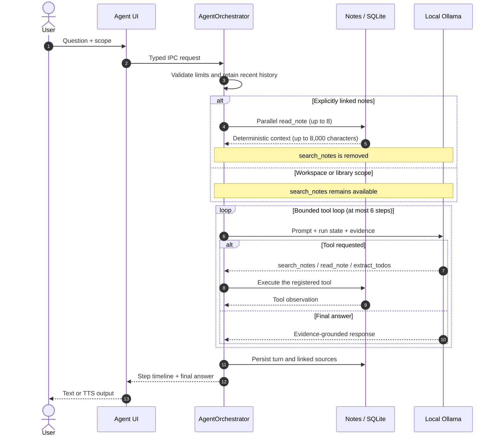
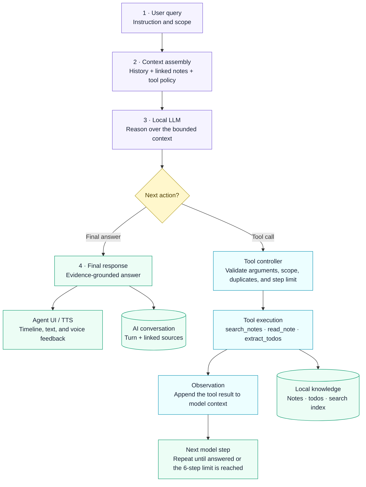

<p align="center">
  <strong>English</strong> · <a href="README.zh-CN.md">简体中文</a>
</p>

<p align="center">
  
</p>

<h1 align="center">SpeakSpace Local</h1>

<p align="center">
  Local-first voice notes and knowledge workspace
</p>

<p align="center">
  <a href="https://github.com/dhebhxh/speakspace-local-electron/actions/workflows/test.yml">
    
  </a>
  <a href="https://github.com/dhebhxh/speakspace-local-electron/actions/workflows/codeql-analysis.yml">
    
  </a>
  <a href="LICENSE">
    
  </a>
  
</p>

<p align="center">
  
  
  
  
  
  
  
</p>

<p align="center">
  <a href="https://github.com/dhebhxh/speakspace-local-electron/releases"><strong>Download</strong></a>
  ·
  <a href="#local-development">Run locally</a>
  ·
  <a href="docs/README.md">Documentation</a>
</p>

SpeakSpace Local is an Electron desktop application that brings recording, audio import, offline transcription, structured notes, scenario knowledge, full-text and semantic search, local AI conversations, and speech playback into one workspace.

“Local” means that inference and the user's knowledge base run on the user's computer. The database, recordings, and application-managed models live under Electron's `userData` directory. Models are neither committed to Git nor bundled with the installer; users download the runtimes and models they need from Model Management.

## Contents

- [Feature map](#feature-map)
- [System architecture](#system-architecture)
- [From recording to knowledge](#from-recording-to-knowledge)
- [Data storage](#data-storage)
- [Search and export coverage](#search-and-export-coverage)
- [Agent workflow](#agent-workflow)
- [Local model stack](#local-model-stack)
- [Evaluation evidence](#evaluation-evidence)
- [Engineering snapshot](#engineering-snapshot)
- [Repository structure](#repository-structure)
- [Local development](#local-development)
- [Packaging and release](#packaging-and-release)
- [Documentation](#documentation)
- [Electron React Boilerplate](#electron-react-boilerplate)
- [License](#license)

## Feature map

| Area | User-facing capabilities | Primary implementation |
| --- | --- | --- |
| Conversation Studio | Record, import audio, transcribe live, review, and save notes | `StudioPage`, `MediaRecorder`, STT IPC |
| Dashboard | Metrics, calendar, tasks, pinned items, and note classification | `DashboardService`, `TodoExtractionService` |
| Workspaces | Complete note details, full-text/semantic search, bulk actions, Word/PDF export | `WorkspaceService`, `SemanticNoteService`, `ExportService` |
| Structured Notes | Summary, key points, tasks, reminders, and calendar intents | `KnowledgeGenerationService` |
| Scenario Knowledge | Built-in templates such as Meeting and Lecture, plus locally normalized custom templates | `KnowledgeScenarios`, `KnowledgeTemplateNormalizer` |
| Ask AI | Ask questions across one note, multiple notes, or a workspace and persist the conversation | `AskAIService` |
| Agent | Bounded tool loop, explicit linked notes, search/read/task extraction | `AgentOrchestrator` |
| Model Management | Download, activate, inspect, and remove STT, LLM, and TTS models | `AI-module/`, `runtime/` |
| Settings and background | Languages, theme, font size, shortcuts, tray, lightweight HUDs, and Trash | `SettingsService`, `BackgroundController`, `TrashService` |

## System architecture

<p align="center">
  
</p>
<p align="center"><em>Figure 1. SpeakSpace Local process-boundary architecture.</em></p>

The scalable diagram above preserves the repository's process-boundary view in a vertical layout. The following implementation view adds the current model, persistence, and core-flow summary without replacing that view.

<p align="center">
  
</p>
<p align="center"><em>Figure 2. Current technical implementation overview.</em></p>

### Process boundaries

| Layer | Responsibilities | Must not |
| --- | --- | --- |
| `src/renderer/` | React UI, routing, interaction, and presentation state | Access `fs`, SQLite, model processes, or import `src/main/` directly |
| `src/main/preload.ts` | Expose a minimal, typed API through `contextBridge` | Contain domain logic or render UI |
| `src/main/ipc/` | Validate cross-process input and call domain services | Duplicate repository or model logic inside handlers |
| `src/main/<domain>/` | Persistence, model inference, file access, and process control | Return class instances that cannot be structured-cloned |
| `src/shared/` | Pure types, entities, and data contracts shared across processes | Depend on Electron, Node.js, or the DOM |

Direct Renderer imports from the main process are prohibited and enforced through ESLint's `no-restricted-imports` rule.

## From recording to knowledge

After transcription completes, the application does not generate a separate summary and then repeat the same work for a structured note. It performs one structured extraction. The review dialog displays the draft's `summary`, and saving binds that draft to the real `noteId` before persisting it.

<p align="center">
  
</p>
<p align="center"><em>Figure 3. Recording-to-knowledge pipeline.</em></p>

Key invariants:

- Even a short transcript with little semantic content receives a usable structured fallback.
- A structured draft is required before save, so a newly created note does not need a second manual generation step.
- Scenario Knowledge is an optional second extraction layer and is stored separately from the general Structured Note.
- A failed recording save cannot leave a database record pointing to a nonexistent audio file.

## Data storage

### userData layout

```text
<Electron userData>/
├─ speakspace.db              # Primary SQLite database
├─ app-settings.json          # Language, theme, shortcuts, background, Agent settings
├─ model-state/
│  ├─ stt.json
│  ├─ llm.json
│  └─ tts.json                # Active model selections
├─ blobs/
│  └─ recordings/             # Saved and imported recordings
├─ models/{stt,llm,tts}/      # Application-managed models
├─ runtimes/{stt,llm,tts}/    # Portable runtimes and manifests
├─ cache/{stt,llm,tts}/       # Download and extraction cache
└─ output/{stt,llm,tts}/      # Temporary inference output
```

`ManagedPaths` validates write and delete targets against the `userData` boundary. System-installed or user-managed runtimes are never removed by the application.

### SQLite relationship model

<p align="center">
  
</p>
<p align="center"><em>Figure 4. SQLite relationship model.</em></p>

Workspaces, notes, AI conversations, and custom templates use `trashed_at` for soft deletion. Physical deletion and cascading cleanup occur only through “Delete permanently” inside Trash.

## Search and export coverage

The search index combines note titles, transcripts, and all visible related text. Structured JSON is flattened into user-visible strings before indexing instead of being searched only as raw JSON.

| Content | Full-text / semantic search | Word/PDF export |
| --- | :---: | :---: |
| Title, workspace, category, and timestamps | ✓ | ✓ |
| Original transcript and audio file name | ✓ | ✓ |
| Structured summary, key points, tasks, reminders, and calendar intents | ✓ | ✓ |
| Scenario Knowledge | ✓ | ✓ |
| Subnotes and legacy Knowledge Outputs | ✓ | ✓ |
| Tasks and their completion/pinned state | ✓ | ✓ |
| Linked AI conversations and messages | ✓ | ✓ |

Semantic search caches vectors in `note_embeddings` and uses `content_hash` to determine whether an embedding must be regenerated. Keyword matches and vector results can both contribute to ranking.

## Agent workflow

Ask AI is designed for question answering over a fixed scope. Agent mode lets the local model call tools within a bounded loop. When users link notes explicitly, those notes are loaded deterministically before the first inference step, and `search_notes` is removed from the available tool set so the model cannot ignore the requested scope.

The two diagrams below are maintained as Mermaid source in this README and rendered by GitHub, so their structure can be updated without editing raster images.



<p align="center"><em>Figure 5. Agent request sequence.</em></p>

The sequence diagram shows interactions over time; the controller view below highlights the decision point, bounded tool loop, evidence return path, and final response.



<p align="center"><em>Figure 6. Bounded Agent controller workflow.</em></p>

Code-level Agent bounds:

| Item | Current limit |
| --- | ---: |
| User instruction | 4,000 characters |
| Conversation history | Latest 12 messages, up to 4,000 characters each |
| Explicitly linked notes | Up to 8 |
| Linked-note context | About 8,000 characters total |
| Tool loop | Up to 6 steps |
| Registered tools | `search_notes`, `read_note`, `extract_todos` |

## Local model stack

| Capability | Runtime | Notes |
| --- | --- | --- |
| STT | Whisper CLI / Parakeet ONNX | Audio transcription; FFmpeg handles required format preprocessing |
| LLM | Local Ollama | Structured Notes, Scenario Knowledge, Ask AI, Agent, classification, and task extraction |
| Embedding | Ollama Embedding | Semantic search; vectors and content hashes are stored in SQLite |
| TTS | Kokoro / MeloTTS / MOSS-TTS-Nano | Main-process inference with pipelined playback in the Renderer |
| Runtime management | Application-managed or system-installed | Main process is authoritative for readiness; Renderer does not infer file state |

## Evaluation evidence

The evaluation suite covers all four local-AI subsystems—TTS, STT, LLM, and embedding-based retrieval—plus bounded Agent behavior and deterministic regression tests. Raw JSON, human-recorded STT audio, generated reports, and chart sources are committed under [`docs/testing`](docs/testing/README.md).

| Area | Current evidence | Important boundary |
| --- | --- | --- |
| TTS | 3 engines × 36 Chinese/English/mixed texts × 3 repetitions; RTF, peak memory, length scaling, and ASR back-transcription | CER is a proxy, not a human MOS listening study |
| STT | 4 Whisper sizes over 56 human recordings; CER, content recall, noise slice, and RTF | One Chinese-native speaker; not a population estimate |
| LLM / tasks | 5 local models on a 54-case task corpus with a 22/32 development-holdout split | Results cover the tested prompts and 1.5B–3.8B models only |
| Embedding retrieval | Production keyword + BGE-M3 vector search + RRF, evaluated independently of the LLM | One embedding model and 24 labelled retrieval tasks |
| Agent | 80 fixed notes and 90 tasks with a 45/45 development-holdout split; strict tool and scope scoring | The Agent remains below the product-readiness target |
| Regression | Machine-readable Jest inventory grouped by feature area | Regression tests do not measure model quality |

<p align="center">
  
</p>
<p align="center"><em>Figure 7. TTS synthesis speed across the tested engines.</em></p>

<p align="center">
  
</p>
<p align="center"><em>Figure 8. STT evaluation on human recordings.</em></p>

<p align="center">
  
</p>
<p align="center"><em>Figure 9. Local LLM accuracy and speed trade-off.</em></p>

<p align="center">
  
</p>
<p align="center"><em>Figure 10. Embedding-based hybrid retrieval evaluation.</em></p>

<p align="center">
  
</p>
<p align="center"><em>Figure 11. Agent end-to-end evaluation.</em></p>

<p align="center">
  
</p>
<p align="center"><em>Figure 12. Jest regression coverage by feature area.</em></p>

The central methodological rule is simple: choose prompts and harnesses on the development split, then report acceptance results on a frozen holdout. Hardware-sensitive measurements—latency, throughput, memory, and GPU offload—are collected separately through the one-click cross-machine benchmark. See the [coverage and limitations ledger](docs/testing/test-coverage-gaps.md) before quoting any number.

### M2 Pro 16GB hardware snapshot

On 2026-09-02, an Apple M2 Pro with 16GB unified memory completed the strict five-stage hardware benchmark—TTS, continuous-run TTS memory, long-text TTS memory, LLM, and STT—in 1h 21m 30.7s with no failed stage.

| Workload | Observed result | Interpretation boundary |
| --- | --- | --- |
| TTS | MeloTTS had the best tested speed/memory balance (P50 RTF 0.761; 895.5 MiB peak RSS); MOSS-TTS was fastest (P50 RTF 0.344) but reached 5843.3 MiB on long text | Performance evidence only; the run did not measure listening quality |
| LLM | All five tested models reported 100% GPU offload; Qwen2.5 1.5B led throughput at 71.9 tokens/s | Throughput does not establish task quality, and unified memory is not zero memory use |
| STT | All four Whisper sizes were faster than real time; `small` averaged RTF 0.082 and `large-v1` 0.359 | This run measured speed, not CER or broader speaker/accent coverage |

This is one machine run, not a universal hardware ranking. Cross-machine comparisons remain partial and may include runtime and platform differences; see the [full M2 Pro 16GB conclusion report](docs/testing/m2-pro-16gb-hardware-benchmark-conclusion.md) for the evidence and limits.

## Engineering snapshot

Evaluation and test inventory generated on 2026-09-01:

| Metric | Count |
| --- | ---: |
| Generated evaluation reports | 8 |
| Reproducible SVG charts | 46 |
| Jest suites | 76 |
| Jest cases | 634 |
| Fixed Agent corpus | 80 notes / 90 tasks |
| Archived machine profiles | 1 (more runs pending) |

Published automated-test inventory and the latest merge verification:

| Check | Result |
| --- | --- |
| TypeScript | Passed |
| Webpack main / renderer build | Passed |
| Jest | 73 suites passed, 3 skipped; 560 tests passed, 74 skipped |
| Evaluation charts | All 46 regenerated from committed result data |
| Detailed inventory | [Generated suite and case listing](docs/testing/jest-test-inventory.md) |

These values are a verification snapshot rather than dynamic badges and should be updated when the implementation changes.

### Hardware archive update (2026-09-02)

As of 2026-09-02, the result archive contains five machine profiles spanning Apple Silicon and NVIDIA RTX 3050, 3060, and 3090 systems. The M2 Pro, `jack`, and `fan3090` profiles record successful outputs for all five hardware stages; the older NVIDIA profiles are partial. The [cross-machine aggregate](docs/testing/cross-machine-benchmark.md) is a generated snapshot that should be regenerated after new runs are imported, and missing cells must not be read as zero.

## Repository structure

```text
assets/             Product logo and platform icons
config/             LLM / STT model catalogs
docs/               Documentation index, test reports, changelogs, and archive
scripts/            Benchmarks, smoke tests, and development helpers
src/
├─ main/            Electron main process, IPC, database, models, domain services
├─ renderer/        React pages, layout, interactions, and styles
└─ shared/          Cross-process pure types, entities, and data contracts
.erb/               Electron React Boilerplate / Webpack engineering scripts
release/
├─ app/             Packaging package.json, native dependencies, build output
├─ build/           Reproducible electron-builder output; not committed
└─ installers/      Locally accepted installers; not committed
```

See [Project Structure](docs/project-structure.md) and [AGENTS.md](AGENTS.md) for detailed ownership and code-placement rules.

## Local development

Node.js 22 and npm are recommended.

```bash
git clone https://github.com/dhebhxh/speakspace-local-electron.git
cd speakspace-local-electron
npm install
npm start
```

`npm start` launches development builds for the Electron main process, preload, and Renderer. For generic Electron React Boilerplate environment issues, see its [installation guide](https://electron-react-boilerplate.js.org/docs/installation).

### Common commands

| Command | Purpose |
| --- | --- |
| `npm start` | Start the development environment |
| `npm run build` | Build main and renderer |
| `npm exec tsc -- --noEmit` | Run TypeScript checks |
| `npm run lint` | Run ESLint |
| `npm test` | Run Jest |
| `npm run test:trash:electron` | Validate Trash database behavior with the Electron ABI |
| `npm run smoke:tts` | Run the TTS runtime smoke test |
| `npm run bench -- --machine <label>` | Run and archive all hardware-sensitive benchmarks for one machine |
| `npm run bench:aggregate` | Aggregate collected machine snapshots |
| `npm run bench:charts` | Regenerate the committed SVG evaluation charts |
| `npm run bench:charts -- --panels-only` | Recompose overview panels from existing detailed charts without selecting new benchmark data |
| `npm run bench:report` | Regenerate the Markdown evaluation reports |
| `npm run check:audit` | Audit production dependencies only |
| `npm run package` | Create an internal build for the current platform |
| `npm run package:release` | Create a release-named build with signing gates |

For non-developers collecting hardware results, double-click `一键跨机硬件测速.cmd` on Windows or `一键跨机硬件测速-Mac.command` on macOS. The launcher checks dependencies, offers to download required runtimes/models, and stores each machine under its own result directory.

## Packaging and release

Windows packages use an NSIS installer. Models are downloaded on demand after installation and are not included in the installer.

Installers for both macOS and Windows are available from [GitHub Releases](https://github.com/dhebhxh/speakspace-local-electron/releases).

```bash
npm run package
```

- Temporary build output: `release/build/`
- Locally accepted installers: `release/installers/`
- Neither directory is committed to Git.
- Windows or macOS code-signing credentials are required before public distribution.
- `npm run package:release` runs the release signing gate first.

## Documentation

See [docs/README.md](docs/README.md) for the complete index.

- [Project structure and process boundaries](docs/project-structure.md)
- [Testing and evaluation overview](docs/testing/README.md)
- [Datasets and development/holdout splits](docs/testing/datasets/README.md)
- [TTS model benchmark](docs/testing/tts-model-benchmark-windows.md)
- [Human-recorded STT evaluation](docs/testing/stt-human-eval.md)
- [Local LLM model sweep](docs/testing/llm-model-sweep.md)
- [Embedding-based retrieval evaluation](docs/testing/retrieval-eval.md)
- [Agent end-to-end evaluation](docs/testing/agent-end-to-end-eval.md)
- [Cross-machine one-click benchmark guide](docs/testing/multi-machine-benchmark-guide.md)
- [M2 Pro 16GB full hardware benchmark conclusion](docs/testing/m2-pro-16gb-hardware-benchmark-conclusion.md)
- [Manual platform acceptance](docs/testing/manual-acceptance.md)
- [Detailed development logs](docs/changelog/)
- [Contributor Code of Conduct](.github/CODE_OF_CONDUCT.md)

## Electron React Boilerplate

This project is built on the [Electron React Boilerplate](https://github.com/electron-react-boilerplate/electron-react-boilerplate) engineering foundation and continues to use Electron, React, React Router, Webpack, and React Fast Refresh.

- [Electron React Boilerplate documentation](https://electron-react-boilerplate.js.org/docs/installation)
- [Electron documentation](https://www.electronjs.org/docs/latest/)

SpeakSpace Local's product functionality, interface, data model, and local AI workflows are maintained independently by this project.

## License

This project is licensed under the [MIT License](LICENSE). Upstream copyright belongs to the contributors of [Electron React Boilerplate](https://github.com/electron-react-boilerplate/electron-react-boilerplate).
