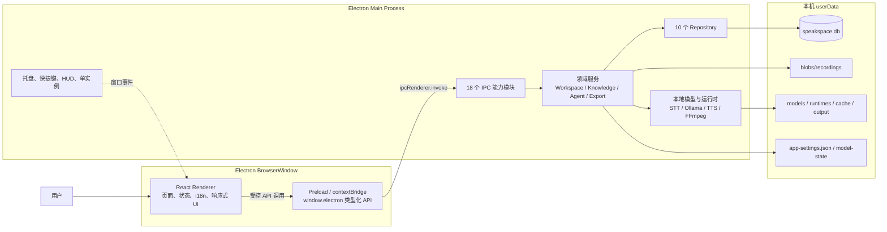
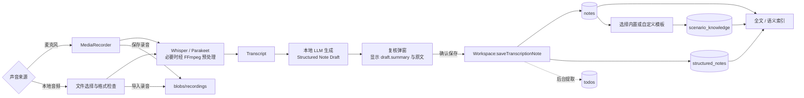
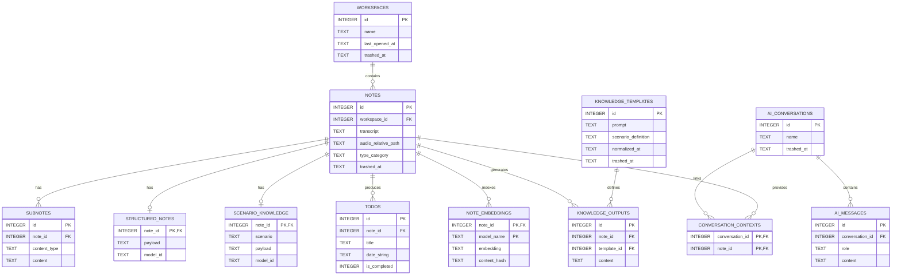
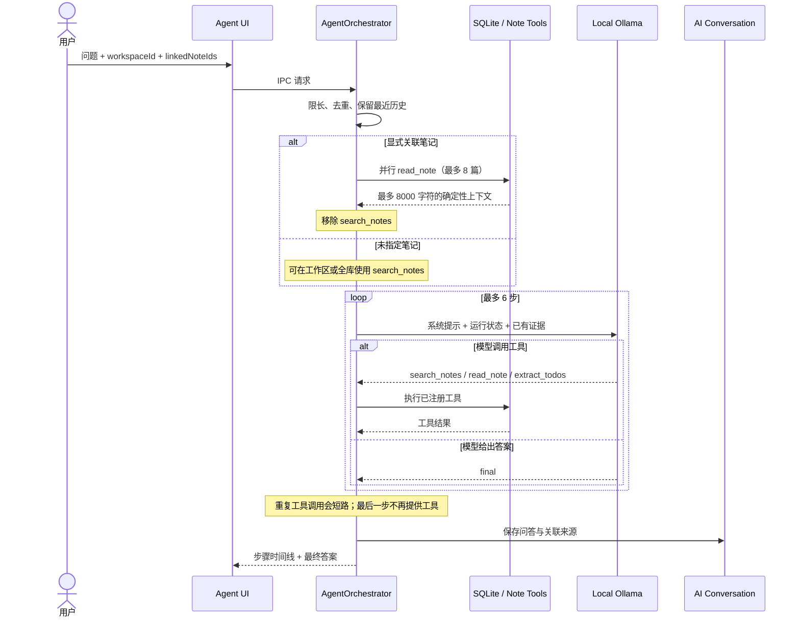

<p align="center">
  
</p>

<h1 align="center">SpeakSpace Local</h1>

<p align="center">
  本地优先的语音笔记与知识工作台
  <br />
  Local-first voice notes and knowledge workspace
</p>

<p align="center">
  <a href="https://github.com/dhebhxh/speakspace-local-electron/actions/workflows/test.yml">
    
  </a>
  <a href="https://github.com/dhebhxh/speakspace-local-electron/actions/workflows/codeql-analysis.yml">
    
  </a>
  <a href="LICENSE">
    
  </a>
  
</p>

<p align="center">
  
  
  
  
  
  
  
</p>

SpeakSpace Local 是一个 Electron 桌面应用，将录音、文件导入、离线转写、结构化笔记、场景知识、全文与语义检索、本地 AI 对话和语音播报整合在同一个工作台中。

“Local”指推理和用户知识库在本机运行：数据库、录音和受管模型均位于 Electron `userData`；模型不进入 Git，也不塞进安装包。首次使用相关能力时，用户再从模型管理页按需下载运行时和模型。

## 功能版图

| 模块 | 用户能力 | 主要实现 |
| --- | --- | --- |
| 对话工作台 | 录音、导入音频、实时转写、复核并保存笔记 | `StudioPage`、`MediaRecorder`、STT IPC |
| 仪表盘 | 指标、日历、待办、置顶和笔记分类 | `DashboardService`、`TodoExtractionService` |
| 工作空间 | 完整笔记详情、全文/语义搜索、批量操作、Word/PDF 导出 | `WorkspaceService`、`SemanticNoteService`、`ExportService` |
| 结构化笔记 | 摘要、关键要点、任务、提醒和日程 | `KnowledgeGenerationService` |
| 场景知识 | Meeting、Lecture 等内置模板，以及本地 LLM 规范化的自定义模板 | `KnowledgeScenarios`、`KnowledgeTemplateNormalizer` |
| Ask AI | 针对单篇、多篇或工作空间内笔记进行问答并保存会话 | `AskAIService` |
| Agent | 有界工具循环、显式关联笔记、搜索/阅读/任务提取 | `AgentOrchestrator` |
| 模型管理 | STT、LLM、TTS 的下载、激活、运行状态和卸载 | `AI-module/`、`runtime/` |
| 设置与后台 | 中英文、主题、字号、快捷键、托盘、轻量 HUD、回收站 | `SettingsService`、`BackgroundController`、`TrashService` |

## 系统架构



### 进程边界

| 层 | 可以做什么 | 不应该做什么 |
| --- | --- | --- |
| `src/renderer/` | React UI、路由、交互和展示状态 | 直接访问 `fs`、SQLite、模型进程或导入 `src/main/` |
| `src/main/preload.ts` | 通过 `contextBridge` 暴露最小化、类型化 API | 放置业务逻辑或直接渲染界面 |
| `src/main/ipc/` | 验证跨进程输入并调用领域服务 | 在 Handler 里复制 Repository 或模型逻辑 |
| `src/main/<domain>/` | 数据持久化、模型推理、文件和进程能力 | 返回无法被 structured clone 的类实例 |
| `src/shared/` | 两侧共享的纯类型、实体和纯数据 | 依赖 Electron、Node 或 DOM |

Renderer 禁止直接导入主进程实现，这条边界由 ESLint 的 `no-restricted-imports` 规则强制。

## 录音到知识的流水线

转写完成后不会先生成一份独立摘要，再重复生成结构化笔记。当前链路只做一次结构化提取，复核弹窗直接显示其中的 `summary`；保存时将草稿绑定真实 `noteId` 并持久化。



关键约束：

- 没有实质内容的短转写仍会生成可用的结构化兜底结果。
- 保存前必须拿到结构化草稿，避免新笔记进入工作空间后仍需手动重新生成。
- 场景知识是第二层、可选择的提取结果，与通用结构化笔记分开保存。
- 录音文件失败时不会留下指向不存在文件的数据库记录。

## 数据存储

### userData 目录

```text
<Electron userData>/
├─ speakspace.db              # SQLite 主数据库
├─ app-settings.json          # 语言、主题、快捷键、后台与 Agent 设置
├─ model-state/
│  ├─ stt.json
│  ├─ llm.json
│  └─ tts.json                # 当前激活模型
├─ blobs/
│  └─ recordings/             # 用户保存或导入的录音
├─ models/{stt,llm,tts}/      # 应用受管模型
├─ runtimes/{stt,llm,tts}/    # 便携运行时及 manifest
├─ cache/{stt,llm,tts}/       # 下载与解压缓存
└─ output/{stt,llm,tts}/      # 临时推理输出
```

`ManagedPaths` 对写入和删除目标做 `userData` 边界校验。系统安装或用户自行安装的运行时不由应用删除。

### SQLite 关系模型



工作空间、笔记、AI 会话和自定义模板使用 `trashed_at` 实现软删除；只有回收站中的“永久删除”才会物理移除记录及其级联数据。

## 搜索与导出覆盖范围

搜索索引会组合笔记标题、转写和所有可见附属文本；结构化 JSON 会先提取可见字符串再参与搜索，而不是只搜索原始 JSON。

| 内容 | 全文/语义检索 | Word/PDF 导出 |
| --- | :---: | :---: |
| 标题、工作空间、分类和时间 | ✓ | ✓ |
| 原始转写与录音文件名 | ✓ | ✓ |
| 结构化摘要、关键点、任务、提醒和日程 | ✓ | ✓ |
| Scenario Knowledge | ✓ | ✓ |
| Subnotes 与旧版 Knowledge Outputs | ✓ | ✓ |
| 待办及完成/置顶状态 | ✓ | ✓ |
| 关联 AI 会话与消息 | ✓ | ✓ |

语义检索会缓存 `note_embeddings`，并通过 `content_hash` 判断是否需要重新生成向量；关键词命中和向量结果可共同参与排序。

## Agent 工作流程

Ask AI 适合固定范围问答；Agent 则允许本地模型在有界循环里调用工具。用户手动关联笔记时，这些笔记会在第一轮推理前确定性载入，同时从可用工具中移除 `search_notes`，防止模型忽略用户指定范围。



Agent 的代码级边界：

| 项目 | 当前限制 |
| --- | ---: |
| 用户指令 | 4000 字符 |
| 对话历史 | 最近 12 条，每条最多 4000 字符 |
| 显式关联笔记 | 最多 8 篇 |
| 关联笔记上下文 | 合计约 8000 字符 |
| 工具循环 | 最多 6 步 |
| 已注册工具 | `search_notes`、`read_note`、`extract_todos` |

## 本地模型栈

| 能力 | 当前运行方式 | 说明 |
| --- | --- | --- |
| STT | Whisper CLI / Parakeet ONNX | 音频转写，FFmpeg 负责必要的格式预处理 |
| LLM | 本地 Ollama | 结构化笔记、场景知识、Ask AI、Agent、分类和任务提取 |
| Embedding | Ollama Embedding | 语义检索，向量与内容哈希写入 SQLite |
| TTS | Kokoro / MeloTTS / MOSS-TTS-Nano | 主进程推理，Renderer 分段流水播放 |
| Runtime | 应用受管或系统已安装 | 状态统一由主进程检测，Renderer 不自行猜测文件是否存在 |

### TTS 基准摘要

以下是 2026-08-13 在 Apple M4、CPU 推理、每条文本重复 3 次后的中位结果。RTF 小于 1 表示生成速度快于实时播放。

| 模型 | 加载时间 | 峰值 RSS | 平均中位 RTF | 结果 |
| --- | ---: | ---: | ---: | --- |
| Kokoro | 1.260 s | 779.8 MiB | 0.978 | 中文/英文实时，混合文本较慢 |
| MeloTTS | 1.344 s | 663.5 MiB | 0.652 | 三类文本均实时 |
| MOSS-TTS-Nano | 4.024 s | 1,248.2 MiB | 0.529 | 最快，但加载和内存最高 |

完整方法、逐文本结果、CER 代理指标和跨平台限制见 [TTS 模型基准报告](docs/testing/tts-model-benchmark-2026-08-13.md)。Windows 运行时兼容不等同于 Windows 实机基准。

## 工程指标

源码规模按 2026-08-23 当前工作树统计：

| 指标 | 数量 |
| --- | ---: |
| TypeScript / TSX / JavaScript / JSX 源文件 | 388 |
| 主进程文件 | 190 |
| Renderer 文件 | 135 |
| Shared 文件 | 21 |
| 测试文件 | 67 |
| IPC 能力模块 | 18 |
| SQLite 表 | 12 |
| 具体 Repository | 10 |

最近一次完整质量门禁：

| 检查 | 结果 |
| --- | --- |
| TypeScript | 通过 |
| ESLint | 0 error，29 个既有 warning |
| Webpack main / renderer build | 通过 |
| Jest | 64 suites passed、3 skipped；535 tests passed、42 skipped |
| Production dependency audit | 0 vulnerabilities |
| Windows NSIS 安装包 | 生成并完成 SHA-256 校验，尚未代码签名 |

这些数字是验证快照，不是动态徽章；代码变化后应同步更新。

## 项目结构

```text
assets/             应用 Logo 与平台图标
config/             LLM / STT 模型目录
docs/               文档索引、测试报告、历史日志和归档
scripts/            benchmark、smoke 与开发辅助脚本
src/
├─ main/            Electron 主进程、IPC、数据库、模型与领域服务
├─ renderer/        React 页面、布局、交互和样式
└─ shared/          跨进程纯类型、实体和数据契约
.erb/               Electron React Boilerplate / Webpack 工程脚本
release/
├─ app/             打包侧 package.json、原生依赖和构建输出
├─ build/           electron-builder 临时产物，不提交
└─ installers/      本地验收安装包，不提交
```

更细的职责和代码放置规则见 [项目结构](docs/project-structure.md) 与 [AGENTS.md](AGENTS.md)。

## 本地开发

建议使用 Node.js 22 和 npm。

```bash
git clone https://github.com/dhebhxh/speakspace-local-electron.git
cd speakspace-local-electron
npm install
npm start
```

`npm start` 会启动 Electron 主进程、preload 和 Renderer 的开发构建。Electron React Boilerplate 的通用环境问题可参考其 [安装文档](https://electron-react-boilerplate.js.org/docs/installation)。

### 常用命令

| 命令 | 用途 |
| --- | --- |
| `npm start` | 启动开发环境 |
| `npm run build` | 构建 main 与 renderer |
| `npm exec tsc -- --noEmit` | TypeScript 类型检查 |
| `npm run lint` | ESLint |
| `npm test` | Jest 测试 |
| `npm run test:trash:electron` | 使用 Electron ABI 验证回收站数据库逻辑 |
| `npm run smoke:tts` | TTS 运行时冒烟测试 |
| `npm run check:audit` | 只检查生产依赖漏洞 |
| `npm run package` | 当前平台内部构建 |
| `npm run package:release` | 带正式命名和签名门禁的发布构建 |

## 打包与发布

Windows 使用 NSIS 安装器。模型由用户安装应用后按需下载，不进入安装包。

```bash
npm run package
```

- 临时构建：`release/build/`
- 本地验收安装包：`release/installers/`
- 两者均不进入 Git。
- 正式分发前必须配置 Windows 或 macOS 代码签名凭据。
- `npm run package:release` 会先执行发布签名门禁。

## 文档导航

完整索引见 [docs/README.md](docs/README.md)。

- [项目结构与代码边界](docs/project-structure.md)
- [任务提取测试用例](docs/testing/task-extraction-cases.md)
- [TTS 模型基准报告](docs/testing/tts-model-benchmark-2026-08-13.md)
- [TTS 平台构建说明](docs/testing/tts-platform-builds.md)
- [Windows TTS 手工验收](docs/testing/tts-windows-manual.md)
- [版本摘要](CHANGELOG.md)
- [详细开发日志](docs/changelog/)
- [历史迁移归档](docs/archive/legacy-merge-inventory.md)
- [贡献者行为准则](.github/CODE_OF_CONDUCT.md)

## Electron React Boilerplate

本项目基于 [Electron React Boilerplate](https://github.com/electron-react-boilerplate/electron-react-boilerplate) 的工程体系构建，并继续使用 Electron、React、React Router、Webpack 和 React Fast Refresh。

- [Electron React Boilerplate 文档](https://electron-react-boilerplate.js.org/docs/installation)
- [Electron 文档](https://www.electronjs.org/docs/latest/)

SpeakSpace Local 的产品功能、界面、数据模型和本地 AI 流程由本项目独立维护。

## 许可证

本项目使用 [MIT License](LICENSE)。上游工程版权归 [Electron React Boilerplate](https://github.com/electron-react-boilerplate/electron-react-boilerplate) 贡献者所有。
