<p align="center">
  <strong>English</strong> · <a href="README.zh-CN.md">简体中文</a>
</p>

<p align="center">
  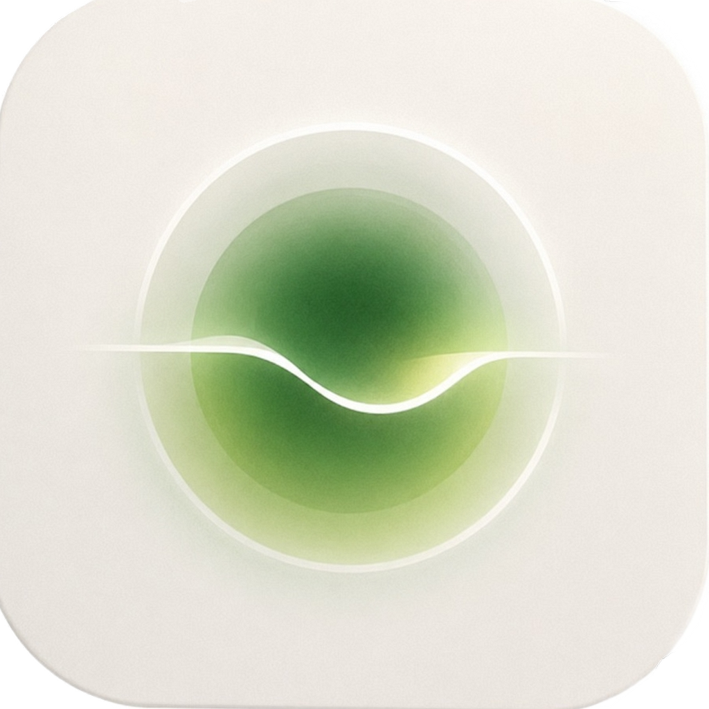
</p>

<h1 align="center">SpeakSpace Local</h1>

<p align="center">
  Local-first voice intelligence for desktop and mobile
</p>

<p align="center">
  <a href="https://github.com/dhebhxh/speakspace-local-electron/actions/workflows/test.yml">
    
  </a>
  <a href="https://github.com/dhebhxh/speakspace-local-electron/actions/workflows/mobile.yml">
    
  </a>
  <a href="https://github.com/dhebhxh/speakspace-local-electron/actions/workflows/codeql-analysis.yml">
    
  </a>
  <a href="LICENSE">
    
  </a>
</p>

<p align="center">
  
  
  
  
  
</p>

<p align="center">
  <a href="https://github.com/dhebhxh/speakspace-local-electron/releases"><strong>Desktop releases</strong></a>
  ·
  <a href="mobile/README.md"><strong>Mobile setup</strong></a>
  ·
  <a href="docs/README.md"><strong>Documentation</strong></a>
</p>

This repository contains two independently built local-first applications. **SpeakSpace Local** is the Electron desktop workspace at the repository root. **LetsVoice** is the Expo / React Native application under `mobile/`. Both turn speech into searchable notes and local AI workflows, but they do not form one shared binary or one synchronised database.

## Two applications, one repository

| Application              | Location        | Stack                                        | Target                                                                      |
| ------------------------ | --------------- | -------------------------------------------- | --------------------------------------------------------------------------- |
| SpeakSpace Local desktop | Repository root | Electron 35, React 19, TypeScript 5.8        | Windows is the primary target; macOS and Linux packaging is also configured |
| LetsVoice mobile         | `mobile/`       | Expo SDK 57, React Native 0.86, TypeScript 6 | Android phones and iPhone; iOS 16.4 or later                                |

Each application has its own package manifest, lockfile, dependencies, data store, model directory, tests, build process, and release path. The repository is not an npm workspace, and neither application imports runtime source from the other.

The mobile display name is **LetsVoice**. Technical identifiers such as the repository slug, bundle/package identifier, URL scheme, and database filename retain their earlier names to preserve links, installations, and local data.

## Current mobile implementation

LetsVoice is now a working mobile implementation rather than a future extension. Its main contribution is a phone-scale, save-first voice workflow with separate persistence and native runtime integration:

- recording and imported audio share language-aware on-device transcription;
- a transcript and its audio are saved before optional Structured Note generation begins;
- local inference is serialised through a cancellable coordinator, while a separate context service reuses compatible LLM contexts;
- Structured Notes and Knowledge stream partial output, while Ask AI remains scoped to selected local notes;
- native capture, conversion and PCM-playback integrations handle platform-sensitive audio behaviour, with session-event integration limited to Apple platforms; and
- notes, tasks, workspaces, search, PDF export, iPhone task notifications and Trash remain independent of desktop storage.

Model acquisition still needs network access and long inference operations remain foreground-bound. There is no built-in desktop/mobile synchronisation, shared database or claim of feature parity.

The current mobile source revision is `0fd7903`. It entered this repository through the history-preserving subtree merge `006dcf1`, retaining 439 tracked files and 111 reachable mobile commits. Detailed change provenance and integration-only differences are recorded in [Mobile Integration](docs/mobile-integration.md).

## Capabilities

### SpeakSpace Local desktop

- Record live audio or import files, transcribe locally, review the result, and save it as a note.
- Generate Structured Notes, tasks and calendar intents, classifications, and template-driven Scenario Knowledge with a local LLM.
- Search note titles, transcripts, related knowledge, tasks, and AI conversations with full-text and semantic retrieval.
- Ask questions over a note, selected notes, or a workspace; Agent mode adds a bounded search/read/task-extraction tool loop.
- Organise notes in workspaces, pin important content, use Trash for recoverable deletion, and export complete notes to Word or PDF.
- Download and manage STT, LLM, embedding, and TTS models together with their local runtimes, without placing models in Git or the installer.

<p align="center">
  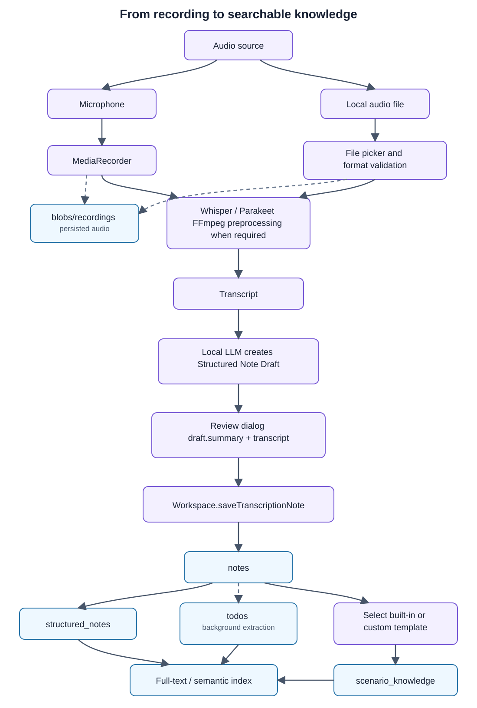
</p>
<p align="center"><em>Figure 1. Desktop recording-to-knowledge pipeline.</em></p>

### LetsVoice mobile

- Record or import up to two hours of WAV, MP3, M4A, AAC, or FLAC audio and transcribe it on the device.
- Use multilingual Whisper or English-only Parakeet models, with an explicit language choice for better short-recording accuracy.
- Organise local notes and workspaces, use fuzzy text search across note titles and content, pin notes and tasks, schedule local task notifications on iPhone, and restore items from Trash.
- Generate streaming Structured Notes and template-based Knowledge, translate saved note sections, and export one note at a time to PDF.
- Ask AI over local note context and listen with downloadable on-device voices.
- Download STT, LLM, and TTS models from the AI screens; large operations check available storage and remain foreground-bound.

The mobile UI is currently English. Multilingual transcription, content processing, and speech do not imply a translated interface.

<p align="center">
  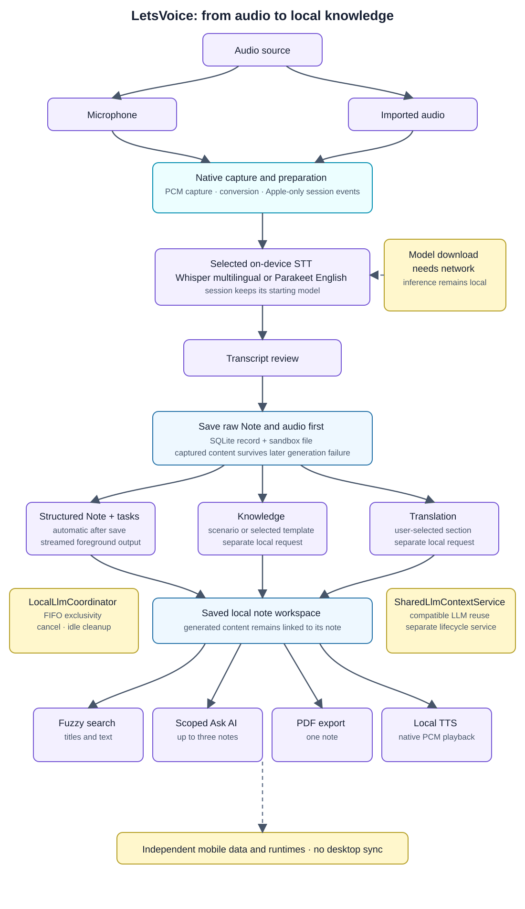
</p>
<p align="center"><em>Figure 2. LetsVoice save-first mobile processing route.</em></p>

## Product interface

These source-derived interface previews use illustrative local data and reproduce the current screen structure and wording. Native control details can vary slightly by operating system.

### SpeakSpace Local desktop

<p align="center">
  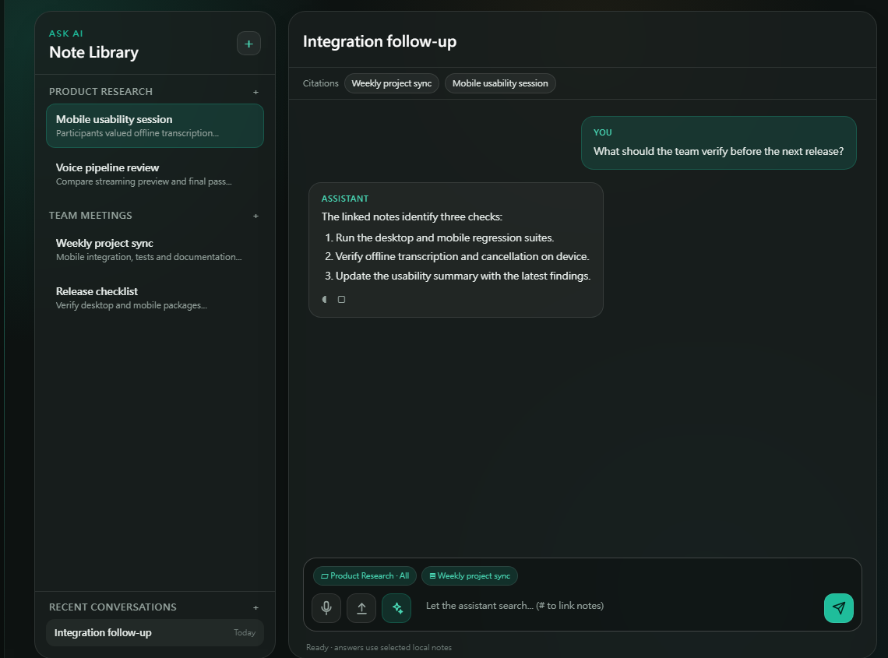
</p>
<p align="center"><sub><strong>Studio</strong> — recording, linked notes, and local Q&amp;A.</sub></p>

<p align="center">
  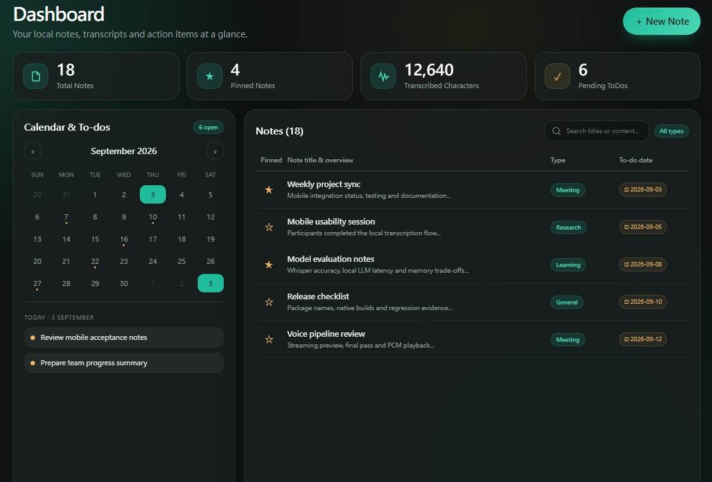
</p>
<p align="center"><sub><strong>Dashboard</strong> — notes, metrics, and action items.</sub></p>

<p align="center">
  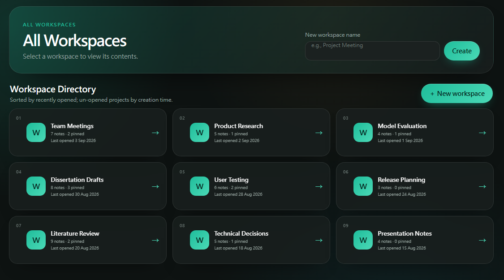
</p>
<p align="center"><sub><strong>Workspaces</strong> — organised local knowledge.</sub></p>

<p align="center">
  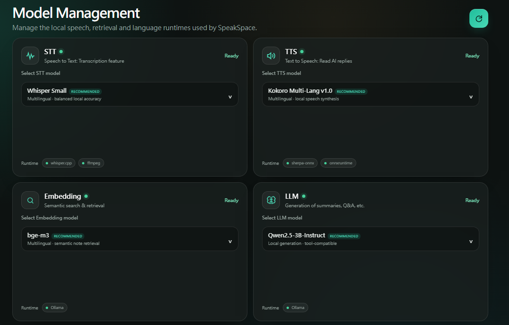
</p>
<p align="center"><sub><strong>Model management</strong> — an example configured local environment.</sub></p>

### LetsVoice mobile

<table>
  <tr>
    <td width="50%" align="center">
      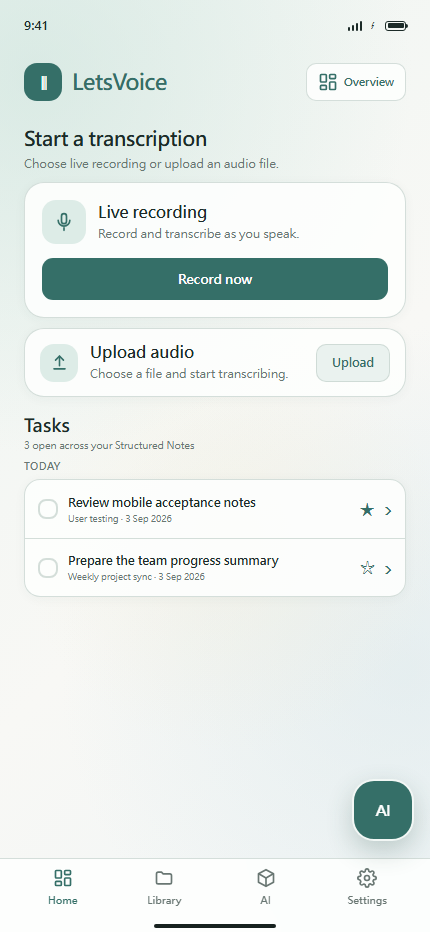
      <br />
      <sub><strong>Home</strong><br />record or import audio</sub>
    </td>
    <td width="50%" align="center">
      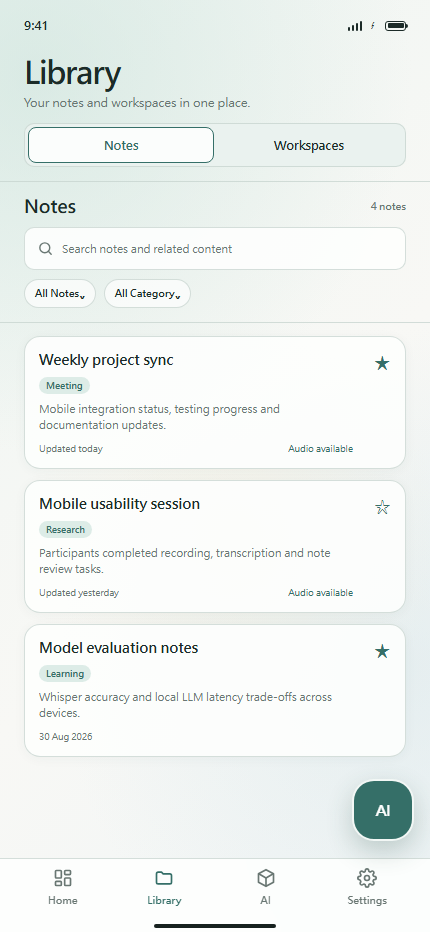
      <br />
      <sub><strong>Library</strong><br />search notes and workspaces</sub>
    </td>
  </tr>
  <tr>
    <td width="50%" align="center">
      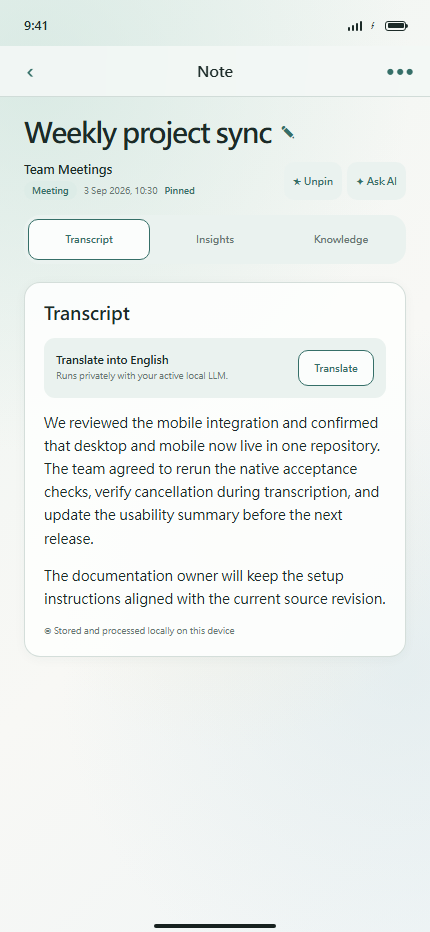
      <br />
      <sub><strong>Note detail</strong><br />review and process a transcript</sub>
    </td>
    <td width="50%" align="center">
      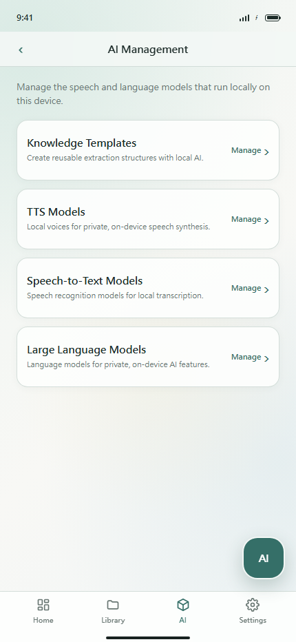
      <br />
      <sub><strong>AI management</strong><br />manage on-device models</sub>
    </td>
  </tr>
</table>

## Local-first boundaries

User data remains on the device. Once the required models are installed, core STT, LLM, and TTS inference also runs locally. Model downloads still require network access.

- Desktop data lives under Electron's `userData` directory, including `speakspace.db`, recordings, settings, models, runtimes, and inference cache.
- Mobile data lives in the operating system's application sandbox, including SQLite data, recordings, chats, preferences, and downloaded models.
- The applications provide no built-in cross-device sync or database transfer. Their user-initiated exports create supported document or share formats, not a complete migration between the two apps.
- Models are not committed to Git and are not bundled with either installer.
- Notes, workspaces, AI conversations, and custom Knowledge templates use Trash before permanent deletion. Temporary content, installed models, and individual Knowledge results follow their own explicit removal flows.

<p align="center">
  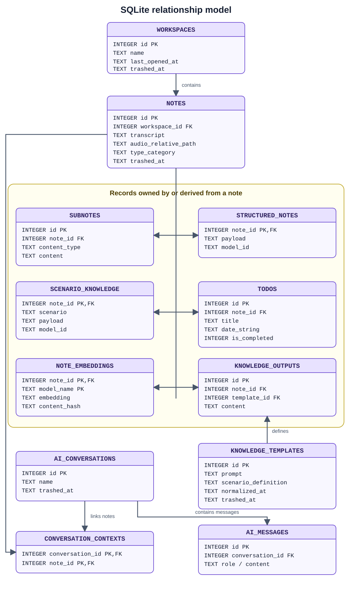
</p>
<p align="center"><em>Figure 3. Desktop SQLite relationship model.</em></p>

## Architecture

The desktop application enforces an Electron process boundary:

| Layer                 | Responsibility                                                                           |
| --------------------- | ---------------------------------------------------------------------------------------- |
| `src/renderer/`       | React UI and presentation state; no direct filesystem, database, or model-process access |
| `src/main/preload.ts` | Small typed bridge exposed through `contextBridge`                                       |
| `src/main/ipc/`       | Cross-process input validation and domain-service dispatch                               |
| `src/main/<domain>/`  | SQLite, files, models, inference, and operating-system integration                       |
| `src/shared/`         | Pure cross-process types and data contracts                                              |

<p align="center">
  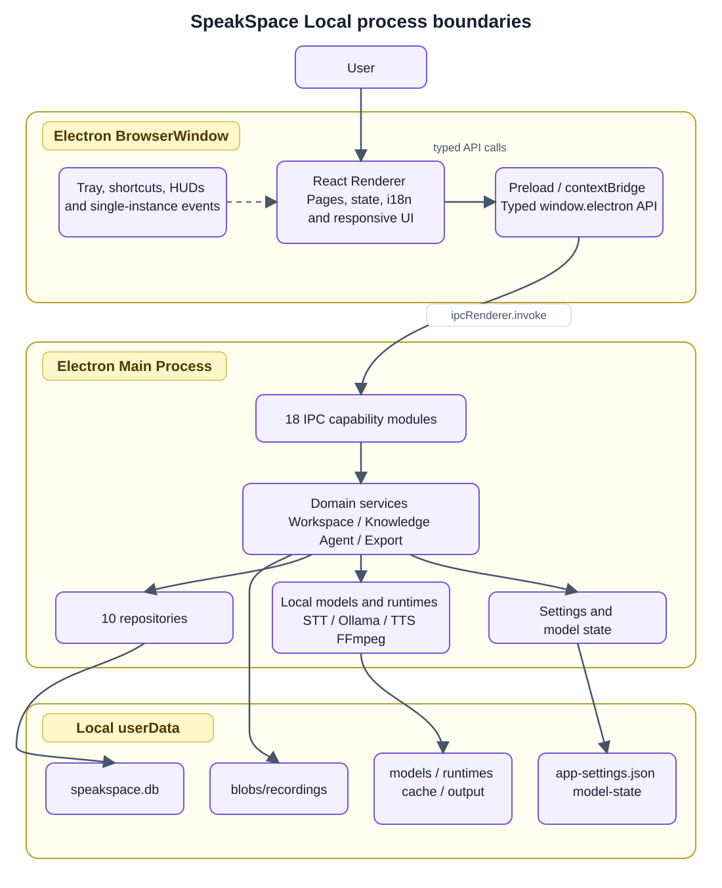
</p>
<p align="center"><em>Figure 4. SpeakSpace Local desktop process-boundary architecture.</em></p>

<p align="center">
  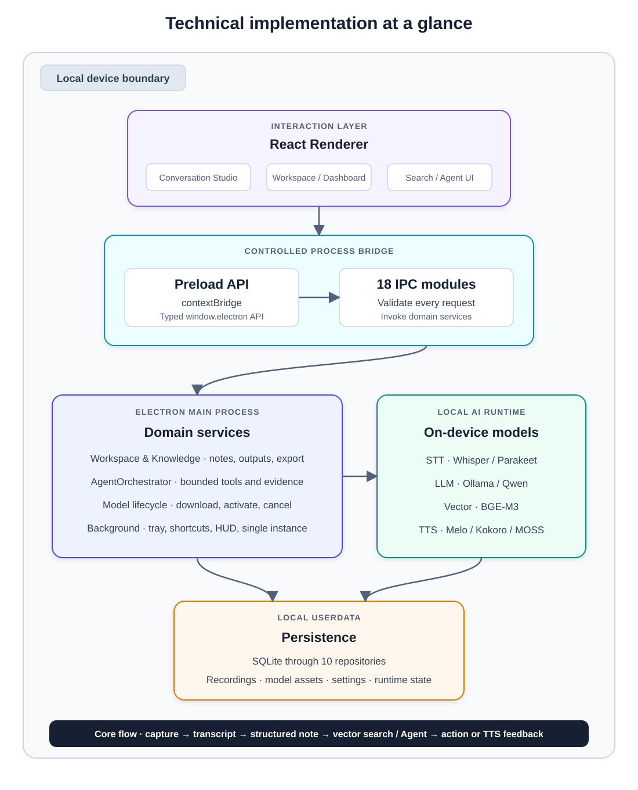
</p>
<p align="center"><em>Figure 5. Current desktop technical implementation overview.</em></p>

LetsVoice follows a separate mobile path. Expo Router screens and hooks consume services from the singleton `AppContainer`, which is the dependency-composition root rather than a UI step. Application services schedule exclusive local inference, while repositories own Expo SQLite persistence. Native audio combines the patched PCM-stream capture adapter with custom converter and PCM-player modules; session-event integration is Apple-only. Native projects are generated from the checked-in Expo configuration and `mobile/modules/`.

<p align="center">
  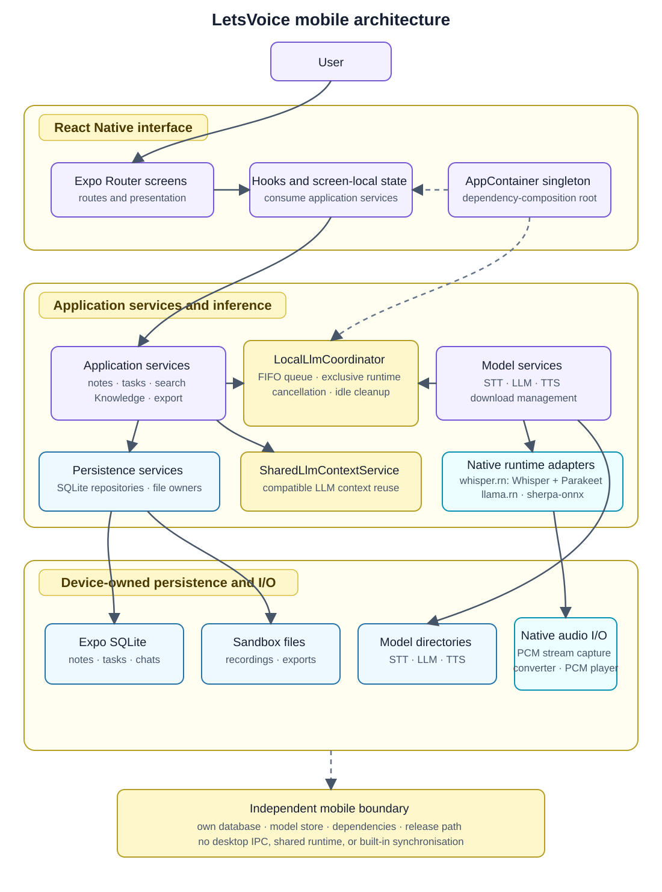
</p>
<p align="center"><em>Figure 6. LetsVoice mobile architecture and ownership boundaries.</em></p>

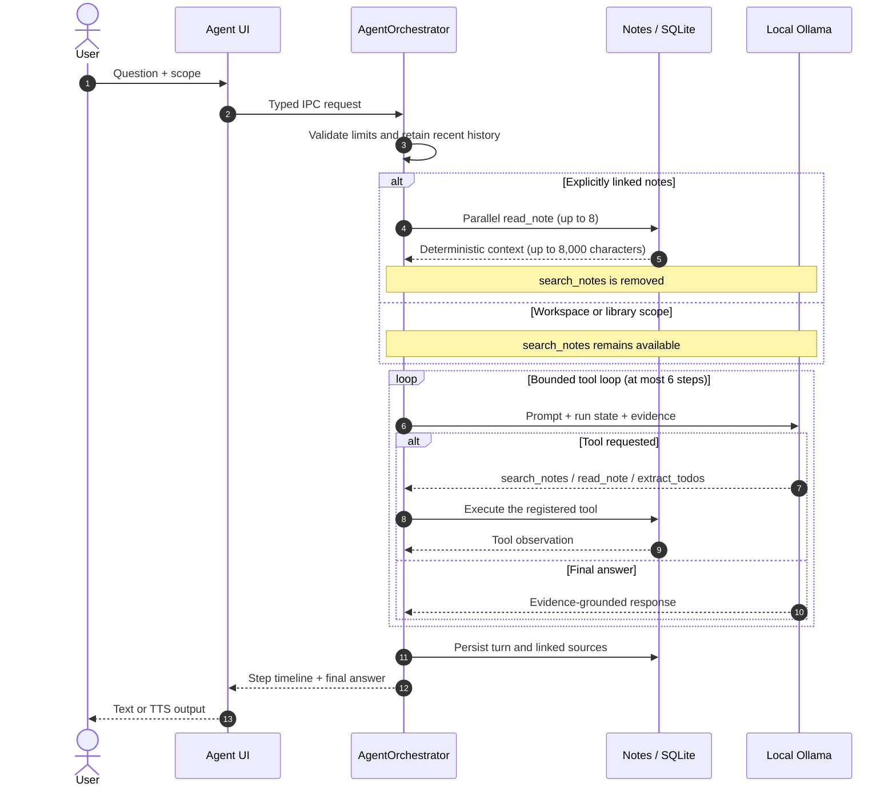
```mermaid
sequenceDiagram
  autonumber
  actor User
  participant UI as Agent UI
  participant Agent as AgentOrchestrator
  participant Data as Notes / SQLite
  participant LLM as Local Ollama

  User->>UI: Question + scope
  UI->>Agent: Typed IPC request
  Agent->>Agent: Validate limits and retain recent history

  alt Explicitly linked notes
    Agent->>Data: Parallel read_note (up to 8)
    Data-->>Agent: Deterministic context (up to 8,000 characters)
    Note over Agent,LLM: search_notes is removed
  else Workspace or library scope
    Note over Agent,LLM: search_notes remains available
  end

  loop Bounded tool loop (at most 6 steps)
    Agent->>LLM: Prompt + run state + evidence
    alt Tool requested
      LLM-->>Agent: search_notes / read_note / extract_todos
      Agent->>Data: Execute the registered tool
      Data-->>Agent: Tool observation
    else Final answer
      LLM-->>Agent: Evidence-grounded response
    end
  end

  Agent->>Data: Persist turn and linked sources
  Agent-->>UI: Step timeline + final answer
  UI-->>User: Text or TTS output
```

<p align="center"><em>Figure 7. Agent request sequence.</em></p>

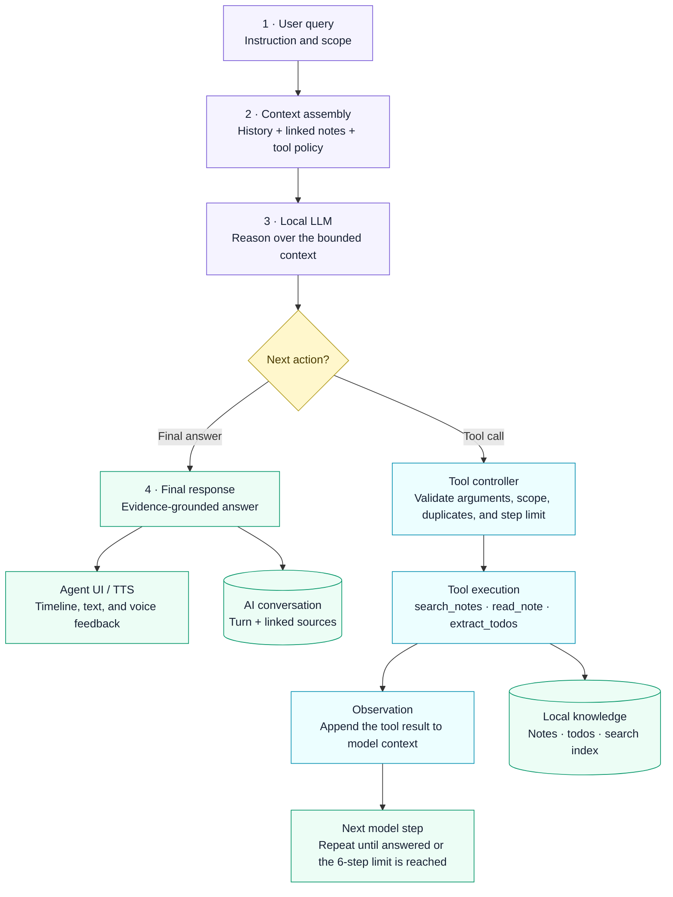
```mermaid
flowchart TB
  Query["1 · User query<br/>Instruction and scope"] --> Context["2 · Context assembly<br/>History + linked notes + tool policy"]
  Context --> LLM["3 · Local LLM<br/>Reason over the bounded context"]
  LLM --> Decision{"Next action?"}

  Decision -->|Final answer| Response["4 · Final response<br/>Evidence-grounded answer"]
  Response --> Delivery["Agent UI / TTS<br/>Timeline, text, and voice feedback"]
  Response --> History[("AI conversation<br/>Turn + linked sources")]

  Decision -->|Tool call| Controller
  Controller["Tool controller<br/>Validate arguments, scope, duplicates, and step limit"]
  Controller --> Tools["Tool execution<br/>search_notes · read_note · extract_todos"]
  Tools --> Observation["Observation<br/>Append the tool result to model context"]
  Observation --> Repeat["Next model step<br/>Repeat until answered or the 6-step limit is reached"]
  Tools --> Knowledge[("Local knowledge<br/>Notes · todos · search index")]

  classDef input fill:#f5f3ff,stroke:#7657d5,color:#172033
  classDef decision fill:#fff7cc,stroke:#b59f27,color:#4b3b00
  classDef tool fill:#ecfeff,stroke:#0891b2,color:#172033
  classDef result fill:#ecfdf5,stroke:#059669,color:#172033
  class Query,Context,LLM input
  class Decision decision
  class Controller,Tools,Observation tool
  class Response,Delivery,History,Repeat,Knowledge result
```

<p align="center"><em>Figure 8. Bounded Agent controller workflow.</em></p>

## Engineering challenges and achieved responses

| Challenge | Implemented response | Current boundary |
| --- | --- | --- |
| Keep privileged desktop resources away from the web UI | Typed preload bridge, validated IPC modules and main-process domain services | Electron isolation reduces exposure; it is not a formal security proof |
| Avoid losing a mobile recording when generation fails | Persist the Note and audio before starting foreground Structured Note generation | Recovery protects captured content, not every derived result |
| Prevent mobile STT, LLM and TTS work from contending for native resources | FIFO `LocalLlmCoordinator` with cancellation and idle cleanup; service-level deadlines where configured; separate `SharedLlmContextService` for compatible LLM reuse | Long work remains foreground-bound and device-sensitive |
| Finish mobile transcription without dropping queued audio | Drain queued slices and use a bounded full-audio Whisper fallback for short retained sessions | This does not provide speaker diarisation or universal accuracy |
| Stop mobile TTS immediately | Dedicated iOS and Android PCM players synchronously stop and flush playback | Listening quality has not been established by a human panel |
| Keep local AI actions inspectable and bounded | Scoped context, registered tools, argument checks, duplicate prevention and a six-step desktop Agent limit | Strong retrieval does not yet imply reliable Agent completion |
| Preserve two independently evolved applications in one repository | History-preserving mobile subtree with separate manifests, stores, tests and release paths | The applications do not synchronise data or share runtimes |

## Repository layout

```text
assets/             Desktop logo and platform assets
config/             Desktop model catalogs
docs/               Architecture, integration, evaluation, and acceptance documentation
mobile/             Independent LetsVoice app, native modules, tests, assets, and source history
scripts/            Desktop benchmarks, smoke tests, and integration checks
src/
├─ main/            Electron main process, IPC, persistence, models, and domain services
├─ renderer/        Desktop React pages, components, and styles
└─ shared/          Cross-process pure types and data contracts
.erb/               Electron React Boilerplate and Webpack tooling
release/
├─ app/             Desktop packaging manifest, native dependencies, and build output
├─ build/           Regenerable electron-builder output; not committed
└─ installers/      Local acceptance artifacts; not committed
```

See [Project Structure](docs/project-structure.md) and [AGENTS.md](AGENTS.md) for ownership and code-placement rules.

## Quick start

Clone the combined repository once:

```bash
git clone https://github.com/dhebhxh/speakspace-local-electron.git
cd speakspace-local-electron
```

### Desktop development

Use Node.js 22 and npm:

```bash
npm ci
npm start
```

`npm start` launches the Electron main process, preload, and Renderer development builds. If generated main-process output is absent before a Jest run, build it first with `npm run build:main`.

### Mobile development

Use Node.js 24 and run commands from the repository root:

```bash
npm run mobile:install
npm run mobile:start
```

LetsVoice includes custom native modules and cannot be validated completely in Expo Go. Create a native development build with `npm run mobile:ios` on macOS with Xcode, or `npm run mobile:android` with the Android SDK installed. The limited Web target is available through `npm run mobile:web`.

For device requirements and signing, use the [iPhone installation guide](mobile/docs/ios-local-install.md), [Windows + SideStore guide](mobile/docs/ios-sidestore-windows.md), and [physical-device acceptance checklist](mobile/docs/ios-device-acceptance.md).

## Commands

| Scope      | Command                              | Purpose                                                         |
| ---------- | ------------------------------------ | --------------------------------------------------------------- |
| Desktop    | `npm start`                          | Start the Electron development environment                      |
| Desktop    | `npm run build`                      | Build the main process and Renderer                             |
| Desktop    | `npm exec tsc -- --noEmit`           | Run desktop TypeScript checks                                   |
| Desktop    | `npm run lint`                       | Run desktop ESLint                                              |
| Desktop    | `npm test`                           | Run desktop Jest tests                                          |
| Desktop    | `npm run package`                    | Create an internal package for the current platform             |
| Desktop    | `npm run package:release`            | Run release naming and platform signing checks, then package    |
| Desktop    | `npm run bench -- --machine <label>` | Run and archive hardware-sensitive benchmarks                   |
| Mobile     | `npm run mobile:install`             | Install the locked mobile dependency tree and apply patches     |
| Mobile     | `npm run mobile:start`               | Start Expo / Metro                                              |
| Mobile     | `npm run mobile:ios`                 | Generate and run the iOS native project                         |
| Mobile     | `npm run mobile:android`             | Generate and run the Android native project                     |
| Mobile     | `npm run mobile:web`                 | Start the limited Web debugging target                          |
| Mobile     | `npm run mobile:test`                | Run mobile Node tests                                           |
| Mobile     | `npm run mobile:typecheck`           | Run mobile TypeScript checks                                    |
| Mobile     | `npm run mobile:lint`                | Run Expo / ESLint checks                                        |
| Repository | `npm run check:apps`                 | Verify that desktop and mobile build boundaries remain separate |

Root `npm test`, TypeScript, lint, and build commands check only the desktop application. The `mobile:*` commands execute inside `mobile/`.

## Validation status

The mobile subtree sync was validated on 2026-09-03 with Node.js 24.16.0 and npm 11.13.0:

| Check                  | Result                                                      |
| ---------------------- | ----------------------------------------------------------- |
| Source integrity       | 439 tracked mobile files and 111 reachable commits retained |
| Locked installation    | `npm ci` applied all seven postinstall patches              |
| Mobile tests           | 187 passed, 0 failed                                        |
| Mobile TypeScript      | Passed                                                      |
| Mobile ESLint          | 0 errors; 12 existing React Hook dependency warnings        |
| Application boundaries | 4 passed, 0 failed                                          |
| Whitespace check       | Passed                                                      |

The locked mobile dependency audit reported 18 moderate advisories and one high advisory. Dependencies were not upgraded during the source sync.

This validation does not replace Xcode or Android native compilation, signing, microphone, notification, model-download, and physical-device testing. The desktop implementation did not change in the compared range and remains covered by the separate Desktop CI workflow.

## Packaging and releases

### Desktop

`npm run package` creates an internal package whose filename is marked `internal-unsigned`. Windows uses NSIS, macOS uses electron-builder's default targets with a configured DMG layout, and Linux AppImage packaging is configured. Windows x64 is the most complete current desktop target; model/runtime setup and published artifacts can differ on macOS and Linux. A macOS release build requires a Developer ID certificate and notarisation credentials. A Windows release can proceed without CSC credentials, but the release check warns that the result will trigger SmartScreen.

Download published desktop builds from [speakspace-local-electron releases](https://github.com/dhebhxh/speakspace-local-electron/releases).

### Mobile

Native projects and release artifacts are generated and remain outside Git. The app has no iPad target and is not distributed through the App Store. A locally built iPhone app can be installed through Xcode; Android requires a native development or release build.

Mobile release assets remain in the original [speakspace-local-mobile releases](https://github.com/dhebhxh/speakspace-local-mobile/releases). The published `ios-v1.6.2` SideStore IPA was built from `218a6be`; it does not contain the post-release changes in source revision `0fd7903`. Build the synced source with Xcode or the Android SDK to test the new features. Do not uninstall LetsVoice merely to refresh or downgrade a SideStore build: uninstalling removes its local sandbox data.

## Evaluation evidence

Desktop evaluation covers TTS, STT, local LLM task extraction, embedding retrieval, and step-limited Agent behaviour. Reports include raw inputs, fixed development/holdout splits, reproducible charts, and hardware snapshots. These measurements describe the tested models, prompts, datasets, and machines; they are not universal rankings.

Start with the [testing and evaluation index](docs/testing/README.md), then read the [coverage and limitations ledger](docs/testing/test-coverage-gaps.md) before quoting results. Cross-machine collection is documented in the [benchmark guide](docs/testing/multi-machine-benchmark-guide.md), with generated results in the [cross-machine aggregate](docs/testing/cross-machine-benchmark.md).

Mobile's 187 deterministic tests verify application behaviour and native patch contracts. They do not measure model quality or replace device acceptance.

### Evidence at a glance

| Area | Current result | Evidence boundary |
| --- | --- | --- |
| STT | The scored read-speech aggregate for Whisper Small was 17.0% CER, with 0.45 RTF on the principal Windows machine. | 56 human recordings from one speaker; this is not an accent or population estimate. |
| Task extraction | The 32-case holdout reached 90.2% F1 and a 65.6% strict case-pass rate. | Inputs were clean text, so the result does not include upstream ASR errors. |
| Hybrid retrieval | Direct keyword and BGE-M3 retrieval reached 98.6% Recall@8 on 24 labelled queries over 80 notes. | The fixed corpus and queries are more controlled than natural workspace search. |
| Bounded Agent | The 45-task holdout reached 40.0% strict completion and 94.8% fact coverage. | High fact coverage did not remove weaknesses in evidence use, refusal, or clarification. |
| TTS | Kokoro, MeloTTS, and MOSS completed all 36 benchmark texts, with P95 RTF below 1 on the tested Windows machine. | The benchmark measures runtime and signal proxies, not human-perceived speech quality. |
| Mobile | 187 deterministic tests passed for the integrated source, while the earlier iOS release supplies native device evidence. | The later source still needs renewed iPhone acceptance; Android native build and device evidence remain open. |
| User evaluation | The bilingual desktop questionnaire is documented in the dissertation appendix. | No aggregate score is claimed here because an auditable anonymous primary-response export is not included in the repository. |

<p align="center">
  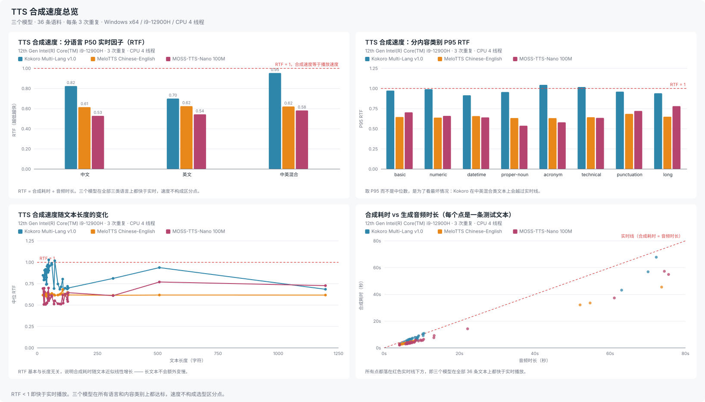
</p>
<p align="center"><em>Figure 9. TTS synthesis speed across the tested engines.</em></p>

<p align="center">
  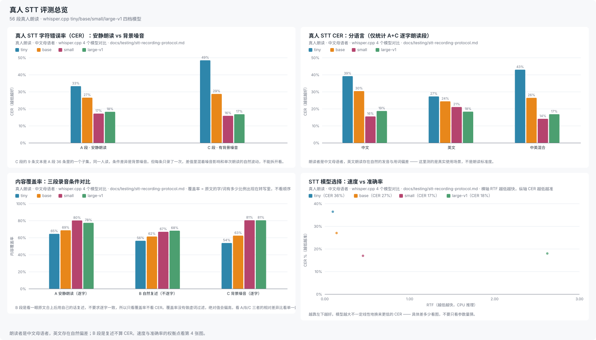
</p>
<p align="center"><em>Figure 10. STT evaluation on human recordings.</em></p>

<p align="center">
  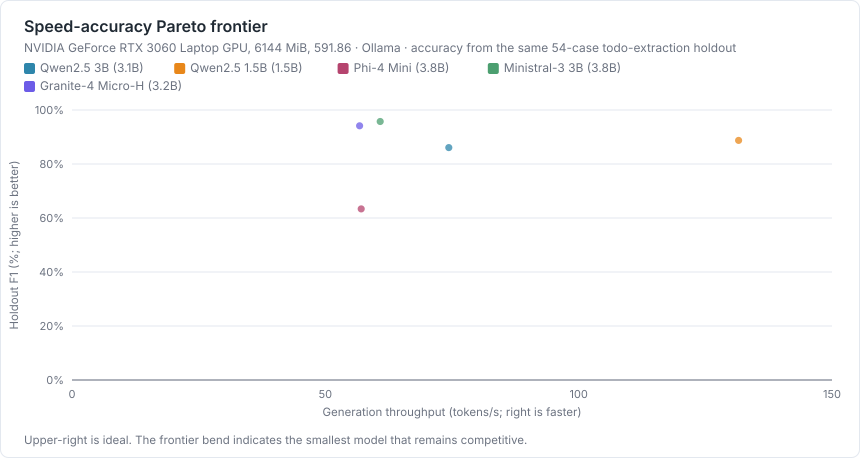
</p>
<p align="center"><em>Figure 11. Local LLM accuracy and speed trade-off.</em></p>

<p align="center">
  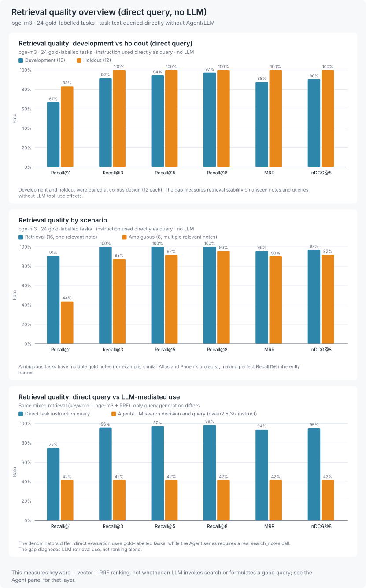
</p>
<p align="center"><em>Figure 12. Embedding-based hybrid retrieval evaluation.</em></p>

<p align="center">
  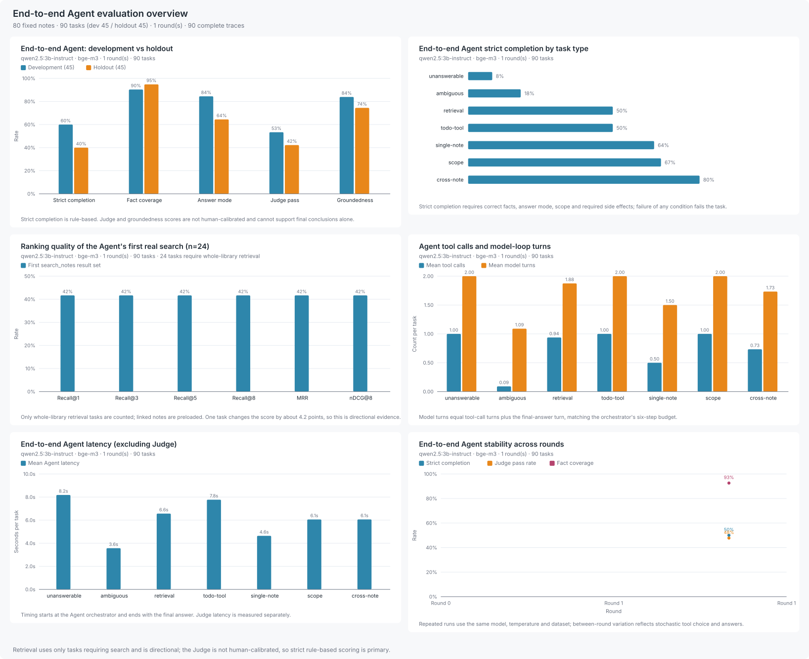
</p>
<p align="center"><em>Figure 13. Agent end-to-end evaluation.</em></p>

<p align="center">
  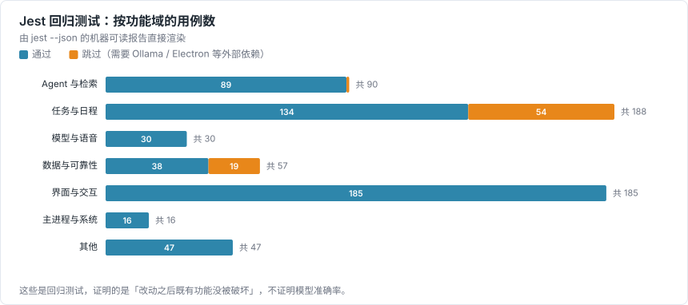
</p>
<p align="center"><em>Figure 14. Jest regression coverage by feature area.</em></p>

## Team contributions

The areas below were reconstructed from the Git histories of the desktop and mobile repositories. They describe traceable activity, not relative workload: commit totals, merge counts, generated artefacts and lines changed are not contribution measures. The 111 mobile commits imported through the subtree are counted once; the later standalone README-only commit `d472f39` is considered separately. The available desktop clone is shallow before `1ee9103`, so earlier activity may be absent. Bot identities are excluded; AI co-author trailers remain visible in the underlying history.

Only three mappings to dissertation authors are directly supported by local Git evidence: `Fan` / `dhebhxh` is Fan Lin, `Yanqing` / `Yanqing797` / `QiaoNimo` is Yanqing Peng, and `Wenlei Miao` is an exact-name match. Other identities remain account-based until the team confirms their mapping.

| Git identity | Evidence-based contribution areas | Representative commits |
| --- | --- | --- |
| `37300112` | Desktop workspace and service refactoring; managed models and runtimes; audio import; Whisper and Parakeet STT; local conversations; Structured Notes and Knowledge; TTS; semantic retrieval; bounded Agent; evaluation diagrams | `c0be796`, `23a9f48`, `9351f52`, `e252250` |
| `Greta` | Early desktop recording, persistence and IPC; mobile SQLite/repository foundations, workspaces, STT, LLM/TTS management, knowledge, tasks, dashboard, streaming, cancellation, playback, localisation and repository documentation | `3d987a5`, `8f1d0ec`, `fab903a`, `d8ca504`, `d472f39` |
| `Jack8ot` | Desktop dashboard, UI consolidation, export and multi-note workflows; mobile grounded-AI/calendar improvements, import feedback and note/task controls; subtree integration, tooling and repository documentation | `06d4aad`, `47d8626`, `40cc114`, `00c7ada` |
| `Fan` / `dhebhxh` (Fan Lin) | Desktop localisation and Studio; runtime/model/hardware management; Agent, Ask AI and task-extraction reliability; concurrent model operations; reproducible evaluation, benchmark automation and cross-machine evidence | `11aff94`, `b8ff539`, `f308695`, `65bf353` |
| `Yanqing` / `Yanqing797` / `QiaoNimo` (Yanqing Peng) | Desktop selectable TTS, TTS benchmark, Trash and Apple M2 evidence; iOS audio preparation, local AI, device/release evidence, SideStore packaging, tasks, search, TTS resume, notifications, PDF export and safety controls | `c9aa9f3`, `45c3e53`, `dc773e0`, `d10829c` |
| `Wenlei Miao` | Feature-branch and pull-request integration across desktop workflow and mobile LLM, knowledge, upload, dashboard, task and model-recommendation streams; available records are merge commits and do not establish authorship of every merged line | `f328b05`, `3235552`, `bf8f3a3` |
| `Gigi` | Initial desktop Ask AI backend/page work and responsive layout fixes recorded on the Ask AI feature branch; reachability from the shallow local copy of current `main` is not independently established | `d3c7fa8`, `55eab6c`, `e7a903b` |
| `Ranto11` / `Rannto11` | Desktop real-time transcription, semantic summary, audio upload and workspace saving; initial iOS setup and grounded mobile Ask AI compatibility | `0aba234`, `39b4546`, `4dd6e0c` |

## Mobile source updates

The mobile history is preserved with a non-squashed Git subtree. Future reviewed updates use a clean working tree:

```bash
git subtree pull --prefix=mobile https://github.com/dhebhxh/speakspace-local-mobile.git main
```

Resolve any conflicts and preserve the documented `typecheck` and nested static-check adjustments. Then reinstall the locked mobile dependencies and run the integration checks:

```bash
npm run check:apps
npm run mobile:install
npm run mobile:test
npm run mobile:typecheck
npm run mobile:lint
```

Do not copy a local mobile working directory over `mobile/`; doing so would mix uncommitted files into the integration and lose source provenance.

## Documentation

- [Documentation index](docs/README.md)
- [Desktop project structure and process boundaries](docs/project-structure.md)
- [Desktop/mobile integration and source provenance](docs/mobile-integration.md)
- [Mobile README and iPhone installation](mobile/README.md)
- [Mobile changelog](mobile/CHANGELOG.md)
- [Testing and evaluation](docs/testing/README.md)
- [Cross-platform manual acceptance](docs/testing/manual-acceptance.md)
- [Detailed development logs](docs/changelog/)

## License

The desktop application is released under the root [MIT License](LICENSE). The imported mobile application retains its own [MIT notice](mobile/LICENSE), and bundled source components retain their applicable notices, including [audio-converter](mobile/modules/audio-converter/LICENSE).

SpeakSpace Local builds on the [Electron React Boilerplate](https://github.com/electron-react-boilerplate/electron-react-boilerplate) engineering stack. Product behaviour, data models, local AI workflows, and mobile integration are maintained by this project.
