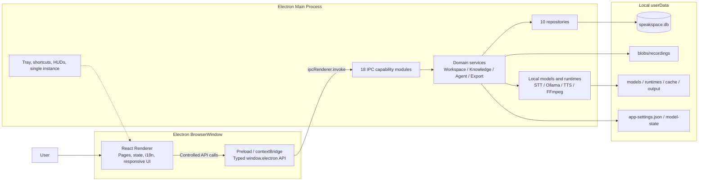
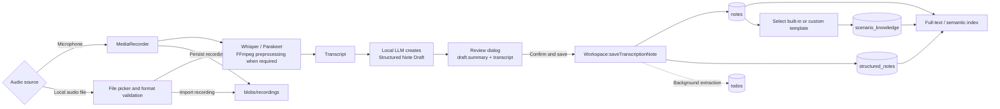

<p align="center">
  <strong>English</strong> · <a href="README.zh-CN.md">简体中文</a>
</p>

<p align="center">
  
</p>

<h1 align="center">SpeakSpace Local</h1>

<p align="center">
  Local-first voice notes and knowledge workspace
  <br />
  本地优先的语音笔记与知识工作台
</p>

<p align="center">
  <a href="https://github.com/dhebhxh/speakspace-local-electron/actions/workflows/test.yml">
    
  </a>
  <a href="https://github.com/dhebhxh/speakspace-local-electron/actions/workflows/codeql-analysis.yml">
    
  </a>
  <a href="LICENSE">
    
  </a>
  
</p>

<p align="center">
  
  
  
  
  
  
  
</p>

SpeakSpace Local is an Electron desktop application that brings recording, audio import, offline transcription, structured notes, scenario knowledge, full-text and semantic search, local AI conversations, and speech playback into one workspace.

“Local” means that inference and the user's knowledge base run on the user's computer. The database, recordings, and application-managed models live under Electron's `userData` directory. Models are neither committed to Git nor bundled with the installer; users download the runtimes and models they need from Model Management.

## Feature map

| Area | User-facing capabilities | Primary implementation |
| --- | --- | --- |
| Conversation Studio | Record, import audio, transcribe live, review, and save notes | `StudioPage`, `MediaRecorder`, STT IPC |
| Dashboard | Metrics, calendar, tasks, pinned items, and note classification | `DashboardService`, `TodoExtractionService` |
| Workspaces | Complete note details, full-text/semantic search, bulk actions, Word/PDF export | `WorkspaceService`, `SemanticNoteService`, `ExportService` |
| Structured Notes | Summary, key points, tasks, reminders, and calendar intents | `KnowledgeGenerationService` |
| Scenario Knowledge | Built-in templates such as Meeting and Lecture, plus locally normalized custom templates | `KnowledgeScenarios`, `KnowledgeTemplateNormalizer` |
| Ask AI | Ask questions across one note, multiple notes, or a workspace and persist the conversation | `AskAIService` |
| Agent | Bounded tool loop, explicit linked notes, search/read/task extraction | `AgentOrchestrator` |
| Model Management | Download, activate, inspect, and remove STT, LLM, and TTS models | `AI-module/`, `runtime/` |
| Settings and background | Languages, theme, font size, shortcuts, tray, lightweight HUDs, and Trash | `SettingsService`, `BackgroundController`, `TrashService` |

## System architecture



### Process boundaries

| Layer | Responsibilities | Must not |
| --- | --- | --- |
| `src/renderer/` | React UI, routing, interaction, and presentation state | Access `fs`, SQLite, model processes, or import `src/main/` directly |
| `src/main/preload.ts` | Expose a minimal, typed API through `contextBridge` | Contain domain logic or render UI |
| `src/main/ipc/` | Validate cross-process input and call domain services | Duplicate repository or model logic inside handlers |
| `src/main/<domain>/` | Persistence, model inference, file access, and process control | Return class instances that cannot be structured-cloned |
| `src/shared/` | Pure types, entities, and data contracts shared across processes | Depend on Electron, Node.js, or the DOM |

Direct Renderer imports from the main process are prohibited and enforced through ESLint's `no-restricted-imports` rule.

## From recording to knowledge

After transcription completes, the application does not generate a separate summary and then repeat the same work for a structured note. It performs one structured extraction. The review dialog displays the draft's `summary`, and saving binds that draft to the real `noteId` before persisting it.



Key invariants:

- Even a short transcript with little semantic content receives a usable structured fallback.
- A structured draft is required before save, so a newly created note does not need a second manual generation step.
- Scenario Knowledge is an optional second extraction layer and is stored separately from the general Structured Note.
- A failed recording save cannot leave a database record pointing to a nonexistent audio file.

## Data storage

### userData layout

```text
<Electron userData>/
├─ speakspace.db              # Primary SQLite database
├─ app-settings.json          # Language, theme, shortcuts, background, Agent settings
├─ model-state/
│  ├─ stt.json
│  ├─ llm.json
│  └─ tts.json                # Active model selections
├─ blobs/
│  └─ recordings/             # Saved and imported recordings
├─ models/{stt,llm,tts}/      # Application-managed models
├─ runtimes/{stt,llm,tts}/    # Portable runtimes and manifests
├─ cache/{stt,llm,tts}/       # Download and extraction cache
└─ output/{stt,llm,tts}/      # Temporary inference output
```

`ManagedPaths` validates write and delete targets against the `userData` boundary. System-installed or user-managed runtimes are never removed by the application.

### SQLite relationship model


Workspaces, notes, AI conversations, and custom templates use `trashed_at` for soft deletion. Physical deletion and cascading cleanup occur only through “Delete permanently” inside Trash.

## Search and export coverage

The search index combines note titles, transcripts, and all visible related text. Structured JSON is flattened into user-visible strings before indexing instead of being searched only as raw JSON.

| Content | Full-text / semantic search | Word/PDF export |
| --- | :---: | :---: |
| Title, workspace, category, and timestamps | ✓ | ✓ |
| Original transcript and audio file name | ✓ | ✓ |
| Structured summary, key points, tasks, reminders, and calendar intents | ✓ | ✓ |
| Scenario Knowledge | ✓ | ✓ |
| Subnotes and legacy Knowledge Outputs | ✓ | ✓ |
| Tasks and their completion/pinned state | ✓ | ✓ |
| Linked AI conversations and messages | ✓ | ✓ |

Semantic search caches vectors in `note_embeddings` and uses `content_hash` to determine whether an embedding must be regenerated. Keyword matches and vector results can both contribute to ranking.

## Agent workflow

Ask AI is designed for question answering over a fixed scope. Agent mode lets the local model call tools within a bounded loop. When users link notes explicitly, those notes are loaded deterministically before the first inference step, and `search_notes` is removed from the available tool set so the model cannot ignore the requested scope.

```mermaid
sequenceDiagram
  actor User
  participant UI as Agent UI
  participant Agent as AgentOrchestrator
  participant DB as SQLite / Note Tools
  participant LLM as Local Ollama
  participant History as AI Conversation

  User->>UI: Question + workspaceId + linkedNoteIds
  UI->>Agent: IPC request
  Agent->>Agent: Validate, limit, deduplicate, retain recent history

  alt Explicitly linked notes
    Agent->>DB: Parallel read_note (up to 8 notes)
    DB-->>Agent: Deterministic context, up to 8000 characters
    Note over Agent: search_notes is removed
  else No linked notes
    Note over Agent: search_notes may inspect a workspace or the full library
  end

  loop At most 6 steps
    Agent->>LLM: System prompt + run state + collected evidence
    alt Model requests a tool
      LLM-->>Agent: search_notes / read_note / extract_todos
      Agent->>DB: Execute a registered tool
      DB-->>Agent: Tool result
    else Model returns an answer
      LLM-->>Agent: final
    end
  end

  Note over Agent: Duplicate calls are short-circuited; tools are removed on the final step
  Agent->>History: Persist the turn and linked sources
  Agent-->>UI: Step timeline + final answer
```

Code-level Agent bounds:

| Item | Current limit |
| --- | ---: |
| User instruction | 4,000 characters |
| Conversation history | Latest 12 messages, up to 4,000 characters each |
| Explicitly linked notes | Up to 8 |
| Linked-note context | About 8,000 characters total |
| Tool loop | Up to 6 steps |
| Registered tools | `search_notes`, `read_note`, `extract_todos` |

## Local model stack

| Capability | Runtime | Notes |
| --- | --- | --- |
| STT | Whisper CLI / Parakeet ONNX | Audio transcription; FFmpeg handles required format preprocessing |
| LLM | Local Ollama | Structured Notes, Scenario Knowledge, Ask AI, Agent, classification, and task extraction |
| Embedding | Ollama Embedding | Semantic search; vectors and content hashes are stored in SQLite |
| TTS | Kokoro / MeloTTS / MOSS-TTS-Nano | Main-process inference with pipelined playback in the Renderer |
| Runtime management | Application-managed or system-installed | Main process is authoritative for readiness; Renderer does not infer file state |

### TTS benchmark snapshot

The following medians were measured on 2026-08-13 on an Apple M4 using CPU inference with three repetitions per text. An RTF below 1 means synthesis is faster than real-time playback.

| Model | Load time | Peak RSS | Mean median RTF | Result |
| --- | ---: | ---: | ---: | --- |
| Kokoro | 1.260 s | 779.8 MiB | 0.978 | Real-time for Chinese/English; slower for mixed text |
| MeloTTS | 1.344 s | 663.5 MiB | 0.652 | Real-time for all three text categories |
| MOSS-TTS-Nano | 4.024 s | 1,248.2 MiB | 0.529 | Fastest, with the highest load time and memory use |

See the [full TTS benchmark](docs/testing/tts-model-benchmark-2026-08-13.md) for the method, per-text results, CER proxy measurements, and platform limitations. Runtime compatibility with Windows is not equivalent to a Windows hardware benchmark.

## Engineering snapshot

Source metrics for the 2026-08-23 working tree:

| Metric | Count |
| --- | ---: |
| TypeScript / TSX / JavaScript / JSX source files | 388 |
| Main-process files | 190 |
| Renderer files | 135 |
| Shared files | 21 |
| Test files | 67 |
| IPC capability modules | 18 |
| SQLite tables | 12 |
| Concrete repositories | 10 |

Latest complete quality gate:

| Check | Result |
| --- | --- |
| TypeScript | Passed |
| ESLint | 0 errors, 29 existing warnings |
| Webpack main / renderer build | Passed |
| Jest | 64 suites passed, 3 skipped; 535 tests passed, 42 skipped |
| Production dependency audit | 0 vulnerabilities |
| Windows NSIS installer | Generated and SHA-256 verified; not yet code-signed |

These values are a verification snapshot rather than dynamic badges and should be updated when the implementation changes.

## Repository structure

```text
assets/             Product logo and platform icons
config/             LLM / STT model catalogs
docs/               Documentation index, test reports, changelogs, and archive
scripts/            Benchmarks, smoke tests, and development helpers
src/
├─ main/            Electron main process, IPC, database, models, domain services
├─ renderer/        React pages, layout, interactions, and styles
└─ shared/          Cross-process pure types, entities, and data contracts
.erb/               Electron React Boilerplate / Webpack engineering scripts
release/
├─ app/             Packaging package.json, native dependencies, build output
├─ build/           Reproducible electron-builder output; not committed
└─ installers/      Locally accepted installers; not committed
```

See [Project Structure](docs/project-structure.md) and [AGENTS.md](AGENTS.md) for detailed ownership and code-placement rules.

## Local development

Node.js 22 and npm are recommended.

```bash
git clone https://github.com/dhebhxh/speakspace-local-electron.git
cd speakspace-local-electron
npm install
npm start
```

`npm start` launches development builds for the Electron main process, preload, and Renderer. For generic Electron React Boilerplate environment issues, see its [installation guide](https://electron-react-boilerplate.js.org/docs/installation).

### Common commands

| Command | Purpose |
| --- | --- |
| `npm start` | Start the development environment |
| `npm run build` | Build main and renderer |
| `npm exec tsc -- --noEmit` | Run TypeScript checks |
| `npm run lint` | Run ESLint |
| `npm test` | Run Jest |
| `npm run test:trash:electron` | Validate Trash database behavior with the Electron ABI |
| `npm run smoke:tts` | Run the TTS runtime smoke test |
| `npm run check:audit` | Audit production dependencies only |
| `npm run package` | Create an internal build for the current platform |
| `npm run package:release` | Create a release-named build with signing gates |

## Packaging and release

Windows packages use an NSIS installer. Models are downloaded on demand after installation and are not included in the installer.

```bash
npm run package
```

- Temporary build output: `release/build/`
- Locally accepted installers: `release/installers/`
- Neither directory is committed to Git.
- Windows or macOS code-signing credentials are required before public distribution.
- `npm run package:release` runs the release signing gate first.

## Documentation

See [docs/README.md](docs/README.md) for the complete index.

- [Project structure and process boundaries](docs/project-structure.md)
- [Task extraction test cases](docs/testing/task-extraction-cases.md)
- [TTS model benchmark](docs/testing/tts-model-benchmark-2026-08-13.md)
- [TTS platform build notes](docs/testing/tts-platform-builds.md)
- [Windows TTS manual acceptance](docs/testing/tts-windows-manual.md)
- [Detailed development logs](docs/changelog/)
- [Historical migration archive](docs/archive/legacy-merge-inventory.md)
- [Contributor Code of Conduct](.github/CODE_OF_CONDUCT.md)

## Electron React Boilerplate

This project is built on the [Electron React Boilerplate](https://github.com/electron-react-boilerplate/electron-react-boilerplate) engineering foundation and continues to use Electron, React, React Router, Webpack, and React Fast Refresh.

- [Electron React Boilerplate documentation](https://electron-react-boilerplate.js.org/docs/installation)
- [Electron documentation](https://www.electronjs.org/docs/latest/)

SpeakSpace Local's product functionality, interface, data model, and local AI workflows are maintained independently by this project.

## License

This project is licensed under the [MIT License](LICENSE). Upstream copyright belongs to the contributors of [Electron React Boilerplate](https://github.com/electron-react-boilerplate/electron-react-boilerplate).
