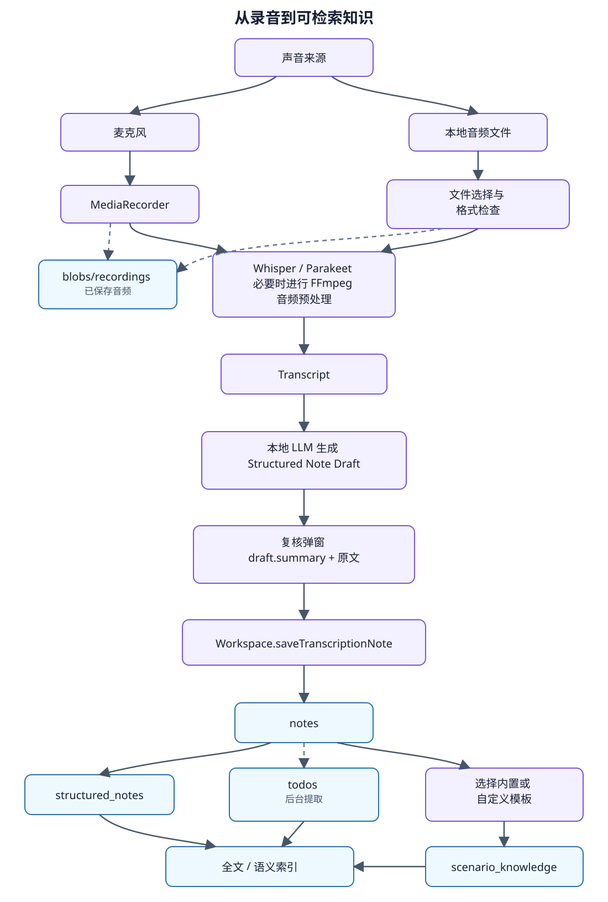
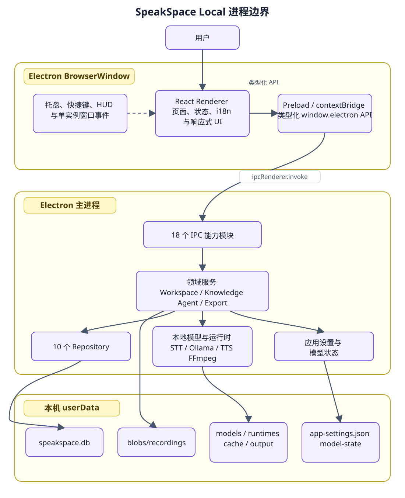
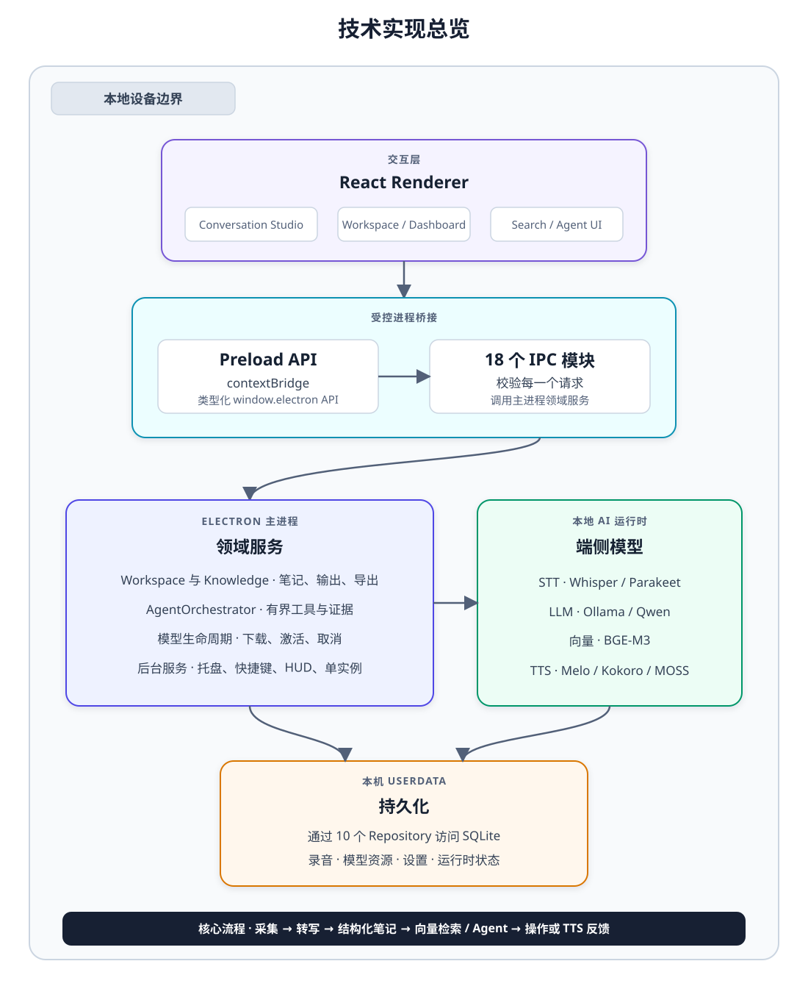
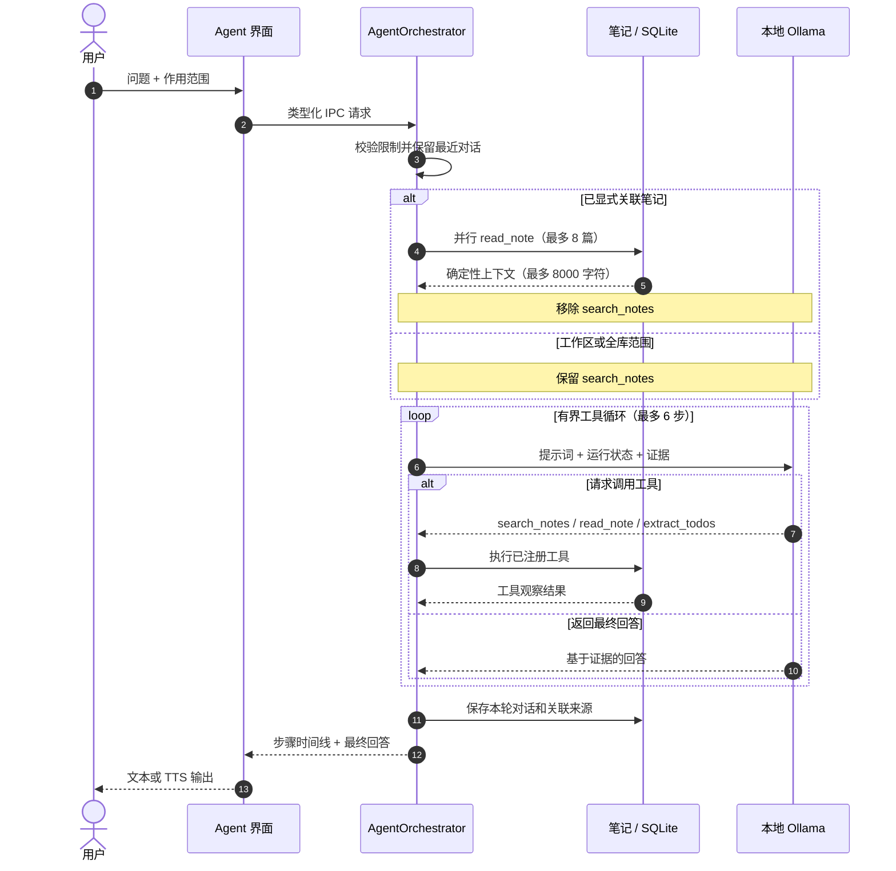
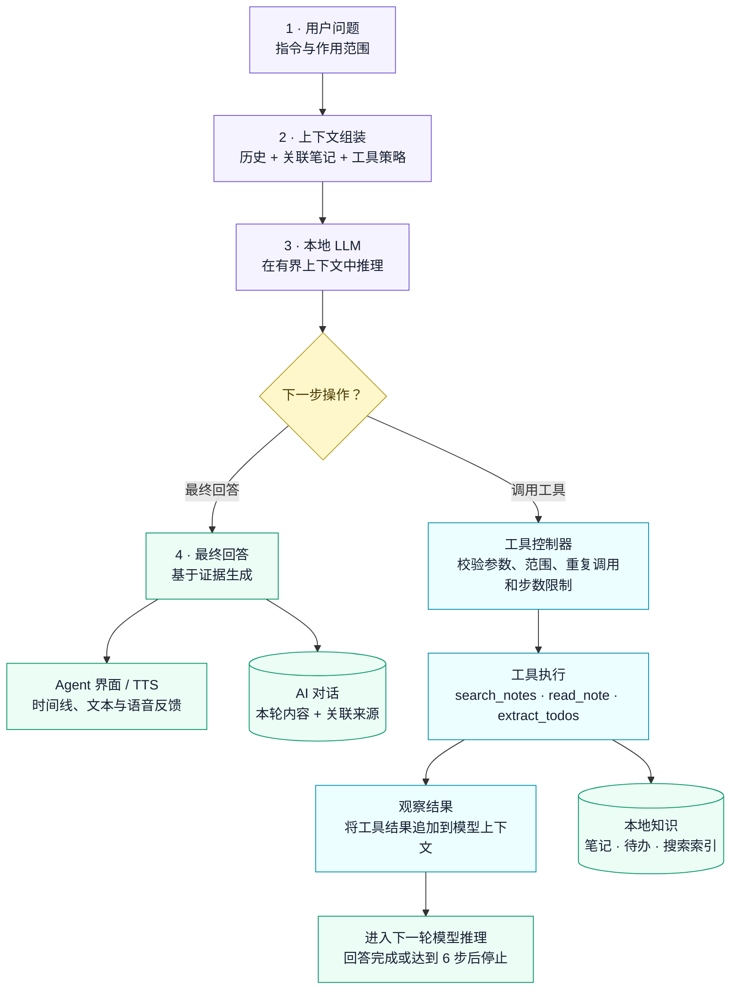

<p align="center">
  <a href="README.md">English</a> · <strong>简体中文</strong>
</p>

<p align="center">
  
</p>

<h1 align="center">SpeakSpace Local</h1>

<p align="center">
  面向桌面与移动设备的本地优先语音智能应用
</p>

<p align="center">
  <a href="https://github.com/dhebhxh/speakspace-local-electron/actions/workflows/test.yml">
    
  </a>
  <a href="https://github.com/dhebhxh/speakspace-local-electron/actions/workflows/mobile.yml">
    
  </a>
  <a href="https://github.com/dhebhxh/speakspace-local-electron/actions/workflows/codeql-analysis.yml">
    
  </a>
  <a href="LICENSE">
    
  </a>
</p>

<p align="center">
  
  
  
  
  
</p>

<p align="center">
  <a href="https://github.com/dhebhxh/speakspace-local-electron/releases"><strong>桌面端下载</strong></a>
  ·
  <a href="mobile/README.md"><strong>移动端安装</strong></a>
  ·
  <a href="docs/README.md"><strong>文档导航</strong></a>
</p>

本仓库包含两套独立构建的本地优先应用。**SpeakSpace Local** 是位于仓库根目录的 Electron 桌面工作台；**LetsVoice** 是位于 `mobile/` 的 Expo / React Native 应用。两端都围绕语音、可检索笔记和本地 AI 工作流展开，但它们不是同一个安装包，也不共享一套同步数据库。

## 两套应用，一个仓库

| 应用                    | 位置       | 技术栈                                       | 运行环境                                         |
| ----------------------- | ---------- | -------------------------------------------- | ------------------------------------------------ |
| SpeakSpace Local 桌面端 | 仓库根目录 | Electron 35、React 19、TypeScript 5.8        | Windows 是主要目标；另有 macOS 与 Linux 打包配置 |
| LetsVoice 移动端        | `mobile/`  | Expo SDK 57、React Native 0.86、TypeScript 6 | Android 手机与 iPhone；iOS 16.4 或更高版本       |

两端各自拥有独立的 `package.json`、锁文件、依赖、数据存储、模型目录、测试、构建和发布流程。本仓库不是 npm workspace，两端也不直接导入对方的运行时代码。

移动端的用户可见品牌是 **LetsVoice**。仓库 slug、iOS Bundle ID、Android package ID、URL scheme 和数据库文件名等技术标识继续保留旧名称，避免破坏链接、现有安装和本地数据。

## 当前移动端实现

LetsVoice 已经是可运行的移动端实现，不再只是未来扩展。其核心成果是一条适合手机的“先保存、后生成”语音流程，并拥有独立的数据与原生运行时边界：

- 录音与导入音频共用可选择语言的设备端转写；
- 转写和音频先保存，之后才启动可选的 Structured Note 生成；
- 本地推理由可取消的协调器串行执行，兼容 LLM 上下文由独立服务复用；
- Structured Note 与 Knowledge 流式显示，Ask AI 只读取用户选定的本地笔记；
- 原生录音、转换和 PCM 播放集成负责平台相关的音频行为；会话事件集成仅适用于 Apple 平台；
- 笔记、任务、工作空间、搜索、PDF 导出、iPhone 任务通知与回收站均不依赖桌面端存储。

模型获取仍需网络，耗时推理仍要求应用保持前台。两端没有内置同步，不共享数据库，也不宣称功能完全一致。

当前移动端来源提交为 `0fd7903`，通过保留历史的 subtree merge `006dcf1` 进入本仓库，保留 439 个已追踪文件与 111 个可达移动端提交。详细来源与整合专用差异见[移动端整合说明](docs/mobile-integration.md)。

## 功能概览

### SpeakSpace Local 桌面端

- 录制现场音频或导入文件，在本机完成转写、复核并保存为笔记。
- 使用本地 LLM 生成 Structured Note、任务与日程意图、分类，以及基于模板的 Scenario Knowledge。
- 对标题、转写、附属知识、任务和 AI 会话执行全文与语义检索。
- 针对单篇笔记、多篇笔记或一个工作空间使用 Ask AI；Agent 模式提供有步数上限的搜索、阅读和任务提取工具循环。
- 使用工作空间整理笔记、置顶重要内容、通过回收站安全删除，并将完整笔记导出为 Word 或 PDF。
- 下载和管理 STT、LLM、Embedding 与 TTS 模型及其本地运行时；模型不会进入 Git 或桌面安装包。

<p align="center">
  
</p>
<p align="center"><em>图 1：桌面端从录音到知识的处理流程。</em></p>

### LetsVoice 移动端

- 录制或导入最长两小时的 WAV、MP3、M4A、AAC 或 FLAC 音频，并直接在设备上转写。
- 使用多语言 Whisper 或只支持英文的 Parakeet；显式指定语言可以改善短录音的识别准确度。
- 在本地管理笔记与工作空间，对笔记标题和正文执行模糊文本搜索，置顶笔记和任务、在 iPhone 上安排本地任务通知，并从回收站恢复内容。
- 流式生成 Structured Note 和模板化 Knowledge，翻译已保存的笔记分区，并按单篇笔记导出 PDF。
- 针对本地笔记上下文使用 Ask AI，并通过下载到设备上的语音模型朗读。
- 从 AI 页面下载 STT、LLM 和 TTS 模型；大文件操作会检查可用空间，并要求应用保持在前台。

移动端界面目前以英文为主。多语言转写、内容处理和语音能力不代表界面已经完成多语言翻译。

<p align="center">
  
</p>
<p align="center"><em>图 2：LetsVoice 先保存、后生成的移动端技术路线。</em></p>

## 产品界面

以下为依据当前源码还原的界面预览，内容均为示例本地数据，并沿用现有画面结构与措辞。原生控件细节可能因操作系统略有不同。

### SpeakSpace Local 桌面端

<p align="center">
  
</p>
<p align="center"><sub><strong>Studio</strong> — 录音、关联笔记与本地问答。</sub></p>

<p align="center">
  
</p>
<p align="center"><sub><strong>仪表板</strong> — 笔记、指标与行动事项。</sub></p>

<p align="center">
  
</p>
<p align="center"><sub><strong>工作空间</strong> — 整理本地知识。</sub></p>

<p align="center">
  
</p>
<p align="center"><sub><strong>模型管理</strong> — 已配置本地环境示例。</sub></p>

### LetsVoice 移动端

<table>
  <tr>
    <td width="50%" align="center">
      
      <br />
      <sub><strong>首页</strong><br />录制或导入音频</sub>
    </td>
    <td width="50%" align="center">
      
      <br />
      <sub><strong>资料库</strong><br />搜索笔记与工作空间</sub>
    </td>
  </tr>
  <tr>
    <td width="50%" align="center">
      
      <br />
      <sub><strong>笔记详情</strong><br />复核及处理转写</sub>
    </td>
    <td width="50%" align="center">
      
      <br />
      <sub><strong>AI 管理</strong><br />管理设备端模型</sub>
    </td>
  </tr>
</table>

## 本地优先的数据边界

用户数据始终保存在本机或移动设备上。安装所需模型后，核心 STT、LLM 和 TTS 推理也会在本地执行。下载模型仍然需要网络。

- 桌面端数据位于 Electron `userData`，包括 `speakspace.db`、录音、设置、模型、运行时和推理缓存。
- 移动端数据位于操作系统分配的应用沙盒，包括 SQLite 数据、录音、聊天、偏好设置和已下载模型。
- 两端没有内置的跨设备同步或数据库迁移流程。用户主动执行的导出只会生成支持的文档或分享格式，不能完整迁移到另一端。
- 模型不提交到 Git，也不随任一安装包分发。
- 笔记、工作空间、AI 会话和自定义 Knowledge 模板会先进入回收站，再执行永久删除。临时内容、已安装模型和单条 Knowledge 结果使用各自明确的移除流程。

<p align="center">
  
</p>
<p align="center"><em>图 3：桌面端 SQLite 关系模型。</em></p>

## 架构

桌面端严格区分 Electron 进程边界：

| 层级                  | 职责                                                       |
| --------------------- | ---------------------------------------------------------- |
| `src/renderer/`       | React 界面与展示状态，不直接访问文件系统、数据库或模型进程 |
| `src/main/preload.ts` | 通过 `contextBridge` 暴露精简的类型化接口                  |
| `src/main/ipc/`       | 校验跨进程输入并调用领域服务                               |
| `src/main/<domain>/`  | SQLite、文件、模型、推理与操作系统集成                     |
| `src/shared/`         | 跨进程共享的纯类型和数据契约                               |

<p align="center">
  
</p>
<p align="center"><em>图 4：SpeakSpace Local 桌面端进程边界架构。</em></p>

<p align="center">
  
</p>
<p align="center"><em>图 5：当前桌面端技术实现概览。</em></p>

LetsVoice 使用独立的移动端调用链。Expo Router 页面与 hooks 消费单例 `AppContainer` 提供的服务；`AppContainer` 是依赖组合根，而不是用户操作流程中的一步。应用服务排他调度本地推理，Repository 负责 Expo SQLite 持久化。原生音频由打过补丁的 PCM-stream 录音适配器、自定义转换/PCM 播放模块共同完成；会话事件集成仅用于 Apple 平台。原生工程由已提交的 Expo 配置与 `mobile/modules/` 生成。

<p align="center">
  
</p>
<p align="center"><em>图 6：LetsVoice 移动端架构与资源所有权边界。</em></p>



<p align="center"><em>图 7：Agent 请求时序图。</em></p>



<p align="center"><em>图 8：有界 Agent 控制器工作流。</em></p>

## 技术难点与已实现方案

| 技术难点 | 已实现方案 | 当前边界 |
| --- | --- | --- |
| 避免网页界面直接接触桌面端高权限资源 | 类型化 preload 桥接、输入校验 IPC 与主进程领域服务 | Electron 隔离降低暴露面，但不等同于形式化安全证明 |
| 移动端生成失败时仍保住录音 | 先保存 Note 与音频，再启动前台 Structured Note 生成 | 能保护采集内容，不能保证每个派生结果都可恢复 |
| 避免移动端 STT、LLM、TTS 争抢原生资源 | FIFO `LocalLlmCoordinator` 负责取消与空闲清理；所需超时由具体服务设置；独立 `SharedLlmContextService` 负责兼容 LLM 上下文复用 | 耗时任务仍受前台状态与设备性能影响 |
| 录音结束时不丢失队列中的音频 | 先清空切片队列；短时 Whisper 会话可执行有边界的完整音频回退 | 不提供说话人分离，也不保证所有语音场景准确 |
| 立即停止移动端朗读 | iOS 与 Android 专用 PCM 播放器同步停止并清空播放 | 尚未通过真人听测确定声音质量 |
| 让本地 AI 行为可控、可检查 | 限定上下文、注册工具、参数校验、去重与桌面 Agent 六步上限 | 检索命中不能自动保证 Agent 完成可靠 |
| 在同一仓库保留两套独立演进的应用 | 保留历史的移动 subtree；两端各自维护清单、存储、测试与发布路径 | 两端不共享运行时，也不内置数据同步 |

## 仓库结构

```text
assets/             桌面端 Logo 与平台资源
config/             桌面端模型目录
docs/               架构、整合、评测与验收文档
mobile/             独立的 LetsVoice 应用、原生模块、测试、资源与源码历史
scripts/            桌面端基准、冒烟测试与整合检查
src/
├─ main/            Electron 主进程、IPC、持久化、模型和领域服务
├─ renderer/        桌面端 React 页面、组件和样式
└─ shared/          跨进程纯类型与数据契约
.erb/               Electron React Boilerplate 与 Webpack 工具
release/
├─ app/             桌面端打包 manifest、原生依赖和构建输出
├─ build/           可重新生成的 electron-builder 产物，不提交
└─ installers/      本地验收产物，不提交
```

详细职责和代码放置规则见[项目结构](docs/project-structure.md)与 [AGENTS.md](AGENTS.md)。

## 快速开始

只需克隆一次整合后的仓库：

```bash
git clone https://github.com/dhebhxh/speakspace-local-electron.git
cd speakspace-local-electron
```

### 桌面端开发

使用 Node.js 22 和 npm：

```bash
npm ci
npm start
```

`npm start` 会启动 Electron 主进程、preload 和 Renderer 的开发构建。如果运行 Jest 前缺少已生成的主进程产物，先执行 `npm run build:main`。

### 移动端开发

使用 Node.js 24，并在仓库根目录运行：

```bash
npm run mobile:install
npm run mobile:start
```

LetsVoice 包含自定义原生模块，无法在 Expo Go 中完成全部验证。macOS 与 Xcode 环境使用 `npm run mobile:ios` 创建原生开发构建；安装 Android SDK 后使用 `npm run mobile:android`。受限的 Web 调试入口为 `npm run mobile:web`。

设备要求和签名流程见 [iPhone 本地安装](mobile/docs/ios-local-install.md)、[Windows + SideStore 指南](mobile/docs/ios-sidestore-windows.md)与[真机验收清单](mobile/docs/ios-device-acceptance.md)。

## 常用命令

| 范围   | 命令                                | 用途                               |
| ------ | ----------------------------------- | ---------------------------------- |
| 桌面端 | `npm start`                         | 启动 Electron 开发环境             |
| 桌面端 | `npm run build`                     | 构建主进程与 Renderer              |
| 桌面端 | `npm exec tsc -- --noEmit`          | 运行桌面端 TypeScript 检查         |
| 桌面端 | `npm run lint`                      | 运行桌面端 ESLint                  |
| 桌面端 | `npm test`                          | 运行桌面端 Jest                    |
| 桌面端 | `npm run package`                   | 为当前平台生成内部包               |
| 桌面端 | `npm run package:release`           | 执行发布命名与平台签名检查后打包   |
| 桌面端 | `npm run bench -- --machine <标签>` | 运行并归档硬件相关基准             |
| 移动端 | `npm run mobile:install`            | 安装锁定依赖并应用补丁             |
| 移动端 | `npm run mobile:start`              | 启动 Expo / Metro                  |
| 移动端 | `npm run mobile:ios`                | 生成并运行 iOS 原生工程            |
| 移动端 | `npm run mobile:android`            | 生成并运行 Android 原生工程        |
| 移动端 | `npm run mobile:web`                | 启动能力受限的 Web 调试目标        |
| 移动端 | `npm run mobile:test`               | 运行移动端 Node 测试               |
| 移动端 | `npm run mobile:typecheck`          | 运行移动端 TypeScript 检查         |
| 移动端 | `npm run mobile:lint`               | 运行 Expo / ESLint                 |
| 全仓   | `npm run check:apps`                | 验证桌面端与移动端构建边界仍然独立 |

根目录的 `npm test`、TypeScript、lint 和 build 只检查桌面端；`mobile:*` 命令会在 `mobile/` 内执行。

## 当前验证状态

移动端 subtree 同步于 2026-09-03 在 Node.js 24.16.0 与 npm 11.13.0 环境完成验证：

| 检查              | 结果                                         |
| ----------------- | -------------------------------------------- |
| 来源完整性        | 保留 439 个移动端文件与 111 个可达提交       |
| 锁定安装          | `npm ci` 成功应用全部 7 个 postinstall patch |
| 移动端测试        | 187 项通过，0 项失败                         |
| 移动端 TypeScript | 通过                                         |
| 移动端 ESLint     | 0 个错误；保留 12 个既有 React Hook 依赖警告 |
| 应用边界          | 4 项通过，0 项失败                           |
| 空白字符检查      | 通过                                         |

锁定的移动端依赖审计结果为 18 个 moderate、1 个 high。本次源码同步没有升级依赖。

这些检查不替代 Xcode 或 Android 原生编译，也不替代签名、麦克风、通知、模型下载和真机验收。两个哈希之间没有桌面端实现变更；桌面端仍由独立的 Desktop CI 工作流检查。

## 打包与发布

### 桌面端

`npm run package` 会生成文件名带有 `internal-unsigned` 的内部包。Windows 使用 NSIS；macOS 使用 electron-builder 默认目标与已配置的 DMG 布局；仓库也配置了 Linux AppImage。Windows x64 是目前最完整的桌面目标；macOS 与 Linux 的模型/运行时安装和已发布资产可能不同。macOS 发布构建必须提供 Developer ID 证书与公证凭据。Windows 没有 CSC 凭据时仍可继续构建，但发布检查会警告该产物可能触发 SmartScreen。

已发布桌面包见 [speakspace-local-electron Releases](https://github.com/dhebhxh/speakspace-local-electron/releases)。

### 移动端

原生工程和发布产物均由本地生成，不进入 Git。应用没有 iPad target，也不通过 App Store 分发。本地构建的 iPhone 应用可以通过 Xcode 安装；Android 需要原生开发构建或发布构建。

移动端发布资产仍保存在原始 [speakspace-local-mobile Releases](https://github.com/dhebhxh/speakspace-local-mobile/releases)。已发布的 `ios-v1.6.2` SideStore IPA 构建自 `218a6be`，不包含来源提交 `0fd7903` 中后续加入的功能。需要使用 Xcode 或 Android SDK 从整合后的源码构建，才能测试本次新功能。不要为了刷新或回退 SideStore 版本而直接卸载 LetsVoice；卸载会删除它的本地沙盒数据。

## 测试与评测证据

桌面端评测覆盖 TTS、STT、本地 LLM 任务提取、Embedding 检索与受步数限制的 Agent 行为。报告保留原始输入、固定的开发集/保留集拆分、可重复生成的图表和硬件快照。所有数字只描述被测模型、提示词、数据集与机器，不能作为普遍排名。

先从[测试与评测索引](docs/testing/README.md)进入；引用结果前请阅读[覆盖范围与限制清单](docs/testing/test-coverage-gaps.md)。跨机器采集方法见[基准指南](docs/testing/multi-machine-benchmark-guide.md)，生成结果见[跨机器汇总](docs/testing/cross-machine-benchmark.md)。

移动端的 187 项确定性测试用于验证应用行为和原生补丁契约，不衡量模型质量，也不替代真机验收。

<p align="center">
  
</p>
<p align="center"><em>图 9：各测试引擎的 TTS 合成速度。</em></p>

<p align="center">
  
</p>
<p align="center"><em>图 10：基于真人录音的 STT 评测。</em></p>

<p align="center">
  
</p>
<p align="center"><em>图 11：本地 LLM 准确率与速度权衡。</em></p>

<p align="center">
  
</p>
<p align="center"><em>图 12：基于 Embedding 的混合检索评测。</em></p>

<p align="center">
  
</p>
<p align="center"><em>图 13：Agent 端到端评测。</em></p>

<p align="center">
  
</p>
<p align="center"><em>图 14：按功能域划分的 Jest 回归覆盖。</em></p>

## 团队贡献

下表依据桌面与移动两个仓库的 Git 历史合并整理，描述可追溯的工作范围，不用于比较相对工作量；提交数、merge 数、生成文件与代码行数均不等同于实际贡献。通过 subtree 导入的 111 个移动端提交只计算一次。当前桌面端克隆在 `1ee9103` 之前为浅历史，早期活动可能缺失。机器人身份已排除，AI co-author trailer 仍保留在底层 Git 历史中。

本地证据只能高置信对应三组论文作者：`Fan` / `dhebhxh` 对应 Fan Lin，`Yanqing` / `Yanqing797` / `QiaoNimo` 对应 Yanqing Peng，`Wenlei Miao` 为同名身份。其余身份在团队确认前保持账号形式，避免错误映射。

| Git identity | 由历史支持的贡献范围 | 代表提交 |
| --- | --- | --- |
| `37300112` | 桌面工作空间与服务重构、模型与运行时管理、音频导入、Whisper/Parakeet STT、本地对话、Structured Note/Knowledge、TTS、语义检索、有界 Agent、评测图表 | `c0be796`、`23a9f48`、`9351f52`、`e252250` |
| `Greta` | 早期桌面录音、持久化与 IPC；移动端 SQLite/Repository、工作空间、STT、LLM/TTS 管理、Knowledge、任务、仪表板、流式输出、取消、播放与本地化 | `3d987a5`、`8f1d0ec`、`fab903a`、`d8ca504` |
| `Jack8ot` | 桌面仪表板、界面整合、导出与多笔记流程；移动端本地 AI/日历改进、导入反馈和笔记任务控制；subtree 整合、工具链与仓库文档 | `06d4aad`、`47d8626`、`40cc114`、`00c7ada` |
| `Fan` / `dhebhxh`（Fan Lin） | 桌面本地化与 Studio、运行时/模型/硬件管理、Agent/Ask AI/任务提取可靠性、并发模型操作、可重复评测、基准自动化和跨机器证据 | `11aff94`、`b8ff539`、`f308695`、`65bf353` |
| `Yanqing` / `Yanqing797` / `QiaoNimo`（Yanqing Peng） | 桌面可选 TTS、TTS 基准、回收站与 Apple M2 证据；iOS 音频准备、本地 AI、真机/发布证据、SideStore、任务、搜索、TTS 恢复、通知、PDF 导出与安全控制 | `c9aa9f3`、`45c3e53`、`dc773e0`、`d10829c` |
| `Wenlei Miao` | 桌面工作流及移动端 LLM、Knowledge、上传、仪表板、任务和模型推荐分支的合并；现有记录主要是 merge，不能据此认定每一行合入代码的作者 | `f328b05`、`3235552`、`bf8f3a3` |
| `Gigi` | Ask AI 功能分支上的早期桌面后端/页面与响应式界面修复；浅克隆中的当前 `main` 无法单独确认这些提交的可达性 | `d3c7fa8`、`55eab6c`、`e7a903b` |
| `Ranto11` / `Rannto11` | 桌面实时转写、语义摘要、音频上传和保存到工作空间；初始 iOS 设置与有依据的移动 Ask AI 兼容性 | `0aba234`、`39b4546`、`4dd6e0c` |

## 更新移动端来源

移动端历史通过不使用 `--squash` 的 Git subtree 保留。以后经过审核的更新应从干净工作区执行：

```bash
git subtree pull --prefix=mobile https://github.com/dhebhxh/speakspace-local-mobile.git main
```

解决冲突，并保留文档记录的 `typecheck` 与嵌套静态检查调整。随后重新安装锁定的移动端依赖，再运行整合检查：

```bash
npm run check:apps
npm run mobile:install
npm run mobile:test
npm run mobile:typecheck
npm run mobile:lint
```

不要直接用某个本地 mobile 工作目录覆盖 `mobile/`；这种做法会混入未提交文件，并丢失来源追踪。

## 文档导航

- [文档总索引](docs/README.md)
- [桌面端项目结构与进程边界](docs/project-structure.md)
- [桌面端/移动端整合与来源记录](docs/mobile-integration.md)
- [移动端 README 与 iPhone 安装](mobile/README.md)
- [移动端更新记录](mobile/CHANGELOG.md)
- [测试与评测](docs/testing/README.md)
- [跨平台手工验收](docs/testing/manual-acceptance.md)
- [详细开发日志](docs/changelog/)

## 许可证

桌面应用使用根目录的 [MIT License](LICENSE)。导入的移动应用保留自己的 [MIT 声明](mobile/LICENSE)，随附源码组件也保留各自适用的许可信息，包括 [audio-converter](mobile/modules/audio-converter/LICENSE)。

SpeakSpace Local 基于 [Electron React Boilerplate](https://github.com/electron-react-boilerplate/electron-react-boilerplate) 工程体系构建。产品行为、数据模型、本地 AI 工作流和移动端整合由本项目维护。
