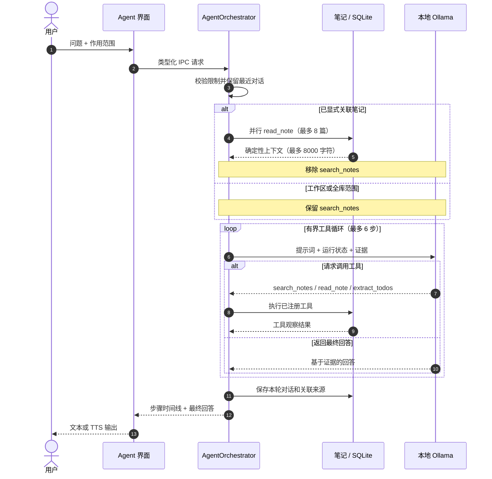
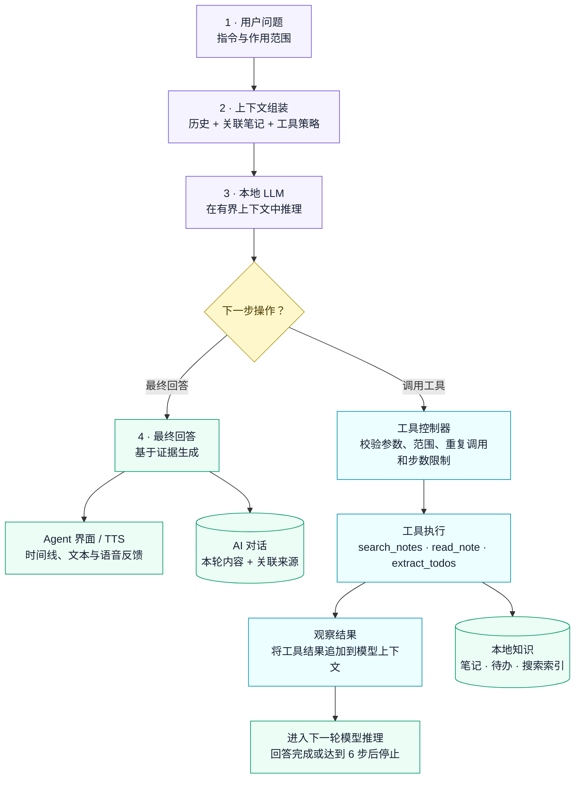

<p align="center">
  <a href="README.md">English</a> · <strong>简体中文</strong>
</p>

<p align="center">
  
</p>

<h1 align="center">LetsVoice</h1>

<p align="center">
  本地优先的语音笔记与知识工作台
  <br />
  Local-first voice notes and knowledge workspace
</p>

<p align="center">
  <a href="https://github.com/dhebhxh/speakspace-local-electron/actions/workflows/test.yml">
    
  </a>
  <a href="https://github.com/dhebhxh/speakspace-local-electron/actions/workflows/codeql-analysis.yml">
    
  </a>
  <a href="LICENSE">
    
  </a>
  
</p>

<p align="center">
  
  
  
  
  
  
  
</p>

<p align="center">
  <a href="https://github.com/dhebhxh/speakspace-local-electron/releases"><strong>下载安装</strong></a>
  ·
  <a href="#本地开发">本地运行</a>
  ·
  <a href="docs/README.md">文档导航</a>
</p>

LetsVoice 是一个 Electron 桌面应用，将录音、文件导入、离线转写、结构化笔记、场景知识、全文与语义检索、本地 AI 对话和语音播报整合在同一个工作台中。

“Local”指推理和用户知识库在本机运行：数据库、录音和受管模型均位于 Electron `userData`；模型不进入 Git，也不塞进安装包。首次使用相关能力时，用户再从模型管理页按需下载运行时和模型。

## 目录

- [功能版图](#功能版图)
- [系统架构](#系统架构)
- [录音到知识的流水线](#录音到知识的流水线)
- [数据存储](#数据存储)
- [搜索与导出覆盖范围](#搜索与导出覆盖范围)
- [Agent 工作流程](#agent-工作流程)
- [本地模型栈](#本地模型栈)
- [测试与评测证据](#测试与评测证据)
- [工程指标](#工程指标)
- [项目结构](#项目结构)
- [本地开发](#本地开发)
- [打包与发布](#打包与发布)
- [文档导航](#文档导航)
- [Electron React Boilerplate](#electron-react-boilerplate)
- [许可证](#许可证)

## 功能版图

| 模块 | 用户能力 | 主要实现 |
| --- | --- | --- |
| 对话工作台 | 录音、导入音频、实时转写、复核并保存笔记 | `StudioPage`、`MediaRecorder`、STT IPC |
| 仪表盘 | 指标、日历、待办、置顶和笔记分类 | `DashboardService`、`TodoExtractionService` |
| 工作空间 | 完整笔记详情、全文/语义搜索、批量操作、Word/PDF 导出 | `WorkspaceService`、`SemanticNoteService`、`ExportService` |
| 结构化笔记 | 摘要、关键要点、任务、提醒和日程 | `KnowledgeGenerationService` |
| 场景知识 | Meeting、Lecture 等内置模板，以及本地 LLM 规范化的自定义模板 | `KnowledgeScenarios`、`KnowledgeTemplateNormalizer` |
| Ask AI | 针对单篇、多篇或工作空间内笔记进行问答并保存会话 | `AskAIService` |
| Agent | 有界工具循环、显式关联笔记、搜索/阅读/任务提取 | `AgentOrchestrator` |
| 模型管理 | STT、LLM、TTS 的下载、激活、运行状态和卸载 | `AI-module/`、`runtime/` |
| 设置与后台 | 中英文、主题、字号、快捷键、托盘、轻量 HUD、回收站 | `SettingsService`、`BackgroundController`、`TrashService` |

## 系统架构

<p align="center">
  
</p>
<p align="center"><em>图 1：LetsVoice 进程边界架构。</em></p>

上方可缩放图以纵向布局保留了 README 原有的进程边界视图；下图补充当前模型、持久化与核心数据流，但不替代该视图。

<p align="center">
  
</p>
<p align="center"><em>图 2：当前技术实现概览。</em></p>

### 进程边界

| 层 | 可以做什么 | 不应该做什么 |
| --- | --- | --- |
| `src/renderer/` | React UI、路由、交互和展示状态 | 直接访问 `fs`、SQLite、模型进程或导入 `src/main/` |
| `src/main/preload.ts` | 通过 `contextBridge` 暴露最小化、类型化 API | 放置业务逻辑或直接渲染界面 |
| `src/main/ipc/` | 验证跨进程输入并调用领域服务 | 在 Handler 里复制 Repository 或模型逻辑 |
| `src/main/<domain>/` | 数据持久化、模型推理、文件和进程能力 | 返回无法被 structured clone 的类实例 |
| `src/shared/` | 两侧共享的纯类型、实体和纯数据 | 依赖 Electron、Node 或 DOM |

Renderer 禁止直接导入主进程实现，这条边界由 ESLint 的 `no-restricted-imports` 规则强制。

## 录音到知识的流水线

转写完成后不会先生成一份独立摘要，再重复生成结构化笔记。当前链路只做一次结构化提取，复核弹窗直接显示其中的 `summary`；保存时将草稿绑定真实 `noteId` 并持久化。

<p align="center">
  
</p>
<p align="center"><em>图 3：录音到知识的处理流水线。</em></p>

关键约束：

- 没有实质内容的短转写仍会生成可用的结构化兜底结果。
- 保存前必须拿到结构化草稿，避免新笔记进入工作空间后仍需手动重新生成。
- 场景知识是第二层、可选择的提取结果，与通用结构化笔记分开保存。
- 录音文件失败时不会留下指向不存在文件的数据库记录。

## 数据存储

### userData 目录

```text
<Electron userData>/
├─ letsvoice.db              # SQLite 主数据库
├─ app-settings.json          # 语言、主题、快捷键、后台与 Agent 设置
├─ model-state/
│  ├─ stt.json
│  ├─ llm.json
│  └─ tts.json                # 当前激活模型
├─ blobs/
│  └─ recordings/             # 用户保存或导入的录音
├─ models/{stt,llm,tts}/      # 应用受管模型
├─ runtimes/{stt,llm,tts}/    # 便携运行时及 manifest
├─ cache/{stt,llm,tts}/       # 下载与解压缓存
└─ output/{stt,llm,tts}/      # 临时推理输出
```

`ManagedPaths` 对写入和删除目标做 `userData` 边界校验。系统安装或用户自行安装的运行时不由应用删除。

### SQLite 关系模型

<p align="center">
  
</p>
<p align="center"><em>图 4：SQLite 关系模型。</em></p>

工作空间、笔记、AI 会话和自定义模板使用 `trashed_at` 实现软删除；只有回收站中的“永久删除”才会物理移除记录及其级联数据。

## 搜索与导出覆盖范围

搜索索引会组合笔记标题、转写和所有可见附属文本；结构化 JSON 会先提取可见字符串再参与搜索，而不是只搜索原始 JSON。

| 内容 | 全文/语义检索 | Word/PDF 导出 |
| --- | :---: | :---: |
| 标题、工作空间、分类和时间 | ✓ | ✓ |
| 原始转写与录音文件名 | ✓ | ✓ |
| 结构化摘要、关键点、任务、提醒和日程 | ✓ | ✓ |
| Scenario Knowledge | ✓ | ✓ |
| Subnotes 与旧版 Knowledge Outputs | ✓ | ✓ |
| 待办及完成/置顶状态 | ✓ | ✓ |
| 关联 AI 会话与消息 | ✓ | ✓ |

语义检索会缓存 `note_embeddings`，并通过 `content_hash` 判断是否需要重新生成向量；关键词命中和向量结果可共同参与排序。

## Agent 工作流程

Ask AI 适合固定范围问答；Agent 则允许本地模型在有界循环里调用工具。用户手动关联笔记时，这些笔记会在第一轮推理前确定性载入，同时从可用工具中移除 `search_notes`，防止模型忽略用户指定范围。

下面两张图以 Mermaid 源码直接维护在 README 中，并由 GitHub 自动渲染；以后可以修改结构，而不需要手工编辑位图。



<p align="center"><em>图 5：Agent 请求时序图。</em></p>

时序图展示各组件随时间发生的交互；下面的控制器视图则补充决策分支、有界工具循环、证据回传和最终回答之间的关系。



<p align="center"><em>图 6：有界 Agent 控制器工作流。</em></p>

Agent 的代码级边界：

| 项目 | 当前限制 |
| --- | ---: |
| 用户指令 | 4000 字符 |
| 对话历史 | 最近 12 条，每条最多 4000 字符 |
| 显式关联笔记 | 最多 8 篇 |
| 关联笔记上下文 | 合计约 8000 字符 |
| 工具循环 | 最多 6 步 |
| 已注册工具 | `search_notes`、`read_note`、`extract_todos` |

## 本地模型栈

| 能力 | 当前运行方式 | 说明 |
| --- | --- | --- |
| STT | Whisper CLI / Parakeet ONNX | 音频转写，FFmpeg 负责必要的格式预处理 |
| LLM | 本地 Ollama | 结构化笔记、场景知识、Ask AI、Agent、分类和任务提取 |
| Embedding | Ollama Embedding | 语义检索，向量与内容哈希写入 SQLite |
| TTS | Kokoro / MeloTTS / MOSS-TTS-Nano | 主进程推理，Renderer 分段流水播放 |
| Runtime | 应用受管或系统已安装 | 状态统一由主进程检测，Renderer 不自行猜测文件是否存在 |

## 测试与评测证据

目前的评测已经覆盖四个本地 AI 子系统——TTS、STT、LLM 和基于 Embedding 的检索，同时覆盖有界 Agent 行为与确定性的回归测试。原始 JSON、真人 STT 录音、生成报告和图表来源都保存在 [`docs/testing`](docs/testing/README.md)，可以直接复核。

| 领域 | 当前证据 | 重要边界 |
| --- | --- | --- |
| TTS | 3 个引擎 × 36 条中英及混合文本 × 3 次重复；RTF、峰值内存、长度扫描和 ASR 回转录 | CER 只是代理指标，不能替代人工 MOS 盲听 |
| STT | 4 档 Whisper、56 段真人录音；CER、内容覆盖率、噪声切片和 RTF | 只有一位中文母语朗读者，不能代表所有用户 |
| LLM / 待办 | 5 个本地模型、54 条用例，严格拆分 22 条开发集和 32 条保留集 | 只覆盖当前提示词与 1.5B–3.8B 模型 |
| Embedding 检索 | 生产环境的关键词 + BGE-M3 向量 + RRF，隔离 LLM 单独评测 | 只有一个 Embedding 模型、24 条带检索金标的任务 |
| Agent | 80 条固定笔记、90 个任务，开发集/保留集各 45 条；严格检查工具、范围和终止行为 | 当前 Agent 尚未达到产品可用目标 |
| 回归测试 | 可按功能域复核的 Jest 机器可读清单 | 回归测试不衡量模型准确率 |

<p align="center">
  
</p>
<p align="center"><em>图 7：各测试引擎的 TTS 合成速度。</em></p>

<p align="center">
  
</p>
<p align="center"><em>图 8：基于真人录音的 STT 评测。</em></p>

<p align="center">
  
</p>
<p align="center"><em>图 9：本地 LLM 准确率与速度权衡。</em></p>

<p align="center">
  
</p>
<p align="center"><em>图 10：基于 Embedding 的混合检索评测。</em></p>

<p align="center">
  
</p>
<p align="center"><em>图 11：Agent 端到端评测。</em></p>

<p align="center">
  
</p>
<p align="center"><em>图 12：按功能域划分的 Jest 回归覆盖。</em></p>

核心方法只有一条：开发集用于选择提示词和脚手架，冻结的保留集才用于验收；延迟、吞吐、内存和 GPU 卸载等硬件敏感指标则通过一键跨机器基准单独采集。引用任何数字前，请先看[测试覆盖与限制清单](docs/testing/test-coverage-gaps.md)。

### M2 Pro 16GB 硬件快照

2026-09-02，一台配备 16GB 统一内存的 Apple M2 Pro 在严格模式下完成了 TTS、TTS 连续运行内存、TTS 长文本内存、LLM 和 STT 五个阶段，总耗时 1 小时 21 分 30.7 秒，所有阶段均无失败。

| 工作负载 | 实测结果 | 结论边界 |
| --- | --- | --- |
| TTS | MeloTTS 在本轮速度与内存之间最均衡（P50 RTF 0.761、峰值 RSS 895.5 MiB）；MOSS-TTS 最快（P50 RTF 0.344），但长文本峰值达到 5843.3 MiB | 仅为性能证据，本轮没有测量主观听感 |
| LLM | 五个模型均报告 100% GPU offload；Qwen2.5 1.5B 吞吐最高，为 71.9 tokens/s | 吞吐不能代表任务质量，统一内存也不等于零内存占用 |
| STT | 四档 Whisper 均快于实时；`small` 平均 RTF 0.082，`large-v1` 为 0.359 | 本轮测量速度，不包含 CER 或更广泛的说话人、口音覆盖 |

这是单台机器的一次运行，不能作为普遍硬件排名。跨机器对比仍不完整，也可能包含运行时与平台差异；完整证据和限制见 [M2 Pro 16GB 全套硬件基准结论报告](docs/testing/m2-pro-16gb-hardware-benchmark-conclusion.md)。

## 工程指标

2026-09-01 生成的评测与测试清单：

| 指标 | 数量 |
| --- | ---: |
| 自动生成的评测报告 | 8 |
| 可重复生成的 SVG 图表 | 46 |
| Jest 测试套件 | 76 |
| Jest 测试用例 | 634 |
| 固定 Agent 语料 | 80 条笔记 / 90 个任务 |
| 已归档机器快照 | 1 台（等待更多机器结果） |

已发布的自动化测试清单与最近一次合并验证：

| 检查 | 结果 |
| --- | --- |
| TypeScript | 通过 |
| Webpack main / renderer build | 通过 |
| Jest | 73 个套件通过、3 个跳过；560 个用例通过、74 个跳过 |
| 评测图表 | 46 张均已从仓库内结果数据重新生成 |
| 详细清单 | [自动生成的套件与用例明细](docs/testing/jest-test-inventory.md) |

这些数字是验证快照，不是动态徽章；代码变化后应同步更新。

### 硬件归档更新（2026-09-02）

截至 2026-09-02，结果归档包含 5 台机器，覆盖 Apple Silicon 以及 NVIDIA RTX 3050、3060 和 3090 系统。M2 Pro、`jack` 与 `fan3090` 均记录了五个硬件阶段的成功结果，较早的两台 NVIDIA 机器则为部分测量。[跨机器汇总](docs/testing/cross-machine-benchmark.md)是生成式快照，新结果导入后应重新生成，其中缺失项不能按 0 解读。

## 项目结构

```text
assets/             应用 Logo 与平台图标
config/             LLM / STT 模型目录
docs/               文档索引、测试报告、历史日志和归档
scripts/            benchmark、smoke 与开发辅助脚本
src/
├─ main/            Electron 主进程、IPC、数据库、模型与领域服务
├─ renderer/        React 页面、布局、交互和样式
└─ shared/          跨进程纯类型、实体和数据契约
.erb/               Electron React Boilerplate / Webpack 工程脚本
release/
├─ app/             打包侧 package.json、原生依赖和构建输出
├─ build/           electron-builder 临时产物，不提交
└─ installers/      本地验收安装包，不提交
```

更细的职责和代码放置规则见 [项目结构](docs/project-structure.md) 与 [AGENTS.md](AGENTS.md)。

## 本地开发

建议使用 Node.js 22 和 npm。

```bash
git clone https://github.com/dhebhxh/speakspace-local-electron.git
cd speakspace-local-electron
npm install
npm start
```

`npm start` 会启动 Electron 主进程、preload 和 Renderer 的开发构建。Electron React Boilerplate 的通用环境问题可参考其 [安装文档](https://electron-react-boilerplate.js.org/docs/installation)。

### 常用命令

| 命令 | 用途 |
| --- | --- |
| `npm start` | 启动开发环境 |
| `npm run build` | 构建 main 与 renderer |
| `npm exec tsc -- --noEmit` | TypeScript 类型检查 |
| `npm run lint` | ESLint |
| `npm test` | Jest 测试 |
| `npm run test:trash:electron` | 使用 Electron ABI 验证回收站数据库逻辑 |
| `npm run smoke:tts` | TTS 运行时冒烟测试 |
| `npm run bench -- --machine <标签>` | 运行并归档一台机器上的全部硬件敏感基准 |
| `npm run bench:aggregate` | 汇总已经收集的机器快照 |
| `npm run bench:charts` | 重新生成仓库内的 SVG 评测图 |
| `npm run bench:charts -- --panels-only` | 使用已有明细图重组总览面板，不重新选择基准数据 |
| `npm run bench:report` | 重新生成 Markdown 评测报告 |
| `npm run check:audit` | 只检查生产依赖漏洞 |
| `npm run package` | 当前平台内部构建 |
| `npm run package:release` | 带正式命名和签名门禁的发布构建 |

非开发人员收集硬件结果时，Windows 可直接双击 `一键跨机硬件测速.cmd`，macOS 可双击 `一键跨机硬件测速-Mac.command`。启动器会检查依赖、询问是否下载缺少的运行时和模型，并将每台机器的结果保存到独立目录。

## 打包与发布

Windows 使用 NSIS 安装器。模型由用户安装应用后按需下载，不进入安装包。

macOS 和 Windows 安装器均可从 [GitHub Releases](https://github.com/dhebhxh/speakspace-local-electron/releases) 获取。

```bash
npm run package
```

- 临时构建：`release/build/`
- 本地验收安装包：`release/installers/`
- 两者均不进入 Git。
- 正式分发前必须配置 Windows 或 macOS 代码签名凭据。
- `npm run package:release` 会先执行发布签名门禁。

## 文档导航

完整索引见 [docs/README.md](docs/README.md)。

- [项目结构与代码边界](docs/project-structure.md)
- [测试与评测总览](docs/testing/README.md)
- [数据集与开发集/保留集拆分](docs/testing/datasets/README.md)
- [TTS 模型基准](docs/testing/tts-model-benchmark-windows.md)
- [真人 STT 评测](docs/testing/stt-human-eval.md)
- [本地 LLM 横向扫描](docs/testing/llm-model-sweep.md)
- [Embedding 检索评测](docs/testing/retrieval-eval.md)
- [Agent 端到端评测](docs/testing/agent-end-to-end-eval.md)
- [一键跨机器基准指南](docs/testing/multi-machine-benchmark-guide.md)
- [M2 Pro 16GB 全套硬件基准结论](docs/testing/m2-pro-16gb-hardware-benchmark-conclusion.md)
- [跨平台手工验收](docs/testing/manual-acceptance.md)
- [详细开发日志](docs/changelog/)
- [贡献者行为准则](.github/CODE_OF_CONDUCT.md)

## Electron React Boilerplate

本项目基于 [Electron React Boilerplate](https://github.com/electron-react-boilerplate/electron-react-boilerplate) 的工程体系构建，并继续使用 Electron、React、React Router、Webpack 和 React Fast Refresh。

- [Electron React Boilerplate 文档](https://electron-react-boilerplate.js.org/docs/installation)
- [Electron 文档](https://www.electronjs.org/docs/latest/)

LetsVoice 的产品功能、界面、数据模型和本地 AI 流程由本项目独立维护。

## 许可证

本项目使用 [MIT License](LICENSE)。上游工程版权归 [Electron React Boilerplate](https://github.com/electron-react-boilerplate/electron-react-boilerplate) 贡献者所有。
