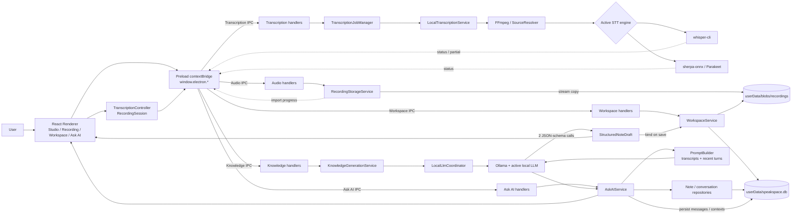

# SpeakSpace Local 桌面端技術成果報告

> Technical Outcomes Report

| 項目 | 內容 |
|---|---|
| 報告基準 | `JackFix` branch，commit `12d36f0` |
| 報告日期 | 2026-08-27 |
| 主要平台 | Windows x64；另有 macOS／Linux build target |
| 產品定位 | Local-first、offline-capable 的錄音、轉寫、知識整理與工作空間桌面應用 |
| 本輪驗證 | 原始碼盤點、`npm run build`、Windows 內部 unsigned package 體積量測、既有 TTS benchmark 複核 |

## 1. 結論摘要

SpeakSpace Local 已形成可運作的桌面端本地 AI 架構：React Renderer 負責互動，Electron preload 提供受控 API，Main process 負責檔案、SQLite、原生套件、AI runtime 與模型生命週期。錄音、匯入、STT、結構化筆記、工作空間保存、Ask AI、語意索引與 TTS 都有明確的本地執行路徑；模型採按需下載，不直接塞入安裝包。

`JackFix` 將本輪產品要求落在既有架構上，主要成果如下：

| 成果 | 技術結果 | 狀態 |
|---|---|---|
| 音訊匯入進度 | Main process 以 stream pipeline 複製到受管路徑，Renderer 顯示真實位元組百分比；AI 階段顯示 processing spinner | 已實作 |
| 匯入後保存穩定性 | 受管錄音路徑重用，並修正 stale controller／ghost save 狀態，避免已有 transcript 卻被判定為不可保存 | 已實作 |
| 新手引導精簡 | 同頁相鄰控制合併說明，核心 tour 由 27 個細步驟減為 15 個 | 已實作 |
| 工作空間引導 | 增加 workspace 情境步驟，並依畫面元素是否存在動態組合 | 已實作 |
| 筆記一鍵全選 | 工作空間加入可見筆記的 select-all／取消全選與 tri-state 狀態 | 已實作 |
| 硬體與模型推薦 | 顯示 CPU、RAM、GPU、VRAM、driver、CUDA、磁碟等資料，並產生 STT／LLM 建議 | 已實作，但推薦器仍是 heuristic v1 |

整體判斷：桌面端主流程具備產品化基礎，但目前不能宣稱已完成跨硬體效能驗證。STT 與 TTS 是明確 CPU 路徑；LLM／Embedding 是否由 Ollama 使用 GPU，應用層尚無 telemetry。TTS 有一組 Apple M4 CPU benchmark，STT、LLM、Embedding、Windows TTS 及 CPU/GPU A/B 尚缺正式數據。Mobile 無法直接移植現有 Electron／Node runtime；較可行的近期方向是 thin mobile companion 或 hybrid on-device 架構。

## 2. 報告證據分級

為避免把程式文案、單機觀察與正式 benchmark 混為一談，本報告使用以下分級：

- **已實作**：可由目前 `JackFix` 原始碼與設定直接確認。
- **已實測**：有可重現命令、產物或既有 benchmark 數據。
- **本機觀測**：只代表 2026-08-27 這台 Windows 電腦，不等同最低需求或普遍效能。
- **推論**：依架構與資源需求判斷，尚未由目標平台 benchmark 證實。
- **待驗證**：目前沒有足夠證據，不能作為產品承諾。

## 3. Architecture diagram and explanation

### 3.1 系統架構



### 3.2 分層與責任

| 層級 | 主要技術 | 責任與設計意義 |
|---|---|---|
| Renderer | React 19、TypeScript | 錄音、匯入、Workspace、Ask AI、Settings、onboarding 與狀態呈現；不直接碰任意檔案或啟動原生程序 |
| Preload boundary | Electron `contextBridge` | 將 namespaced、typed API 暴露為 `window.electron.*`，隔離 Renderer 與 Node 權限 |
| Main process | Electron／Node services | 檔案 I/O、IPC、系統能力、原生套件、child process、AI job 與 runtime 管理 |
| Persistence | `better-sqlite3` + filesystem blobs | 結構化資料存於 `userData/speakspace.db`；錄音存於 `userData/blobs/recordings`，DB 只保存關聯與相對路徑 |
| AI runtimes | whisper.cpp、sherpa-onnx、ONNX Runtime、Ollama、FFmpeg | STT、LLM、Embedding、TTS 與音訊標準化全部在本機執行 |
| Shared domain | `src/shared` | 純 types、entities、contracts，降低 Renderer／Main 之間的資料模型漂移 |

這個分層的優點是安全邊界清楚、AI runtime 可替換、資料預設不離開本機；代價是 Electron IPC、原生 Node 套件與多個 runtime 使安裝包、跨平台 build 和 mobile 移植成本增加。

### 3.3 核心資料流

#### 音訊匯入與轉寫

1. Renderer 只送出使用者選擇的來源與 `requestId`。
2. Main process 驗證副檔名與大小上限，以串流方式複製到受管錄音目錄，並回傳已複製位元組百分比。
3. FFmpeg 在需要時轉為 16 kHz mono WAV。
4. `LocalTranscriptionService` 依 active model 分派至 Whisper CLI 或 Parakeet。
5. Whisper 可回傳 partial segment；狀態事件回到 Renderer。Parakeet 目前回傳完整結果。
6. 完成後 transcript、錄音關聯與 workspace note 在保存交易中寫入 SQLite／blob storage。

進度條反映的是「本機受管複製」而非網路上傳；AI spinner 目前表示工作仍在進行，但沒有模型層百分比或 ETA。

#### 結構化筆記

Transcript 送往 `KnowledgeGenerationService`，再由 `LocalLlmCoordinator` 串行呼叫 Ollama。現行流程以兩次 `temperature: 0`、JSON schema 約束的生成分別產生摘要／重點，以及任務／行動／行事曆草稿。使用者確認後才綁定 note 並保存，降低模型輸出直接改寫正式資料的風險。

#### Ask AI

Ask AI 會讀取 workspace 內的筆記來源與最近對話，再透過 Ollama 生成回答並保存 conversation context。現行 prompt 主要使用原始 transcript：單篇約 6,000 字元，多篇約每篇 1,200 字元、最多 24 篇，並帶入最近 10 個對話 turns。

重要限制：專案已有 `bge-m3` embedding 與 SQLite 向量索引能力，但目前 Ask AI 主路徑尚未把 structured note、scenario knowledge 或 semantic retrieval 結果納入證據組合。因此「有語意索引」不等於「Ask AI 已完整使用 RAG」。

## 4. Model and runtime choices

### 4.1 選型總覽

| 能力 | 模型／runtime | 選擇理由 | 已知代價或限制 |
|---|---|---|---|
| STT | 16 個 Whisper GGML／Q5 選項，75 MiB–2.9 GiB；`whisper-cli` | 成熟的本地離線路徑；多語與 English-only 分級；Q5 可降低磁碟／RAM | Windows portable 明確是 CPU build；大模型較慢且佔用高；尚無本專案 WER／RTF benchmark |
| STT | Parakeet TDT 0.6B V2 INT8，約 631 MiB；sherpa-onnx | 提供英文會議／訪談的替代引擎，INT8 降低 footprint | English-only、CPU／最多 4 threads、無 partial；catalog 尚無固定 checksum |
| LLM | Qwen2.5 1.5B／3B Q4、Phi-4 Mini、Ministral 3B Q4、Granite Micro | 將模型控制在約 1–3 GB，適合一般 laptop；兼顧中英／多語與結構化輸出 | Q4 會犧牲部分品質；產品標籤不是 benchmark；目前 `stream:false` |
| Embedding | `bge-m3` via Ollama | 與 LLM 共用 Ollama runtime；支援多語語意搜尋；content hash 可增量索引 | 模型固定且缺少 retrieval benchmark；Ask AI 尚未完整串接此結果 |
| TTS | Kokoro、MeloTTS、MOSS-TTS-Nano | 提供穩定基線、中英均衡與多語實驗路徑；三者均可離線 | 全部走 CPU；MOSS 冷啟動／RAM／體積最高；Windows 尚無性能數據 |

### 4.2 LLM catalog

| 模型 | 產品定位 | 約略下載體積 | 說明 |
|---|---|---:|---|
| Qwen2.5 1.5B Q4_K_M | 輕量多語／中文 | 986 MB | 最低 footprint 的完整本地 LLM 選項 |
| Qwen2.5 3B Q4_K_M | 多語總結、問答 | 1.9 GB | 品質與 laptop 資源的中間點 |
| Phi-4 Mini | 英文、輕量快速 | 2.5 GB | 偏英文工作流 |
| Ministral 3 3B Q4_K_M | 多語、結構化生成 | 3.0 GB | 現行 16 GB RAM heuristic 容易選中此模型 |
| Granite 4 Micro-H | 英文摘要、分類 | 1.9 GB | 偏英文結構化工作 |

上述「中文強、英文強、均衡」是 catalog 與 UI 的設計定位，不是本專案模型品質實測結論。

Ollama 可使用系統既有服務或 Windows portable runtime。Portable 模式把模型根目錄放進 app-managed `userData`；如果連到外部 Ollama，模型實際位置與服務生命週期則由外部環境控制。LLM、Embedding、Structured Note、Ask AI、Agent、分類與 Todo 抽取共用此 runtime，避免重複維護不同 LLM server。

### 4.3 TTS 選型依據

| 模型 | 架構／輸出 | Catalog 體積 | 定位 |
|---|---|---:|---|
| Kokoro Multi-Lang | sherpa-kokoro／ONNX，24 kHz mono，53 voices | 382 MiB | 穩定、多音色基線 |
| MeloTTS zh-en | sherpa-vits／ONNX，44.1 kHz mono，1 voice | 182 MiB | 目前推薦；中英混合、體積、RSS、速度較均衡 |
| MOSS-TTS-Nano 100M | onnxruntime-node，48 kHz stereo，20 languages／18 voices | 684 MiB | 多語實驗模型；速度快但資源成本最高 |

Catalog 將 MeloTTS 標為唯一 `recommended: true`，與現有 Apple M4 benchmark 的工程平衡一致。不過 legacy TTS installer 仍以 Kokoro 作為預設安裝路徑，UI 推薦與舊安裝流程尚未完全統一，應在正式發佈前釐清。

### 4.4 模型下載、完整性與生命週期

- 模型、runtime、cache 與 output 由 `ManagedPaths` 限制在 Electron `userData`。
- 下載先寫入暫存檔，校驗成功後以 rename 完成；失敗會清除未完成檔案。
- Whisper catalog 使用 SHA-1；TTS archive／asset 使用 SHA-256；MOSS 固定 revision 並逐檔校驗。
- Parakeet 目前 `checksum: null`，只驗證 encoder、decoder、joiner、tokens 是否存在，供應鏈保護弱於其他模型。
- Active STT／LLM／TTS ID 分別持久化；若未選擇但已有模型，會採 catalog 第一個可用項。
- 模型不隨 installer 綁定，降低初始包體，但把下載時間、首次設定與 GB 級磁碟需求移到使用者端。

### 4.5 硬體推薦器的實際邏輯

Settings 可偵測與顯示 CPU、總／可用 RAM、GPU、VRAM、driver、CUDA 與磁碟，但 `ModelRecommendationScorer` 目前只將下列資料納入分數：

- 總 RAM；
- logical CPU cores；
- catalog model size；
- locale，多語模型在非英文 locale 加分。

STT memory budget 約為 180／520／1,700／3,200 MiB 四級；LLM 約為 1,100／2,200／3,600／8,000 MB，低核心數再降權。GPU、VRAM、CUDA、可用 RAM、可用磁碟、KV cache、runtime provider、實測速度與品質目前都不參與計算。

因此推薦結果只能解讀為「依總 RAM、核心數和模型大小做的 heuristic v1」，不能解讀為此硬體上的最佳模型。相同大小的模型還可能因 catalog 排序而選到較舊版本。

## 5. GPU vs CPU observations

### 5.1 現行執行路徑

| 子系統 | 目前 provider | GPU 狀態 | 可以下的結論 |
|---|---|---|---|
| Whisper STT | 官方 Windows CPU `whisper-cli`，最多 8 threads | App 未提供 GPU build／device 選擇 | 現行 portable STT 是 CPU；不能宣稱有 GPU 加速 |
| Parakeet STT | `provider: 'cpu'`，最多 4 threads | 未啟用 GPU provider | CPU-only |
| Kokoro／Melo TTS | sherpa `provider: 'cpu'`，最多 4 threads | 未啟用 GPU provider | CPU-only |
| MOSS TTS | ONNX `executionProviders: ['cpu']` | DirectML 資產雖可能存在於 dependency，但程式未使用 | CPU-only |
| LLM | Ollama 自動決策 | Portable archive 含 CUDA／Vulkan runners，但 App 未指定或讀取 offload | 可能使用 GPU，實際比例未知 |
| Embedding | 與 LLM 共用 Ollama | 同上 | 可能使用 GPU，未量測 |

### 5.2 本機硬體觀測

2026-08-27 的測試電腦快照：

- Windows x64；Intel Core i7-12700H；14 physical／20 logical cores；
- 15.6 GiB RAM；盤點當時可用約 2.2 GiB；
- NVIDIA RTX 3050 Laptop GPU 4 GiB；driver 591.74；CUDA 13.1；
- 另有 Intel UHD；虛擬顯卡已由 probe 過濾。

以 `zh-TW` 和目前 scorer 執行，結果傾向 Whisper Medium 1.5 GiB 與 Ministral 3B 3.0 GB。這只是現行公式輸出，不是 performance benchmark；RTX 3050、4 GB VRAM、CUDA 及當時僅 2.2 GiB 可用 RAM都沒有影響分數，故結果可能過度樂觀。

### 5.3 目前不能回答的問題

本專案尚未做同一硬體、同一模型、同一輸入的 CPU-only 與 GPU-offload A/B 測試，也沒有保存 GPU layers、VRAM、TTFT、tokens/s、功耗或溫度。因此目前不能得出「GPU 比 CPU 快多少」或「4 GB VRAM 足以跑哪個模型」的可靠結論。

## 6. Latency, quality, memory, package-size and UX trade-offs

### 6.1 Latency

| 流程 | 現況 | 使用者體感與取捨 |
|---|---|---|
| 音訊匯入 | stream copy 並回報真實百分比 | 不把大檔一次讀入 Main RAM；進度可見，但本質是本機複製且尚無取消／續傳 |
| 自動語言 STT | Whisper 先做 language detection，再正式轉寫 | 語言判定更自動，但可能形成額外 pass；尚未重用第一輪計算 |
| 麥克風 live STT | MediaRecorder 約每 5 秒形成獨立片段並串行排隊解碼 | 最早可見文字約為 5 秒加解碼時間；低階 CPU 可能產生 queue backlog，不是真正 streaming decoder |
| Batch STT | Job 有 `elapsedMs`、Whisper 可回 partial | 有處理回饋；尚無長音訊 P50／P95／RTF 基準 |
| Structured Note | 兩個 serial JSON-schema LLM calls | 輸出分工清楚、資源競爭較可控；總等待時間會累加 |
| Ask AI／Agent | Ollama `stream: false` | 完整回答後才顯示內容，spinner 可告知仍在處理，但 TTFT 體感較差 |
| TTS | 每段完成 PCM 後播放；Renderer 播放本段時預生成下一段 | 24–40 字切段可隱藏部分等待；仍有 IPC 與 AudioBuffer 複製成本，首段不是 token/audio streaming |

STT 的 `elapsedMs` 與結構化筆記的 `llmDurationMs` 已存在，但尚未集中保存成 telemetry 或 percentile，因此不能用個別欄位宣稱整體性能 SLA。

### 6.2 TTS 已有 benchmark

測試條件：Apple M4 10-core、16 GiB、macOS arm64、CPU、4 threads；中文、英文、中英混合三條短句，各跑三次並取中位數。此數據不能直接外推到目前 Windows 電腦。

| 模型 | Model size | Load time | Peak RSS | 平均中位 RTF | 首輪 app E2E smoke |
|---|---:|---:|---:|---:|---:|
| Kokoro | 382.2 MiB | 1.260 s | 779.8 MiB | 0.978 | 3.868 s |
| MeloTTS | 182.4 MiB | 1.344 s | 663.5 MiB | 0.652 | 2.840 s |
| MOSS-TTS-Nano | app download 684 MiB；完整測試目錄 727.8 MiB | 4.024 s | 1,248.2 MiB | 0.529 | 3.949 s |

RTF 小於 1 表示生成速度快於音訊播放。Melo 三類輸入都能即時生成，體積最小且峰值 RSS 比 Kokoro 低約 116 MiB，因此是目前最均衡的預設推薦。MOSS 的 steady-state RTF 最快，但冷啟動、記憶體與下載成本最高；Kokoro 的中英混合 RTF 為 1.311，該案例慢於即時播放。

### 6.3 Quality

- **TTS：**既有文件以 Whisper Tiny 回轉錄 CER 作低信心代理：Kokoro 21.3%、Melo 37.8%、MOSS 40.9%。這不是人工 MOS，也不應作為自然度排名；混合語言尤其不可靠。Kokoro／Melo 沒有 clipping，MOSS 原始波形略有超幅，App 已 normalize peak 至 0.98。
- **STT：**目前沒有以真實錄音集量測 WER／CER，也沒有 Whisper 各尺寸、Q5、Parakeet 的同資料集比較。
- **LLM：**目前沒有保存模型間摘要品質、幻覺率、引用正確率、JSON schema 成功率或 task completion benchmark。Todo extraction 有 22 個 eval cases，但預設 skip，repo 沒有本輪通過率。
- **Embedding：**已有 cosine ranking 與 threshold，但沒有 Recall@K、nDCG 或人工 relevance set。

因此「模型較大／產品標籤較強」只能作選型假設，不能取代任務級品質驗證。

### 6.4 Memory and storage

正向設計：

- 音訊匯入使用 stream pipeline，避免 Main process 一次讀完整大檔。
- TTS 切換模型時 dispose 舊 engine，避免多個模型常駐。
- MOSS 依序建立四個 ONNX sessions，降低同時初始化的峰值。
- 模型按需下載，使用者只承擔所選功能的模型空間。

主要風險：

- 錄音中的 1 秒 Blob chunks 仍留在 Renderer RAM，保存時再組合 Blob 與 ArrayBuffer；長錄音可能短暫存在多份資料。
- 匯入保留原檔並複製一份受管音訊，換取路徑穩定、中文路徑安全與工作空間可攜，但會佔雙份磁碟。
- LLM 沒有 RAM／VRAM telemetry；model file size 不能等同 runtime memory，還需考慮 KV cache、prompt、runner 與 GPU offload。

本機 `SpeakSpace Local` userData 快照為 12.42 GiB，其中 models 10.38 GiB、runtimes 2.02 GiB；models 約分為 LLM／Embedding 6.15 GiB、STT 3.01 GiB、TTS 1.22 GiB。這是已選裝多模型的單機狀態，不是最低需求。因 copy-only migration，本機三個歷史資料根合計約 29.6 GiB，顯示未來可考慮在驗證成功後提供「可預覽、可復原、由使用者確認」的 legacy cleanup UI，不應自動刪除。

### 6.5 Package size

本輪先執行 `npm run build`，Main／Renderer production build 成功。標準 Windows packaging 在 `winCodeSign` cache 解壓階段因目前 Windows 帳號無法建立 Darwin library symlink 而失敗；因此正式 signing／executable editing 路徑尚未驗證。

為量測包體，另以 `signAndEditExecutable=false` 產生內部 unsigned artifact：

| 產物／組件 | 實測大小 | 說明 |
|---|---:|---|
| `SpeakSpace Local-4.6.0-internal-unsigned.exe` | 174,983,525 bytes／166.9 MiB | 僅供工程量測，未簽章、未作 clean-machine 安裝驗收 |
| `win-unpacked` | 630,634,262 bytes／601.4 MiB，182 files | 解壓後應用，不含使用者後續下載模型 |
| Electron distribution | 約 284.1 MiB | 桌面 shell 基礎成本 |
| `release/app/node_modules` | 約 304.7 MiB | 原生 AI／DB dependencies 為主要來源 |
| `onnxruntime-node` | 約 258.3 MiB | 同時含 Darwin、Linux、Windows、不同 arch 與 DirectML assets |
| `sherpa-onnx-win-x64` | 約 21.9 MiB | Windows x64 STT／TTS native binding |
| `better-sqlite3` | 約 11.7 MiB | 本地 DB native binding |
| SentencePiece dependency | 約 10.9 MiB | NLP tokenizer dependency |

最明顯的優化機會是依 target platform／architecture prune `onnxruntime-node` 的非 Windows x64 binaries，並評估 MOSS／DirectML runtime 是否應改為按需下載。模型不在 installer 內是正確方向，但完整離線能力在實際選裝後仍可能超過 12 GiB。

### 6.6 User experience trade-offs

| 正向成果 | 伴隨代價 |
|---|---|
| 敏感錄音、轉寫、DB 與模型預設留在本機 | 需要下載 runtime／模型，首次可用時間較長，且硬體差異直接影響體驗 |
| 匯入進度、AI spinner、partial transcript 提升可感知回饋 | AI 階段沒有百分比／ETA，STT／LLM model download 主要仍是 busy state |
| 受管錄音副本避免外部檔案移動、權限與 Unicode 路徑問題 | 額外磁碟副本；目前缺少 cancel／resume，progress IPC 也未節流 |
| 小型 Q4／INT8 模型適合 laptop-local | 品質上限低於較大模型，仍需 task-specific eval |
| 結構化筆記先預覽再保存 | 兩個 serial LLM calls 增加等待 |
| 工作空間一鍵全選降低大量操作成本 | 「全選可見筆記」會保留被篩選隱藏的既有選取，batch action 前需清楚顯示實際選取總數 |
| 新手引導由 27 步降為 15 步，並增加 workspace 情境 | 同一步資訊密度提高，仍需 usability test 確認理解率與完成率 |

## 7. Desktop vs mobile feasibility

### 7.1 Desktop 現況

Electron builder 設定涵蓋 Windows NSIS、macOS 與 Linux AppImage，但平台能力尚不等價：Whisper、FFmpeg、Ollama 的一鍵 runtime 安裝目前以 Windows 為主，macOS／Linux 仍可能需要手動安裝。Tray、global shortcut、HUD、background window、auto update 等也是桌面專屬核心能力。

Windows x64 是目前最完整的產品化目標；macOS 已有 arm64 TTS benchmark，但全流程安裝體驗仍需驗證；Windows ARM64 不在現行 TTS 驗收承諾內。

### 7.2 可重用與必須替換的部分

| 區域 | Mobile 重用度 | 判斷 |
|---|---|---|
| `src/shared` types／entities／contracts | 高 | 可直接或少量調整重用 |
| Prompt builders、parsers、normalizers、日期／Todo／搜尋純邏輯 | 高 | 與 Electron 耦合低 |
| React Renderer 狀態與表單邏輯 | 中 | 可重用概念與部分程式，但 desktop navigation、hover、HUD、tray 需重設計 |
| Repository／service interfaces、SQLite schema 概念 | 中 | 介面可延續，實作需 mobile adapter |
| Electron Main／preload／IPC／contextBridge | 低 | 必須換成 Capacitor／React Native native bridge 或 client-server API |
| `better-sqlite3`、Node `fs/path` | 低 | 必須換 mobile SQLite、sandbox／content URI／security-scoped file API |
| child-process Whisper／FFmpeg／Ollama | 低 | 必須換 native library、mobile inference runtime 或遠端 desktop service |
| `onnxruntime-node`／`sherpa-onnx-node` | 低 | Node binding 不能直接裝入 iOS／Android，需 mobile/native binding |
| Tray／global shortcut／HUD／desktop updater | 無直接等價 | 應改為 notification、share sheet、widget、background task 與商店更新模式 |

### 7.3 三種 mobile 路線

| 路線 | 可行性 | 優點 | 主要限制 |
|---|---|---|---|
| Thin mobile companion，AI 在桌面／LAN service | 高，適合近期 PoC | 模型與重運算留在桌面；最大化 shared／UI 邏輯重用；手機包體小 | 需裝置發現、認證、TLS、同步與離線策略；桌面不在線時能力受限 |
| Hybrid on-device | 中，最務實的獨立 app 方向 | 手機保留錄音、SQLite、Tiny／Base STT；較重 LLM／TTS 可交給桌面或服務 | 需 native bridge；電池、thermal、背景錄音、檔案權限、同步衝突都需實測 |
| 完整離線 feature parity | 低／高投入 | 延續 local-first 與隱私承諾 | 必須重寫 runtime／storage／background；GB 級模型、KV cache 與 0.66–1.25 GiB 級 TTS 峰值對手機風險高 |

Mobile 結論：現有 Electron 應用不能直接「包成手機版」。建議先做「錄音 → Tiny STT → mobile SQLite → 與桌面同步」的 architecture spike，同時比較 Capacitor + native bridge 與 React Native；在取得包體、峰值 RSS、耗電、thermal、背景中斷數據後，再決定是否把 LLM／TTS 搬到裝置端。

## 8. What works, what does not, and what should be explored next

### 8.1 已有證據可用

- Electron Renderer／preload／Main 分層與 typed IPC 邊界。
- SQLite、受管錄音 blob、模型與 runtime 的本地生命週期。
- 音訊匯入 stream copy、真實複製進度、AI busy 狀態與保存狀態修正。
- Whisper／Parakeet dispatch、FFmpeg 準備、Whisper language detection、partial segment、job retry／cancel。
- Ollama 安裝／定位／啟動、LLM pull／activate／delete 與多工作流共用。
- `bge-m3` 增量 embedding cache 與 workspace-scoped semantic search。
- Kokoro／Melo／MOSS 三套 TTS engine、模型切換釋放與 Renderer pipelined playback。
- Apple M4 CPU 上三套 TTS 均能產生有效音訊；Melo 是目前資源／速度最均衡的推薦。
- `JackFix` production build 成功；內部 unsigned Windows package 可產生並完成包體量測。
- 新手引導精簡、workspace 引導、一鍵全選與硬體／模型推薦 UI。

### 8.2 尚不可宣稱或已知不完整

- 正式簽章 Windows installer 與 clean-machine 安裝／升級／卸載尚未在本輪完成驗收。
- Windows TTS 效能、任何 GPU 優於 CPU 的幅度、STT WER／RTF、LLM TTFT／tokens/s／品質、Embedding retrieval quality 都沒有正式數據。
- LLM／Embedding 的 Ollama GPU offload 沒有應用層 telemetry；硬體推薦也未使用 GPU／VRAM／可用 RAM／磁碟。
- LLM 不支援 token streaming；live STT 是 5 秒檔案片段的 offline queue，不是真正 streaming decoder。
- Parakeet 沒有 partial，且 inference 中的 `decodeAsync` 不能即時中止；catalog 缺固定 checksum。
- Studio readiness 目前偏 all-or-nothing，可能要求 STT、TTS、LLM、Embedding 全部就緒；即使使用 Parakeet，也可能仍被 Whisper runtime gate 擋住。
- STT／LLM model manager 有 progress callback，但 model IPC／UI 尚未完整顯示百分比、取消或續傳。
- Ask AI 目前主要使用原始 transcript，尚未把 structured note、scenario knowledge 與 semantic retrieval 統合成可評估的 RAG pipeline。
- Mobile build、Windows ARM64 TTS、macOS／Linux 一鍵 runtime setup 尚未完成。
- TTS 品質沒有人工 MOS／ABX；現有 CER 只是一個低信心代理。

### 8.3 建議優先路線圖

#### P0：Release readiness

1. 在 Windows CI／乾淨 VM 固定 Node 22 與 native dependency build 環境，解決 winCodeSign symlink 權限，完成簽章 NSIS 的 install／upgrade／uninstall smoke test。
2. 依平台／架構 prune ONNX Runtime 非目標 binaries；重打 JackFix installer，保存 installer、unpacked、首次啟動與冷啟動數據。
3. 將 Studio gate 改成 capability-based：只做錄音／STT 不應強制要求 TTS、LLM、Embedding；Parakeet ready 不應依賴 Whisper runtime。
4. 為 Parakeet 固定版本與 digest；統一 Melo 推薦與 legacy Kokoro 安裝流程。

#### P1：可量測的 AI 與 UX

1. 建立 Windows x64 benchmark matrix：
   - STT：cold／warm、WER／CER、RTF、P50／P95、RSS、長音訊；
   - LLM：TTFT、tokens/s、JSON schema 成功率、摘要／問答 task eval、RSS／VRAM；
   - Embedding：docs/s、Recall@K、nDCG、索引大小；
   - TTS：first-audio、P50／P95 RTF、段落 gap、RSS、人工 MOS／ABX；
   - End-to-end：import → transcript → structured note → save。
2. 在 RTX 3050 4 GB 上做 Ollama CPU-only 與 GPU-offload A/B；保存 offload layers、VRAM、功耗與 thermal。若要比較 STT GPU，需另建 GPU-enabled Whisper runtime，不能沿用現行 CPU binary。
3. 推薦器 v2 納入 available RAM、VRAM／CUDA、free disk、runtime overhead、KV cache、語言與 benchmark；以「model + runtime provider」為推薦單位並修正 tie ordering。
4. 加入 Ollama `ps`／runtime telemetry，讓 Settings 顯示目前究竟使用 CPU、GPU 或混合 offload。
5. 加入 LLM token streaming、AI stage 實際耗時；對 audio import／model download 提供節流 progress、取消與可恢復下載。
6. 長錄音直接串流至磁碟，避免 Renderer 長時間保留 Blob chunks；為 live STT 加 backpressure 與 queue 指標。

#### P2：品質與新平台探索

1. 將 semantic retrieval、structured note 與 scenario knowledge 接入 Ask AI，先建立引用正確率與 hallucination eval，再擴大 context。
2. 評估真正 streaming STT／incremental decoder，以及可中止的 Parakeet inference。
3. 進行 mobile architecture spike；先量 Tiny／Base STT 的包體、RSS、耗電、thermal 與背景中斷，再決定 LLM／TTS 是否 on-device。
4. 對 onboarding 15-step 版本做完成率、跳過率、每步停留時間與 workspace 任務成功率 usability test。
5. 提供 legacy data cleanup 預覽與確認流程，降低 copy-only migration 的重複磁碟成本。

## 9. 驗證紀錄與限制

### 9.1 本輪執行

```powershell
npm run build
node .\node_modules\electron-builder\cli.js build --config electron-builder.js --win nsis --publish never
node .\node_modules\electron-builder\cli.js build --config electron-builder.js --config.win.signAndEditExecutable=false --win nsis --publish never
```

- 第一個命令成功。
- 第二個命令完成 app packaging，但在 winCodeSign cache 建立 Darwin symlink 時失敗；這是本機 packaging 權限問題，不是應用 runtime 測試失敗。
- 第三個命令只為量測內部 unsigned artifact 而執行，成功；不應拿來取代正式 release 驗收。

### 9.2 關鍵證據

- 架構與入口：[main.ts](../src/main/main.ts)、[preload.ts](../src/main/preload.ts)、[project-structure.md](./project-structure.md)
- 模型 catalog：[stt-catalog.json](../config/stt-catalog.json)、[llm-catalog.json](../config/llm-catalog.json)
- STT：[LocalTranscriptionService.ts](../src/main/transcription/LocalTranscriptionService.ts)、[WhisperTranscriptionService.ts](../src/main/transcription/WhisperTranscriptionService.ts)、[ParakeetEngine.ts](../src/main/transcription/ParakeetEngine.ts)
- LLM／Ollama：[LocalChatService.ts](../src/main/llm/LocalChatService.ts)、[OllamaServerController.ts](../src/main/llm/OllamaServerController.ts)
- Embedding：[OllamaEmbeddingService.ts](../src/main/semantic/OllamaEmbeddingService.ts)、[SemanticNoteService.ts](../src/main/semantic/SemanticNoteService.ts)
- TTS：[TTSModelCatalog.ts](../src/main/tts/TTSModelCatalog.ts)、[TTSPlaybackPipeline.ts](../src/renderer/tts/TTSPlaybackPipeline.ts)
- Hardware recommendation：[SystemProfileService.ts](../src/main/recommendation/SystemProfileService.ts)、[ModelRecommendationScorer.ts](../src/main/recommendation/ModelRecommendationScorer.ts)
- TTS benchmark：[tts-model-benchmark-2026-08-13.md](./testing/tts-model-benchmark-2026-08-13.md)
- Packaging：[electron-builder.js](../electron-builder.js)

### 9.3 報告限制

本報告是指定 commit 的工程快照，不是正式性能認證。除 TTS benchmark 與本輪 package 體積外，多數性能描述來自程式行為與單機資源觀測；所有未在相同硬體、固定資料集與固定版本下重複量測的數值，都不應轉化為對外 SLA、最低需求或跨平台品質承諾。
