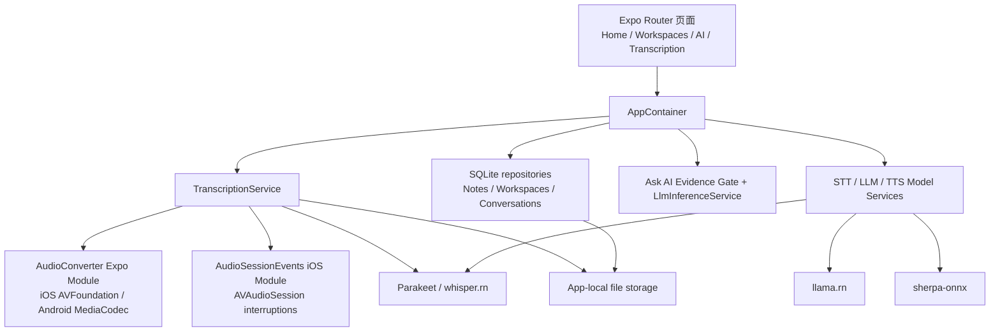

# SpeakSpace iPhone 端移植开发记录（YQ）

## 摘要

本阶段把已有的 SpeakSpace Android/Expo 手机项目扩展为可在 iPhone 上独立运行的本地优先应用。目标不是发布 App Store，也不包含 iPad 或 Mac 版本；重点是让录音转写、音频导入、Workspace、本地模型管理、TTS 和基于转录的 Ask AI 在 iPhone 真机上可用，并为没有 Mac、没有付费开发者账号的组员准备可由 SideStore 重新签名的 IPA。

最终交付不只是“能够编译”：代码中增加了 iOS 原生音频转换和音频中断模块、Whisper 中文模型路径、存储与时长保护、iPhone 安全区布局、可重复执行的 Release 检查、SideStore IPA 打包脚本和物理设备验收文档。

2026 年 8 月 23 日继续完成了一个独立的 iOS feature batch：把桌面端已有的外观偏好、首页完整 Task 操作，以及 Ask AI、Structured Note、Knowledge document 的本地语音朗读移植到 iPhone。语音朗读支持渐进合成、暂停、续播、切换内容时停止旧会话，以及进入后台或锁屏时自动暂停。

> Evidence:
> - Source: `modules/audio-converter/ios/`, `modules/audio-session-events/ios/`, `src/services/transcription-service.ts`, `scripts/verify-ios-release.mjs`, `scripts/package-ios-sidestore.mjs`
> - Method: 对照 `main` 基线审查所有新增与修改文件；在 iPhone 16 Pro Max 上构建、安装并执行核心流程
> - Confidence: High；Windows + SideStore 的真实安装仍需要一名组员完成外部试装

## 一、项目约束和范围

### 1.1 已确认约束

- 只支持 iPhone 手机，不做 iPad 和 Mac 适配。
- 最低 iOS 版本设为 16.4，界面锁定竖屏。
- 不发布 App Store；开发阶段使用 Personal Team 真机安装，组员测试采用 SideStore 自签名。
- 录音、转录、笔记、Workspace、Ask AI 历史和模型保存在应用本地容器。
- 只有用户主动下载模型时需要网络；推理过程在设备上完成。
- 模型不打入 IPA，避免安装包过大，由每台设备分别下载。
- 中文是主要验收语言，因此加入多语言 Whisper 模型和中文 Ask AI 证据处理。

### 1.2 不在本阶段范围内

- App Store 上架、TestFlight、付费 Ad Hoc 分发。
- iCloud 或服务器同步。
- 后台持续录音或后台持续下载。
- iPad 分栏布局和 Mac Catalyst。

## 二、整体架构

项目继续使用 Expo Router、React Native 和本地服务层，没有为 iOS 复制一套业务代码。平台差异收敛在 Expo Modules 和配置层，页面仍调用统一的 `AppContainer` 服务。



这个结构的关键决定是：`ios/` 和 `android/` 保持 Expo Prebuild 生成并由 Git 忽略，必须长期保存的原生实现放在 `modules/`，构建修复放在可审计的 `postinstall` 脚本中。这样组员从干净仓库执行 `npm ci` 和 `npx expo prebuild` 时能够重建相同原生工程。

## 三、主要开发内容

### 3.1 iOS 音频导入与格式转换

Android 原版的 `AudioConverter` 只注册了 Android 平台，iPhone 无法处理导入文件。为此新增：

- `AudioConverterModule.swift`：向 JavaScript 暴露 `prepareAudioAsync`。
- `AudioPreparer.swift`：使用 AVFoundation 读取 WAV、MP3、M4A、AAC、FLAC 等系统可解码音频，转换为 16 kHz、单声道、16-bit PCM WAV。
- `AudioConverter.podspec` 和 `expo-module.config.json` 的 Apple 注册。
- 转换失败时删除临时文件，避免无效输出占用空间。
- 输入和输出两层两小时限制，防止元数据不可信时生成超长 WAV。

Android 端同步增加相同的两小时时长约束，避免跨平台规则不一致。

> Evidence:
> - Source: `modules/audio-converter/ios/AudioPreparer.swift`, `modules/audio-converter/android/src/main/java/expo/modules/audioconverter/AudioConverterModule.kt`, `src/domain/audio-import/audio-import.ts`
> - Method: 检查目标采样率、声道数、PCM 位深、时长检查和失败清理分支；Swift smoke test 覆盖短样本与超长输入
> - Confidence: High

### 3.2 录音生命周期、Finish 和系统中断

真机测试发现用户说完话后点击 Finish，最后一段语音可能尚未进入转写队列。修复后的顺序是先停止音频流并结算活动时长，再要求 transcriber 处理 `nextSlice()`，最后停止转写器并合并结果。空转录不会进入无法保存的弹窗，并提供带确认的丢弃出口。

iOS 来电、Siri、其他音频 App 和锁屏可能触发 AVAudioSession 中断。新增 `AudioSessionEvents` Expo Module，把系统中断事件送到 React Native 页面；页面将活动录音暂停并保留会话，不在返回前台时自动恢复，避免用户不知情地继续录音。

同时实现：

- 活动录音累计计时，暂停时间不计入两小时上限。
- 距离上限五分钟时提示。
- 到达两小时后自动暂停并进入可保存状态。
- 录音期间保持屏幕唤醒，离开活动状态时解除。

> Evidence:
> - Source: `src/services/transcription-service.ts`, `src/app/transcription.tsx`, `modules/audio-session-events/ios/AudioSessionEventsModule.swift`, `tests/live-transcription-finish.test.mjs`
> - Method: 检查 Finish 调用顺序、计时器清理、AppState 和 interruption 回调；在真机完成“录音—Finish—保存—重启”流程
> - Confidence: High

### 3.3 中文 STT 与 Whisper 原生稳定性

原领域模型只允许 `parakeet`。现在 `SttModelEngine` 同时支持 `parakeet` 和 `whisper`，模型目录新增 `Whisper Small Multilingual (F16)`，中文提示传给 whisper.rn，并在实时录音和音频导入两条路径统一选择引擎。

whisper.rn 0.7.2 的异步 JSI 任务会复制配置对象，但其中的 `language` 和 `initial_prompt` 指针仍可能指向移动前字符串。`scripts/patch-whisper-jsi-string-lifetimes.mjs` 在 `npm ci` 后重新绑定 `c_str()` 指针；脚本要求精确命中两个上游位置，依赖升级导致源代码变化时会主动失败，强制重新审查补丁，而不是静默修改未知版本。

> Evidence:
> - Source: `src/constants/stt-model-catalog.ts`, `src/domain/stt-model/stt-model.ts`, `src/services/stt-model-service.ts`, `src/services/transcription-service.ts`, `scripts/patch-whisper-jsi-string-lifetimes.mjs`, `tests/whisper-jsi-config-lifetime.test.mjs`
> - Method: 静态回归测试验证补丁锚点；真机下载并激活模型后完成中文录音转写
> - Confidence: High

### 3.4 模型下载和存储安全

STT、LLM 和 TTS 模型都可能达到数百 MB 或数 GB。新增 `ensureStorageAvailable()`，在下载、音频转换和保留原始录音前检查可用空间，同时保留 256 MB 安全余量。检查失败只返回可理解的错误，不自动删除用户的模型、录音、笔记或 Workspace。

模型下载统一使用 Expo FileSystem foreground session。应用离开前台时传输可能停止，但不会继续占用不可见的后台任务；用户回到模型页面后可以重新开始。下载完成后检查实际字节数，失败或大小不匹配时只清理本次临时文件。TTS 的压缩包在解压和模型检测完成后删除。

> Evidence:
> - Source: `src/services/storage-safety-service.ts`, `src/services/stt-model-service.ts`, `src/services/llm-model-service.ts`, `src/services/tts-model-service.ts`, `tests/model-download-session.test.mjs`
> - Method: 检查三个模型服务的 foreground session、字节校验和清理范围；自动测试防止退回后台下载器
> - Confidence: High

### 3.5 Ask AI 的中文证据约束

真机短会议转录测试中，Ask AI 返回“转录信息不足”，原因不是模型完全不可用，而是原证据分块和关键词处理偏向英文，中文连续文本没有形成足够稳定的检索 token。

解决方法：

- Unicode NFKC 归一化。
- CJK 字符和双字 token 提取，同时保留英文词干逻辑。
- 识别“这个笔记说了什么”“总结这份转录”等中文概述问题。
- 概述答案必须保留证据中的数字和时间原子；如果模型遗漏关键日期/时间，拒绝把不完整回答当成已验证结果。
- 证据门只允许基于选中转录回答，不将普通模型知识当作笔记内容。

> Evidence:
> - Source: `src/services/ask-ai-evidence-text.ts`, `src/services/ask-ai-evidence-gate.ts`, `src/services/llm-inference-service.ts`, `tests/ask-ai-chinese-grounding.test.mjs`
> - Method: 中文和英文概述问题单元测试；验证转录中的日期与时间不会被无声丢弃
> - Confidence: High；不同本地 LLM 的语言质量仍需持续真机抽样

### 3.6 iPhone 界面和安全区域

适配过程中出现三类明显布局问题：

1. 底部 Home、Workspaces、AI 使用占位三角形，并与 Home Indicator 重叠。
2. Save transcription 弹窗从顶部展开，与状态栏和灵动岛重叠。
3. New workspace 表单同样进入顶部状态栏。

底部导航在 iOS 使用 SF Symbols、在 Android/Web 使用对应的 Material Symbols：Home 使用四宫格、Workspaces 使用文件夹、AI 使用立方体，并用 `useSafeAreaInsets()` 计算底部高度。Expo 57 的 `SymbolView` 只接收 SF Symbol 字符串时不会在 Android 渲染，因此这里使用逐平台名称和字重映射。两个表单改为“全屏遮罩 + 安全区 viewport + 居中卡片”，键盘出现时在剩余可见区域内居中，内容过长仍可滚动。

> Evidence:
> - Source: `src/app/(tabs)/_layout.tsx`, `src/app/transcription.tsx`, `src/app/workspaces/index.tsx`, `tests/bottom-tab-bar.test.mjs`, `tests/live-transcription-finish.test.mjs`, `tests/workspace-create-modal-layout.test.mjs`
> - Method: iPhone 16 Pro Max 截图复现；代码检查 safe-area inset 和 centered viewport；回归测试锁定布局结构
> - Confidence: High

### 3.7 Release、Personal Team 和 SideStore

项目禁用了 llama.rn 可选的 Extended Virtual Addressing 和 Increased Memory Limit entitlement，因为免费 Personal Team 无法签发这些能力。`verify-ios-release.mjs` 检查：

- `UIDeviceFamily` 必须只有 iPhone。
- 最低系统版本不低于 16.4。
- 设备可执行文件必须是 arm64，不能混入模拟器架构。
- 必须内嵌 `main.jsbundle`，确保脱离 Metro 启动。
- Release 不声明后台音频、Bonjour 或应用自有的本地网络权限。
- Personal Team 安装包不得带有两个不可用的内存 entitlement。

Expo Dev Launcher 的 Release Info.plist 处理阶段曾可能早于最终 plist 生成。`patch-expo-dev-launcher-release-plist.mjs` 为该脚本增加 Info.plist 输入依赖，保证 Xcode 构建顺序稳定。

团队仓库使用中性 Bundle ID，`app.config.ts` 允许开发者通过 `IOS_BUNDLE_IDENTIFIER` 环境变量生成自己的本地工程，避免把个人 Team ID 写进 Git。`package-ios-sidestore.mjs` 从已验证 `.app` 复制应用，删除原签名和 provisioning profile，验证 `Payload/*.app` 结构并生成 SHA-256，供 Windows 测试者在 SideStore 中自行重签。

> Evidence:
> - Source: `app.json`, `app.config.ts`, `scripts/verify-ios-release.mjs`, `scripts/patch-expo-dev-launcher-release-plist.mjs`, `scripts/package-ios-sidestore.mjs`, `tests/ios-personal-team.test.mjs`, `tests/ios-release-verifier.test.mjs`, `tests/ios-sidestore-packager.test.mjs`
> - Method: Release 真机构建与 codesign 验证；IPA 解压检查并对照 SHA-256
> - Confidence: High for build/package structure; Medium for Windows installation until pilot tester completes SideStore import and refresh

## 四、开发期间遇到的问题与解决方法

| 问题 | 根因 | 解决方法 | 验证方式 |
| --- | --- | --- | --- |
| Xcode 提示 `.xcworkspace has disappeared` | `ios/` 是 Expo 生成目录，Prebuild/Pods 重建后旧 Xcode 窗口仍指向已替换的 workspace | 关闭旧 container，重新执行 Prebuild/Pod install，只打开 `.xcworkspace` | 新 workspace 能解析 Pods 并完成设备构建 |
| 真机签名失败或 Bundle ID 不可用 | Personal Team 只能注册属于该账号的 App ID，个人标识被写进团队配置会互相冲突 | 仓库保留团队中性 ID，本地用 `IOS_BUNDLE_IDENTIFIER` 覆盖，Xcode 自动签名 | `npx expo config` 同时验证默认值和环境覆盖值 |
| 点击 Finish 后最后一段语音丢失 | 最后一片音频仍在队列，停止顺序过早 | 停流后显式 `nextSlice()`，再停止 transcriber 并合并结果 | 真机短语音测试和 `live-transcription-finish` 回归测试 |
| iOS 无法导入 Android 已支持的音频格式 | Android MediaCodec 模块没有 Apple 实现 | 使用 AVFoundation 新增 iOS AudioConverter，统一输出 STT WAV | Swift smoke test和真机文件导入矩阵 |
| 锁屏/来电后录音状态不可信 | JS AppState 无法覆盖所有 AVAudioSession 中断 | 新增 AudioSessionEvents 原生模块并保持手动恢复 | 锁屏、前后台和系统音频中断验收表 |
| 中文 Ask AI 返回“信息不足” | 英文式分词使中文证据无法稳定命中 | CJK token、概述意图和数字原子完整性检查 | 中文会议转录问题和自动测试 |
| 模型下载失败后残留或存储不足 | 大文件下载、解压和模型同时存在，空间估算不足 | 操作前空间预算、foreground task、字节校验、局部临时文件清理 | 模型下载测试和低存储验收 |
| 弹窗与灵动岛/状态栏重叠 | 旧底部抽屉 `ScrollView` 在全屏透明 Modal 中从顶部扩展 | safe-area viewport 内居中卡片，KeyboardAvoidingView 处理键盘 | iPhone 截图与三个布局回归测试 |
| Android 底部图标在合并审阅中可能消失 | `expo-symbols` 仅收到 SF Symbol 字符串，Android 没有 Material Symbol 名称和字重 | 为三枚图标提供 iOS/Android/Web 映射和 Android 字重 | Expo 57 文档核对、类型检查和底部导航回归测试 |
| 免费签名不能使用 llama.rn 内存 entitlement | Apple Personal Team 不提供这两个可选 capability | 关闭 entitlement，选择适合手机内存的模型和上下文 | Release entitlement 检查和连续问答测试 |
| 原 `.app` 不能直接发给其他 iPhone | provisioning profile 绑定签名 Team 和设备 | Release 提供去除原签名的 IPA，由 SideStore 为每位组员重签 | IPA 结构检查；Windows 试装待完成 |

## 五、构建和验证方法

### 5.1 自动检查

```bash
npm ci
npm test
npx tsc --noEmit
npm run lint
npx expo-doctor
git diff --check
```

测试覆盖的关键回归包括：中文 Ask AI、底部导航与安全区、Finish 最后一片音频、居中保存弹窗、Personal Team entitlement、Release 元数据、模型前台下载、whisper.rn JSI 补丁和 SideStore 打包规则。

### 5.2 设备 Release

```bash
IOS_BUNDLE_IDENTIFIER=com.example.speakspace.local \
  npm run ios:device:release

npm run verify:ios-release -- \
  /absolute/path/to/speakspacelocalmobile.app \
  --require-signed
```

物理设备验收记录位于 `docs/ios-device-acceptance.md`。模拟器结果不能代替麦克风、签名、模型内存、系统音频中断和本地数据持久化的真机结论。

### 5.3 SideStore 产物

```bash
npm run package:ios:sidestore -- \
  /absolute/path/to/speakspacelocalmobile.app
```

输出 IPA 与 SHA-256 文件上传到 GitHub Release。Windows 组员执行 `docs/ios-sidestore-windows.md`，首位测试者必须记录安装、启动、模型下载、一次转写、一次 Ask AI 和一次签名刷新。

## 六、当前验证状态

- iPhone 16 Pro Max 真机 Release 构建、签名、覆盖安装和脱离 Metro 启动：已完成。
- STT、TTS 激活；中文短语音识别并保存到 Workspace：已完成。
- Save transcription、New workspace 和底部导航安全区修复：已在真机确认问题并安装修复版。
- Ask AI 中文证据处理：自动测试完成；不同会议样本仍建议扩大测试。
- 干净 Prebuild 后的 iPhone Release：`xcodebuild` 重新编译 139 个原生 target，结果为 `BUILD SUCCEEDED`；产物只包含 arm64、`UIDeviceFamily = [1]`、最低 iOS 16.4 和团队中性 Bundle ID。
- 自动质量门：2026-08-23 的当前分支为 30/30 测试通过，TypeScript 通过，Expo Doctor 21/21 通过，ESLint 为 0 error（17 个 warning），`git diff --check` 通过。
- SideStore IPA：32,828,985 bytes；不含签名、provisioning profile 或 `__MACOSX` 元数据；SHA-256 为 `95308e11392d881db71ca8e6c410bc9fea837b97d3558b8682704c1d5e4f32fa`。
- Windows + SideStore 实际安装与七天内 Refresh：待首位组员试装。这是分发链剩余的唯一外部设备验收项，不应被自动测试替代。

## 七、已知限制和后续工作

1. 免费 SideStore 签名需要周期性刷新，无法做到永久的一键安装。
2. SideStore 本身和 SpeakSpace 会占用 Personal Team 的开发应用名额。
3. iOS 版本升级可能使 pairing file 失效，需要重新配置。
4. 所有用户数据只在设备本地；卸载应用会删除容器，当前没有自动导出/恢复功能。
5. 大模型能否连续运行受 iPhone 内存限制影响；不能通过免费签名开启额外内存 entitlement。
6. Whisper Small F16 适合中文验收，但约 488 MB；每位测试者需要单独下载。
7. 本阶段没有真实 Windows 环境，SideStore 指南基于官方流程和 IPA 结构；必须由组员完成一次 pilot test 后再宣布整个分发链通过。

## 八、可用于个人报告和团队报告的贡献要点

### 个人报告可展开

- 为什么采用“共享业务层 + 双平台 Expo Module”，而不是复制一套 iOS 页面。
- AVFoundation 音频转换的格式、采样率、声道和临时文件策略。
- 实时转写 Finish 顺序、系统中断和两小时时长状态机。
- whisper.rn JSI 字符串生命周期问题的定位和可重复补丁策略。
- 中文证据检索与数字/时间事实完整性约束。
- Personal Team、SideStore 和应用签名之间的边界。
- 安全区域问题如何从截图复现，再用代码结构测试防回归。

### 团队报告可展开

- Android 与 iPhone 共用领域模型、服务和 SQLite 仓储，平台差异集中到原生模块。
- 本地优先隐私设计：内容不上云，联网仅用于用户主动模型下载。
- 自动测试、Release 元数据验证、物理设备验收和 Windows 外部试装构成四层质量门。
- 不上架 App Store 条件下的分发权衡：免费但需七天刷新的 SideStore，与付费官方渠道之间的取舍。

## 九、2026-08-23 桌面功能移植与真机验收

### 9.1 需求选择与设计边界

本轮只处理 iPhone，不要求 Android 同步，也不增加 App Store 发布能力。移植内容来自桌面端已有工作流，范围固定为：

1. Light、Dark、System 三种全局 Theme preference。
2. Home 直接展示 Structured Note 生成的完整 Task，可完成、展开已完成项并恢复未完成。
3. Ask AI 助手回复、Structured Note 和 Knowledge document 的本地 TTS 朗读，以及暂停和续播。

Raw transcript、用户问题、界面文字朗读、语速和说话人设置没有进入本轮范围。三个实现决策分别记录在 `docs/adr/0003-use-resumable-progressive-tts-playback.md`、`docs/adr/0004-preserve-task-completion-across-regeneration.md` 和 `docs/adr/0005-serialize-local-inference-operations.md`。

### 9.2 Theme preference 开发过程

旧实现的 `useColorScheme()` 固定返回 Light，因此虽然颜色常量中已经存在 Dark token，界面仍无法进入深色模式。本轮新增 `ThemeProvider`，在 React 首次渲染前同步读取 `expo-sqlite/kv-store`，并把 `mode`、`preference` 和 `setPreference()` 暴露给全部页面。根布局主动保持 Splash，主题解析完成后再隐藏，避免启动时先闪出浅色页面。

Settings 成为第四个底部 Tab。用户选择会先更新界面，再写入本地存储；写入失败时回滚到原值并显示错误。`app.json` 同时改为自动外观并为 Splash 提供深色背景，使原生启动画面和 React 页面保持一致。

> Evidence:
> - Source: `src/providers/theme-provider.tsx`, `src/app/(tabs)/settings.tsx`, `src/app/_layout.tsx`, `src/hooks/use-theme.ts`, `app.json`
> - Method: 检查同步读取、失败回滚和 Splash 生命周期；在 Reference iPhone 上依次选择 Dark、System，再恢复测试前偏好
> - Confidence: High

### 9.3 Home Task List 开发过程

原 Home/Dashboard 数据查询只返回 Task ID、Note ID 和状态，足够计数但不足以渲染可操作列表。本轮让 repository 返回完整 `CoreTask`，Home 按 due time 优先、start time 次优的规则分为 Overdue、Today、Upcoming 和 Unscheduled；Completed 单独折叠显示，Cancelled 不出现在 Home。

勾选操作直接调用 Structured Note repository 的状态更新，成功后重新加载 Home。点击 Task 内容会打开来源 Note。为了避免用户完成的 Task 在重新生成 Structured Note 后丢失，repository 使用“规范化标题 + 有效日期”匹配旧 Task，只把精确匹配项的完成时间带到新结果，不做模糊匹配。

开发期间删除了隐藏的独立 Dashboard 页面，把概览、Task、Note 和 Calendar 保留在唯一 Home 页面，减少手机端重复导航。

> Evidence:
> - Source: `src/components/home-task-list.tsx`, `src/app/(tabs)/index.tsx`, `src/services/home-task-groups.ts`, `src/services/core-task-identity.ts`, `src/repositories/core-note-insight-repository.ts`
> - Method: 单元测试覆盖分组和 Task identity；真机从 Home 完成 Task，确认 SQLite 状态变为 `completed`，再从 Completed 展开并恢复为 `pending`
> - Confidence: High

### 9.4 渐进式 TTS 开发过程

TTS 模型页面原本只有下载、激活和模型检测，没有生成音频或播放入口。本轮新增全局 `SpeechPlaybackService`：

- 按自然标点把长文本分成目标约 240 字、最多 360 字的片段。
- 第一段完成后立即使用 `expo-audio` 播放，后续片段继续合成，不等待全文结束。
- 暂停时保留当前播放器位置和已经生成的片段，不启动新的片段合成；续播从原位置继续。
- 全应用同一时间只保留一个 Speech playback session；朗读另一项内容时清理旧播放器、TTS engine 和临时 WAV。
- 进入后台或锁屏时自动暂停，返回前台后必须由用户手动续播。
- 启动时删除上次异常退出可能遗留的 speech playback cache。

`LocalLlmCoordinator` 的范围从 LLM 扩展到 transcription 和 TTS 协调。开始录音、文件转录或本地 LLM 生成前会停止正在播放的语音，避免模型同时占用手机内存，也避免扬声器反馈进入麦克风。TTS 模型路径改为相对 Documents 保存，解决 iOS 更新或覆盖安装后应用容器 UUID 改变导致绝对路径失效的问题。

页面层使用一个共享 `SpeechPlaybackButton`，目前接入 Ask AI assistant message、Structured Note 和 Knowledge document。没有 Active model 时会明确提示并提供 TTS Models 入口。

> Evidence:
> - Source: `src/services/speech-playback-service.ts`, `src/services/speech-text-chunks.ts`, `src/components/speech-playback-button.tsx`, `src/services/local-llm-coordinator.ts`, `src/services/sandbox-document-path.ts`, `src/services/tts-model-service.ts`
> - Method: 自动测试覆盖分块、FIFO 和容器路径迁移；Reference iPhone 使用 AISHELL3 Chinese 完成真实合成、播放、暂停保持和续播
> - Confidence: High

### 9.5 真机测试样本与执行方法

真机为 iPhone 16 Pro Max，系统 iOS 27.0，使用 Xcode 26.6 和 Personal Team 本地签名。测试前先备份应用 Documents/SQLite；测试数据库原本为空，因此写入一组只带 `Codex QA` 前缀的 Workspace、Note、Structured Note 和 pending Task。语音样本使用一段说明主题、Task 和 TTS 验收目标的中文长摘要，保证播放时间足以验证暂停位置。

本地生成的 `ios/SpeakSpaceDeviceUITests` XCUITest Target 被 `/ios` ignore 规则排除，不进入 Git。测试动作依次为：

1. 启动并确认 Home 显示 1 个 Note 和 1 个 open Task。
2. 选择 Dark，再选择 System。
3. 完成 Task，展开 Completed，恢复为 pending。
4. 下载约 30 MB 的 AISHELL3 Chinese，完成解压、检测和激活。
5. 从 Workspaces 打开测试 Note 和 Structured Note。
6. 等待状态从 Preparing 进入 Playing，点击 Pause，确认 Paused 状态保持 3 秒，再点击 Resume 并确认重新进入 Playing。
7. 返回 Settings，恢复测试开始前的 Theme preference。

完整真机用例在 68.525 秒内通过，Xcode 结果为 `TEST SUCCEEDED`。随后还原测试前 Documents，卸载 XCUITest Runner，并在干净数据库上执行启动用例；两次 UI configuration 启动分别在 5.868 秒和 3.232 秒内通过。

### 9.6 数据清理与验收结果

测试结束后没有把测试模型或样本留在手机：

- `workspaces`、`notes`、`core_note_insights`、`core_note_tasks`、`tts_models` 均恢复为 0 条。
- `Codex QA` 残留查询为 0。
- SQLite `PRAGMA integrity_check` 返回 `ok`。
- 临时 sherpa-onnx TTS model directory 已从 Documents 移除。
- 原 Theme preference 恢复为 System。
- 正式测试包仍保留在手机，XCUITest Runner 已卸载。

同一提交范围的 `npm test` 结果为 30 passed、0 failed。Node 对 TypeScript ESM 动态导入给出 `MODULE_TYPELESS_PACKAGE_JSON` 性能提示，但不影响测试正确性；该提示不是本轮功能阻塞项。

设备 Release 产物也通过 `verify-ios-release --require-signed`：最低系统版本为 iOS 16.4、设备族仅 iPhone、可执行文件为 arm64、内嵌 JavaScript bundle 存在且签名有效。验证器保留一条 Expo 生成 ATS dictionary 的审计提示；应用没有声明 Bonjour 或 Local Network privacy key，本轮新增网络访问仍只用于用户主动发起的模型下载。

> Evidence:
> - Source: `tests/ios-feature-batch.test.mjs`, Xcode `.xcresult`, 设备应用容器 SQLite 和测试命令日志
> - Method: XCUITest 真实触控与状态断言；测试后重新复制手机 Documents 并执行表计数、前缀残留查询和 SQLite integrity check
> - Confidence: High；结论覆盖本轮三个功能，不替代 `docs/ios-device-acceptance.md` 中尚未逐项填写的完整 STT、长时录音和 Windows SideStore 验收矩阵

## 十、参考资料

- Expo SDK 57 app config：<https://docs.expo.dev/versions/v57.0.0/config/app/>
- Expo dynamic app config：<https://docs.expo.dev/workflow/configuration/>
- Expo SDK 57 safe area：<https://docs.expo.dev/versions/v57.0.0/sdk/safe-area-context/>
- Apple Personal Team 限制：<https://developer.apple.com/support/compare-memberships/>
- SideStore 官方安装文档：<https://docs.sidestore.io/docs/installation/install>

## 附录：证据文件索引

| 主题 | 主要文件 |
| --- | --- |
| iOS 音频转换 | `modules/audio-converter/ios/AudioPreparer.swift` |
| 系统音频中断 | `modules/audio-session-events/ios/AudioSessionEventsModule.swift` |
| 实时/文件转写 | `src/services/transcription-service.ts` |
| STT/LLM/TTS 下载 | `src/services/stt-model-service.ts`, `src/services/llm-model-service.ts`, `src/services/tts-model-service.ts` |
| 存储保护 | `src/services/storage-safety-service.ts` |
| 中文 Ask AI | `src/services/ask-ai-evidence-text.ts`, `src/services/ask-ai-evidence-gate.ts` |
| iPhone UI | `src/app/(tabs)/_layout.tsx`, `src/app/transcription.tsx`, `src/app/workspaces/index.tsx` |
| Release 验证 | `scripts/verify-ios-release.mjs` |
| SideStore 打包 | `scripts/package-ios-sidestore.mjs` |
| 自动测试 | `tests/*.test.mjs` |
