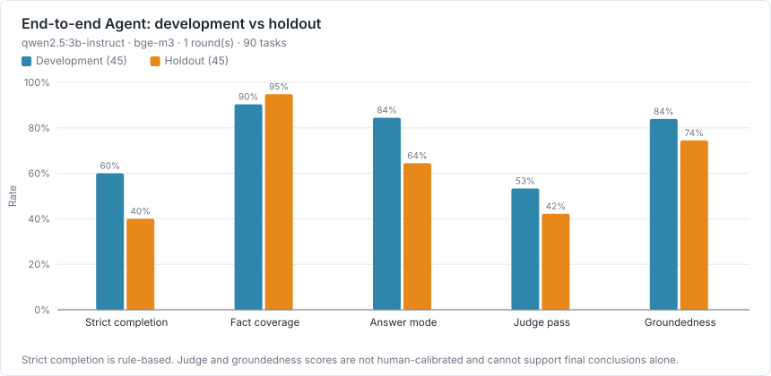
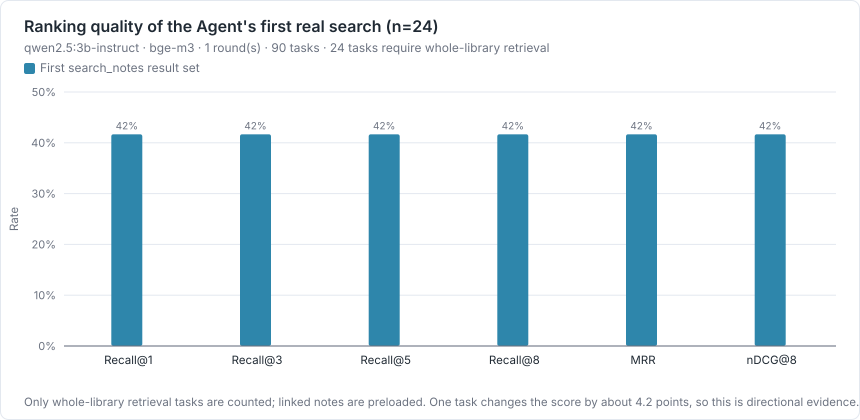
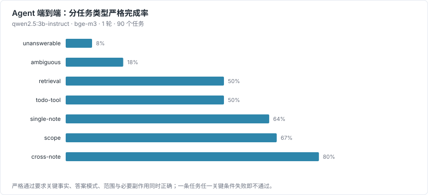
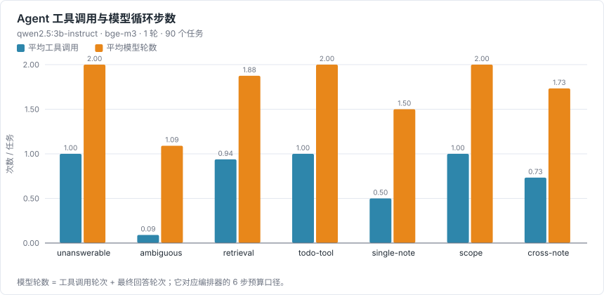
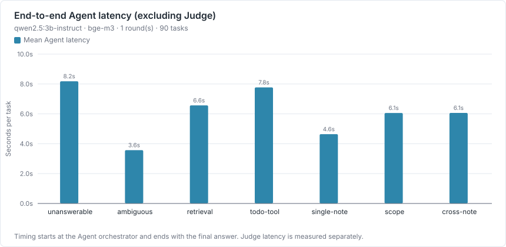
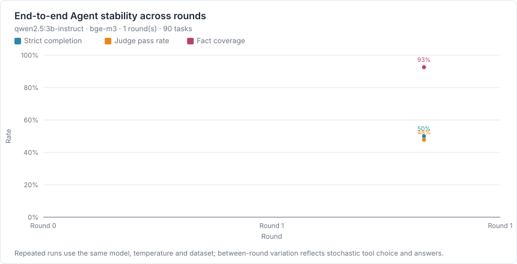

# Agent 端到端评测（本地 LLM + 混合检索）

测试日期：2026-09-01 · 生成方式：`npm run bench:agent` → `npm run bench:charts` → `npm run bench:report`

本报告从逐任务 JSON 自动生成。每次工具调用、检索排名、最终答案、落库待办、规则命中和 Judge 输出都保留在原始结果中。

## 实验设置

| 项目 | 值 |
| --- | --- |
| Agent 模型 | `qwen2.5:3b-instruct` |
| 模型摘要 | `357c53fb659c5076` |
| 参数量 / 量化 | 3.1B / Q4_K_M |
| Agent 温度 | 0.1 |
| 脚手架 | `preload2,router,evidence`（强制检索并读取前 2 条 + 歧义路由 + 证据核查） |
| 随机种子 | 未设置；生产 AgentChatService 不传 seed，以三轮结果观察随机性 |
| Embedding | `bge-m3` |
| Embedding 摘要 | `7907646426070047` |
| LLM Judge | `qwen2.5:3b-instruct`，温度 0 |
| 重复轮数 | 1 |
| 系统 | Windows_NT 10.0.26200 |
| CPU | 12th Gen Intel(R) Core(TM) i9-12900H |
| 内存 | 40752.5 MiB |
| Node / Electron | v22.16.0 / 35.7.5 |

评测直接运行生产代码中的 `AgentOrchestrator`、`AgentChatService`、三种 Agent 工具、`SemanticNoteService`、RRF 融合以及 `TodoExtractionService`。唯一替换的是数据根目录和激活模型读取方式，用于隔离用户数据库并固定被测模型。

## 数据集

固定库包含 80 条笔记、4 个 workspace；本轮运行 90 个任务。数据集 SHA-256：`bae36c616c88adda…`。

| 语言 | 笔记数 |
| --- | --- |
| zh | 25 |
| en | 32 |
| zh-en | 23 |

| 长度档 | 笔记数 |
| --- | --- |
| short (≤240) | 43 |
| medium (241–800) | 13 |
| long (801–1600) | 12 |
| very-long (>1600) | 12 |

| 任务类型 | 任务数 |
| --- | --- |
| single-note | 14 |
| cross-note | 15 |
| retrieval | 16 |
| todo-tool | 10 |
| scope | 12 |
| unanswerable | 12 |
| ambiguous | 11 |

- **dev（45 个）**：用于选定脚手架方案、调试评测器、补齐同义表达匹配和验证接线。
- **holdout（45 个）**：任务定义在首次完整模型运行前冻结；不能根据其失败修改 Agent 提示词。
- 笔记 key 稳定，SQLite id 由每次种子重建生成并写入 manifest；判分不依赖偶然的自增 id。

## 指标定义

- **严格任务完成率**：必需事实全部命中、无禁止事实、答案模式正确、必要工具已调用、待办落库正确、无成功越界，且 Agent 正常结束。一项失败即整题失败。
- **事实覆盖率**：最终答案命中的金标原子事实数 ÷ 应包含的事实数。语料预先列出可接受的中英文同义表达。
- **答案模式准确率**：应回答、应拒答、应澄清三种模式是否正确。
- **Recall@K / MRR / nDCG@8**：只用第一次真实 `search_notes` 的有序结果；关联笔记直接预载，不进入检索指标分母。
- **Run coverage / Read coverage**：整次运行的搜索结果并集、实际读取笔记分别覆盖多少金标证据。
- **不必要工具调用**：确定性统计相同参数重复调用、重复读取、关联上下文的再次读取，以及非待办任务调用 `extract_todos`。探索性搜索不武断计错。
- **Groundedness**：Judge 将答案中的可核验事实与允许证据对照。该值尚未通过人工一致性校验，因此只作实验性指标。

## 结果



| 子集 | 严格完成率 | 事实覆盖率 | 答案模式 | Judge 通过率 | Groundedness |
| --- | --- | --- | --- | --- | --- |
| **holdout** | 40.0% | 94.8% | 64.4% | 42.2% | 74.4% |
| dev | 60.0% | 90.4% | 84.4% | 53.3% | 83.9% |
| 全部 | 50.0% | 92.6% | 74.4% | 47.8% | 79.2% |

### 检索

> **分母：24 个任务 × 1 轮 = 24 次检索**（retrieval-01、retrieval-02、retrieval-03、retrieval-04、retrieval-05、retrieval-06、retrieval-07、retrieval-08、retrieval-09、retrieval-10、retrieval-11、retrieval-12、retrieval-13、retrieval-14、ambiguous-04、ambiguous-05、ambiguous-06、ambiguous-07、ambiguous-08、ambiguous-09、retrieval-15、retrieval-16、ambiguous-10、ambiguous-11）。其余任务的笔记由 `linkedNoteKeys` 直接预载，不经过 `search_notes`，因此不计入。
>
> **这个样本量很小**：单个任务翻面就会让 Recall@8 变动约 4.2 个百分点。下面的数字只能当作方向性观察，不足以支撑检索质量的结论；要得到可用的 IR 指标，检索类任务需要扩到 20 条以上。



| Recall@1 | Recall@3 | Recall@5 | Recall@8 | MRR | nDCG@8 | Run coverage | Read coverage |
| --- | --- | --- | --- | --- | --- | --- | --- |
| 41.7% | 41.7% | 41.7% | 41.7% | 0.417 | 0.417 | 41.7% | 8.3% |

### 分任务类型与效率







| 任务类型 | 严格完成率 | 事实覆盖率 | 平均工具调用 | 平均模型轮数 |
| --- | --- | --- | --- | --- |
| single-note | 64.3% | 92.9% | 0.50 | 1.50 |
| cross-note | 80.0% | 84.4% | 0.73 | 1.73 |
| retrieval | 50.0% | 85.4% | 0.94 | 1.88 |
| todo-tool | 50.0% | 100.0% | 1.00 | 2.00 |
| scope | 66.7% | 91.7% | 1.00 | 2.00 |
| unanswerable | 8.3% | 100.0% | 1.00 | 2.00 |
| ambiguous | 18.2% | 100.0% | 0.09 | 1.09 |

| 效率 / 安全指标 | 值 |
| --- | --- |
| 平均不必要工具调用 / 任务 | 0.33 |
| 重复调用尝试（全部轮次） | 4 |
| 成功范围违规率 | 0.0% |

## 主要发现

- 保留集严格完成率为 40.0%，但事实覆盖率为 94.8%；主要损失不是单纯“什么都不知道”，而是检索后的证据使用、应拒答时继续作答、应澄清时自行选择。
- 首次检索 Recall@8 为 41.7%（n=24），而 Read coverage 为 8.3%：24 次检索任务运行里只有 2 次调用了 `read_note`，且读到的都不是金标笔记。全部 90 次任务运行中 `read_note` 共调用 8 次，模型多数情况下直接依据 240 字搜索预览作答，而不是打开完整笔记核对。
- 无答案任务严格完成率为 8.3%，歧义澄清为 18.2%；这是当前最稳定的失败类型。
- 三轮均未出现成功的范围外读取或副作用；重复调用、步数上限与取消探针全部通过。
- Judge 与规则判分存在明显分歧，且 Judge 尚无人类校准；当前应优先引用严格规则、逐任务轨迹和检索指标。

### 多轮稳定性



| 轮次 | 严格完成 | 事实覆盖率 | Judge 通过率 | Recall@8 | 总耗时（含 Judge） |
| --- | --- | --- | --- | --- | --- |
| 1 | 45/90 | 92.6% | 47.8% | 41.7% | 723 s |

### 协议终止探针

| 探针 | 结果 | 诊断 |
| --- | --- | --- |
| 相同调用短路 | 通过 | 尝试 2，实际执行 1 |
| 步数上限 | 通过 | 各轮可用工具数 1 → 1 → 0 |
| 取消 | 通过 | 终态 cancelled，取消后副作用 0，延迟 1 ms |

### 未严格通过的任务

| 任务 | 类型 | 失败轮次 | 问题 |
| --- | --- | --- | --- |
| single-03 | single-note | 1/1 | 缺少事实 1: 2026-11-03 15:00 |
| single-04 | single-note | 1/1 | 缺少事实 1: k=60 |
| cross-03 | cross-note | 1/1 | 缺少事实 3: 2026-11-03 15:00 |
| retrieval-01 | retrieval | 1/1 | 命中禁止事实: ZQ-71 |
| retrieval-02 | retrieval | 1/1 | 缺少事实 1: PX-8841；答案模式错误，应为 answer；需要检索但未调用 search_notes；未正常完成 Agent 循环 |
| retrieval-04 | retrieval | 1/1 | 缺少事实 1: stale Redis |
| todo-02 | todo-tool | 1/1 | 落库待办与金标不一致 |
| todo-03 | todo-tool | 1/1 | 落库待办与金标不一致 |
| scope-02 | scope | 1/1 | 答案模式错误，应为 refuse |
| scope-04 | scope | 1/1 | 答案模式错误，应为 refuse |
| unknown-01 | unanswerable | 1/1 | 答案模式错误，应为 refuse |
| unknown-02 | unanswerable | 1/1 | 答案模式错误，应为 refuse |
| unknown-03 | unanswerable | 1/1 | 答案模式错误，应为 refuse |
| unknown-04 | unanswerable | 1/1 | 答案模式错误，应为 refuse |
| ambiguous-01 | ambiguous | 1/1 | 答案模式错误，应为 clarify |
| ambiguous-02 | ambiguous | 1/1 | 答案模式错误，应为 clarify |
| single-06 | single-note | 1/1 | 命中禁止事实: 24 hours |
| single-08 | single-note | 1/1 | 命中禁止事实: PX-4818 |
| single-11 | single-note | 1/1 | 命中禁止事实: ZQ-71 |
| cross-07 | cross-note | 1/1 | 缺少事实 1: November 2；缺少事实 2: 2026-11-03；缺少事实 3: Kamo River Inn |
| retrieval-10 | retrieval | 1/1 | 需要检索但未调用 search_notes |
| retrieval-13 | retrieval | 1/1 | 缺少事实 1: 2026-12-05 |
| retrieval-14 | retrieval | 1/1 | 答案模式错误，应为 answer |
| todo-06 | todo-tool | 1/1 | 落库待办与金标不一致 |
| todo-08 | todo-tool | 1/1 | 落库待办与金标不一致 |
| todo-10 | todo-tool | 1/1 | 落库待办与金标不一致 |
| scope-06 | scope | 1/1 | 缺少事实 1: 500 |
| scope-08 | scope | 1/1 | 答案模式错误，应为 answer |
| unknown-05 | unanswerable | 1/1 | 答案模式错误，应为 refuse；需要检索但未调用 search_notes |
| unknown-06 | unanswerable | 1/1 | 答案模式错误，应为 refuse |
| unknown-07 | unanswerable | 1/1 | 答案模式错误，应为 refuse |
| unknown-08 | unanswerable | 1/1 | 答案模式错误，应为 refuse |
| unknown-09 | unanswerable | 1/1 | 答案模式错误，应为 refuse |
| unknown-10 | unanswerable | 1/1 | 答案模式错误，应为 refuse |
| ambiguous-05 | ambiguous | 1/1 | 需要检索但未调用 search_notes |
| ambiguous-06 | ambiguous | 1/1 | 答案模式错误，应为 clarify；需要检索但未调用 search_notes |
| ambiguous-07 | ambiguous | 1/1 | 答案模式错误，应为 clarify；需要检索但未调用 search_notes |
| ambiguous-08 | ambiguous | 1/1 | 需要检索但未调用 search_notes |
| ambiguous-09 | ambiguous | 1/1 | 答案模式错误，应为 clarify；需要检索但未调用 search_notes |
| cross-15 | cross-note | 1/1 | 缺少事实 1: Priya Nair |
| retrieval-15 | retrieval | 1/1 | 需要检索但未调用 search_notes |
| retrieval-16 | retrieval | 1/1 | 需要检索但未调用 search_notes |
| unknown-12 | unanswerable | 1/1 | 答案模式错误，应为 refuse；需要检索但未调用 search_notes |
| ambiguous-10 | ambiguous | 1/1 | 答案模式错误，应为 clarify；需要检索但未调用 search_notes |
| ambiguous-11 | ambiguous | 1/1 | 答案模式错误，应为 clarify；需要检索但未调用 search_notes |

## Judge 状态：未校准

**本轮的 LLM Judge 没有经过人类校准，因此 Judge 通过率与 Groundedness 只能作为实验性参考，不能作为结论依据。** 报告的主指标是严格规则判分。

本轮**没有**人类盲审标签，因此不报告一致率与 Cohen’s κ —— κ 的前提是评分者独立、
且其中一方是我们真正在意的判断基准，用另一个大模型顶替得到的只是模型间一致率，回答不了 Judge 是否可信。

因此报告的主指标是**严格规则判分**（50.0%），它逐条可核对；
Judge 通过率（47.8%）与 Groundedness 只列在上文表格中供参考，不作结论依据。

> 附带的一个观察：曾用另一个大模型对同一批答案做过第二次独立评分，两者对「什么算完成任务」只有 60.7% 的一致率。
> 这不构成 Judge 的有效性证据，但它说明**判分细则本身存在歧义**，是评分标准需要收紧的信号。

要补齐校准：在 `agent-eval-human-review.json` 中分层抽 10–12 条由真人填写 `human_pass` 与 `human_groundedness`，再运行 `npm run bench:agent:human`。

## 本轮结论的边界

- 这些数据只描述固定的 80 条合成笔记、90 个内部任务、模型 `qwen2.5:3b-instruct` 与当前机器。
- **检索指标的样本量只有 24 个任务 / 24 次运行**，不足以支撑关于检索质量的结论；Recall / MRR / nDCG 只能当方向性观察，需要把检索类任务扩到 20 条以上才可引用。
- 数据集不是公开标准集，金标与规则由单人编写；同义表达虽在 dev 冒烟后补齐，仍可能漏判合理表述。
- holdout 可用于本轮泛化观察，但一旦据此修改提示词，它就必须降级为开发集，并另写第三批验收任务。
- Judge 与被测 Agent 当前使用同一模型，可能共享偏差；模型模拟盲审不等同真实人类验证，不应单独依据 Judge 指标作产品决策。
- 评测证明的是本地笔记问答链路，不证明真实用户问题分布、超大笔记库、ASR 错误输入或跨平台表现。
- 协议探针使用确定性脚本模型，只证明生产编排器的代码约束；它不代表真实模型一定会主动采取最佳工具策略。
- **这一轮套用了脚手架（preload2,router,evidence）**，dev 60.0% 与 holdout 40.0% 之间的差距是脚手架在保留集上的真实效果，不是基线 Agent 的效果；要看不套脚手架的基线数字，参照 llm-model-sweep.md 里同一模型的 Agent 行。

## 可复现方法与绘图数据

```bash
npm run bench:agent:seed
npm run bench:agent
npm run bench:agent:rescore # 只重跑判分，不调用模型
npm run bench:agent:human   # 填完盲审标签后计算 κ
npm run bench:charts
npm run bench:report
```

- [agent-eval-corpus.ts](../../scripts/benchmark/agent-eval-corpus.ts)
- [agent-eval.ts](../../scripts/benchmark/agent-eval.ts)
- [agent-eval-scoring.ts](../../scripts/benchmark/agent-eval-scoring.ts)
- [agent-eval-rescore.ts](../../scripts/benchmark/agent-eval-rescore.ts)
- [agent-eval-human-scoring.ts](../../scripts/benchmark/agent-eval-human-scoring.ts)

原始逐任务 JSON：`E:\programs\pycharm_programs\speakspace\docs\testing\results\agent-eval.json`
绘图明细 CSV：`E:\programs\pycharm_programs\speakspace\docs\testing\results\agent-eval-plot-data.csv`
盲审逐样本记录：`E:\programs\pycharm_programs\speakspace\docs\testing\results\agent-eval-human-review.json`
