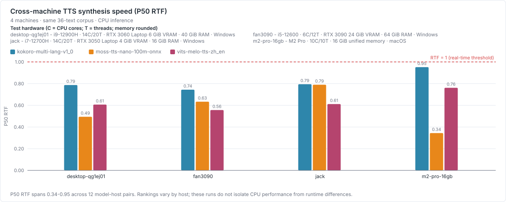
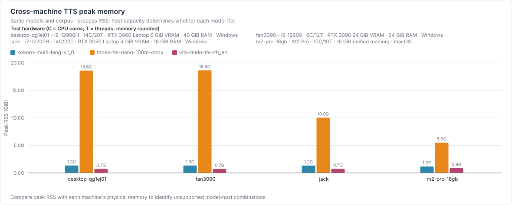
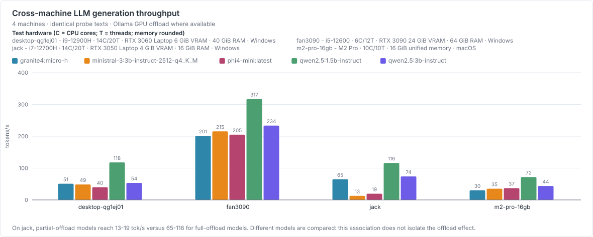
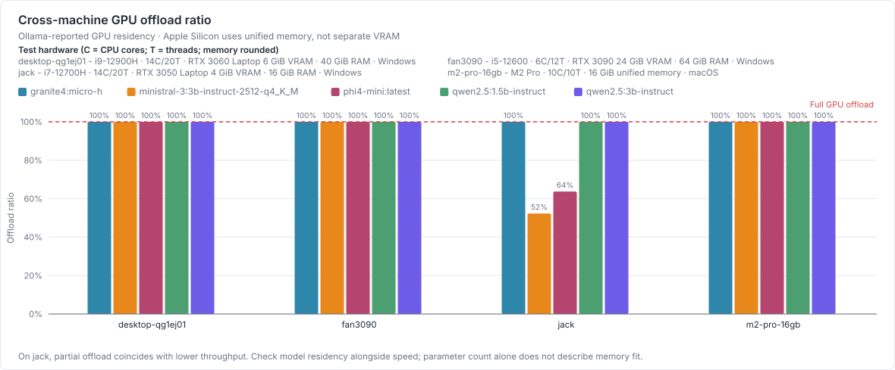
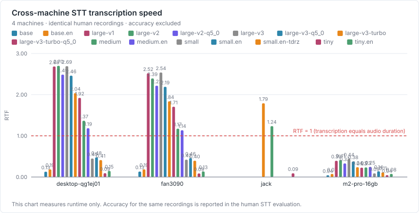

# 跨机器硬件基准汇总

生成时间：2026-09-02 · 生成方式：`npm run bench:aggregate`

已收集 **4** 台机器。本表只汇总**对硬件敏感**的指标；准确率取决于模型与提示词、与机器无关，因此不在这里比较。

## 机器清单

| 机器 | 系统 | CPU | 核心 | 内存 | GPU | 类别 |
| --- | --- | --- | --- | --- | --- | --- |
| `desktop-qg1ej01` | Windows_NT 10.0.26200 x64 | 12th Gen Intel(R) Core(TM) i9-12900H | 14C/20T | 40752.5 MiB | NVIDIA GeForce RTX 3060 Laptop GPU 6144 MiB | nvidia-gpu |
| `fan3090` | Windows_NT 10.0.26200 x64 | 12th Gen Intel(R) Core(TM) i5-12600 | 6C/12T | 65303.1 MiB | NVIDIA GeForce RTX 3090 24576 MiB | nvidia-gpu |
| `jack` | Windows_NT 10.0.26200 x64 | 12th Gen Intel(R) Core(TM) i7-12700H | 14C/20T | 16004.7 MiB | NVIDIA GeForce RTX 3050 Laptop GPU 4096 MiB | nvidia-gpu |
| `m2-pro-16gb` | Darwin 25.6.0 arm64 | Apple M2 Pro | 10C/10T | 16384.0 MiB | — | apple-silicon |

## TTS 合成速度（P50 RTF，越低越快）

| 机器 | kokoro-multi-lang-v1_0 | moss-tts-nano-100m-onnx | vits-melo-tts-zh_en |
| --- | --- | --- | --- |
| `desktop-qg1ej01` | 0.787 | 0.495 | 0.607 |
| `fan3090` | 0.744 | 0.634 | 0.556 |
| `jack` | 0.794 | 0.790 | 0.611 |
| `m2-pro-16gb` | 0.952 | 0.344 | 0.761 |

RTF = 合成耗时 ÷ 音频时长。小于 1 表示快于实时播放，是这个功能可用的最低要求。

## TTS 峰值内存（跑完全部语料）

| 机器 | kokoro-multi-lang-v1_0 | moss-tts-nano-100m-onnx | vits-melo-tts-zh_en |
| --- | --- | --- | --- |
| `desktop-qg1ej01` | 1377.4 MiB | 19048.5 MiB | 748.5 MiB |
| `fan3090` | 1380.0 MiB | 19082.8 MiB | 734.9 MiB |
| `jack` | 1359.6 MiB | 10277.9 MiB | 763.6 MiB |
| `m2-pro-16gb` | 1195.7 MiB | 5637.0 MiB | 895.5 MiB |

峰值内存会受模型、运行时和平台影响，并且**它决定这台机器跑不跑得动**：把每台机器的峰值和「内存」一列对照，才能判断容量是否足够。

## LLM 生成吞吐（tokens/s，越高越快）

| 机器 | granite4:micro-h | ministral-3:3b-instruct-2512-q4_K_M | phi4-mini:latest | qwen2.5:1.5b-instruct | qwen2.5:3b-instruct |
| --- | --- | --- | --- | --- | --- |
| `desktop-qg1ej01` | 50.9 | 48.6 | 39.9 | 117.9 | 53.5 |
| `fan3090` | — | — | — | — | 230.1 |
| `jack` | — | 13.4 | 19.0 | — | — |
| `m2-pro-16gb` | 30.2 | 35.3 | 37.0 | 71.9 | 43.9 |

## GPU 卸载比例（1 = 整个模型都在显存里）

| 机器 | granite4:micro-h | ministral-3:3b-instruct-2512-q4_K_M | phi4-mini:latest | qwen2.5:1.5b-instruct | qwen2.5:3b-instruct |
| --- | --- | --- | --- | --- | --- |
| `desktop-qg1ej01` | 100% | 100% | 100% | 100% | 100% |
| `fan3090` | — | — | — | — | 100% |
| `jack` | — | 52% | 64% | — | — |
| `m2-pro-16gb` | 100% | 100% | 100% | 100% | 100% |

小于 100% 表示显存放不下、部分层回落到 CPU，吞吐会显著下降。**这一列是判断「这台机器能带动多大模型」最直接的依据。**

## STT 转写速度（RTF，越低越快；不含准确率，同一批录音换机器内容不会变）

| 机器 | base | base.en | large-v1 | large-v2 | large-v3-q5_0 | large-v3-turbo | large-v3-turbo-q5_0 | medium | medium.en | small | small.en | small.en-tdrz | tiny | tiny.en |
| --- | --- | --- | --- | --- | --- | --- | --- | --- | --- | --- | --- | --- | --- | --- |
| `desktop-qg1ej01` | 0.15 | 0.20 | 2.64 | 2.66 | 2.47 | — | 1.93 | 1.37 | 1.19 | 0.46 | 0.48 | 0.42 | 0.10 | 0.15 |
| `fan3090` | — | — | — | — | — | — | — | — | — | 0.37 | — | — | — | — |
| `jack` | — | — | — | — | — | 1.79 | — | 1.24 | — | — | — | — | 0.09 | — |
| `m2-pro-16gb` | 0.04 | — | 0.36 | — | — | — | — | — | — | 0.08 | — | — | 0.04 | — |

只测转写耗时，不算 CER——同一批真人录音在任何机器上转写内容都不会变，准确率结论看 [STT 真人评测](./stt-human-eval.md)，这里只回答「这台机器跑 whisper 快不快」。

## 怎么读这份表

- **速度差异**主要来自 CPU 单核性能（TTS、STT 都走 CPU）与 GPU 显存带宽（LLM）。
- **内存/显存**还会受运行时与平台影响，不能假设跨机器不变；应把各机实测峰值和总量对照着看。
- **GPU 卸载比例掉到 100% 以下**是最重要的信号：说明这台机器带不动这个模型，
  此时吞吐的下降往往是数倍，而不是几个百分点。
- 准确率不在这份表里。它取决于模型与提示词，换机器不会变；
  相关结论见 [待办提取评测](./task-extraction-eval.md) 与 [LLM 横向扫描](./llm-model-sweep.md)。

## 各机器原始结果

- [`desktop-qg1ej01`](./results/machines/desktop-qg1ej01/)
- [`fan3090`](./results/machines/fan3090/)
- [`jack`](./results/machines/jack/)
- [`m2-pro-16gb`](./results/machines/m2-pro-16gb/)
