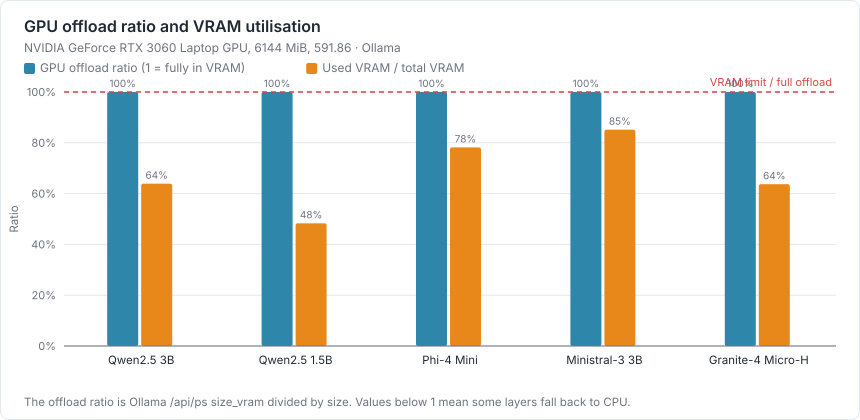
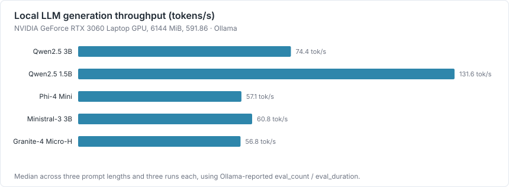
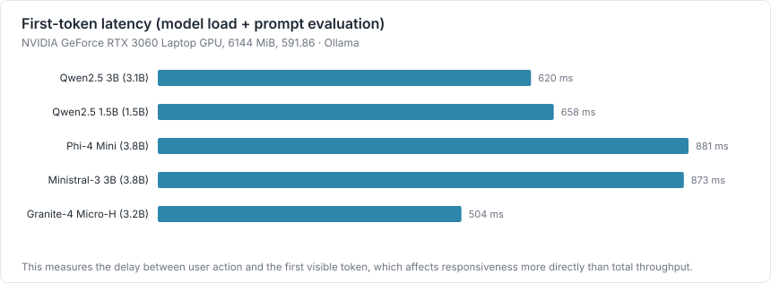
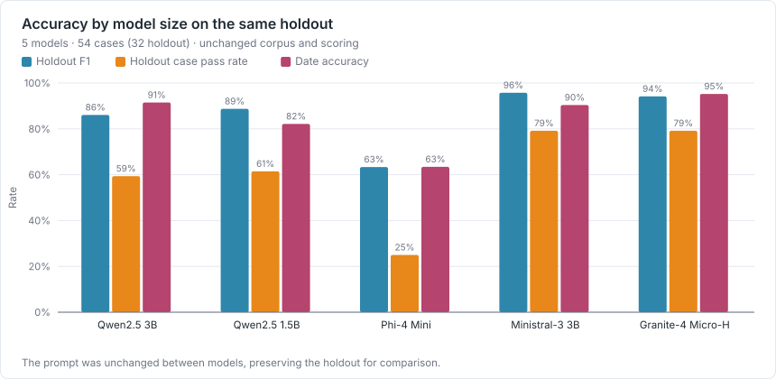
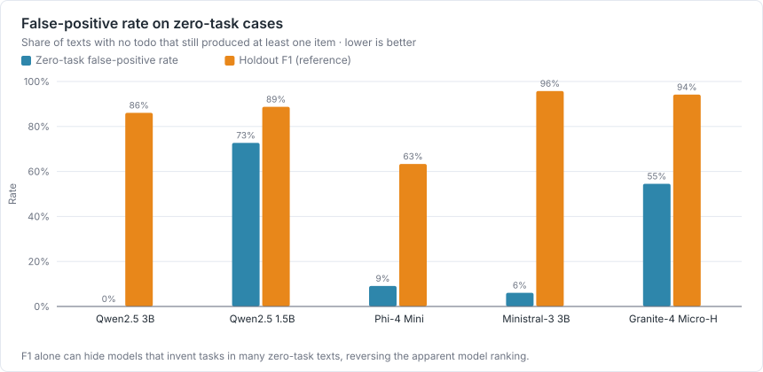
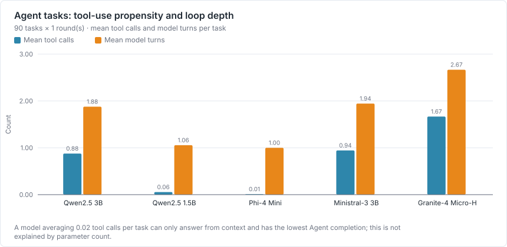
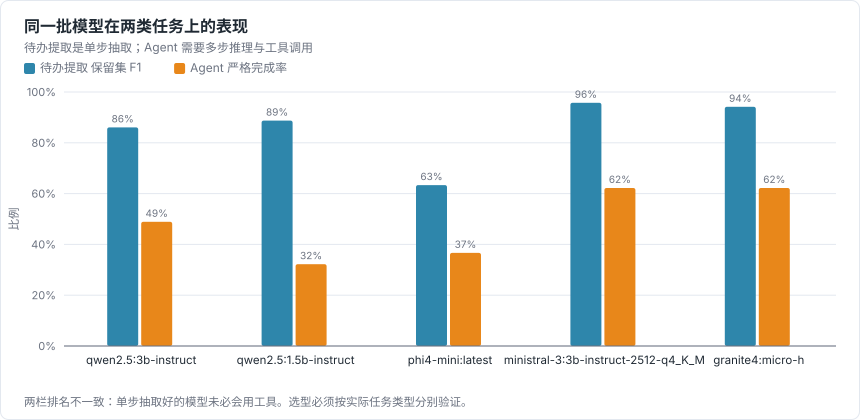
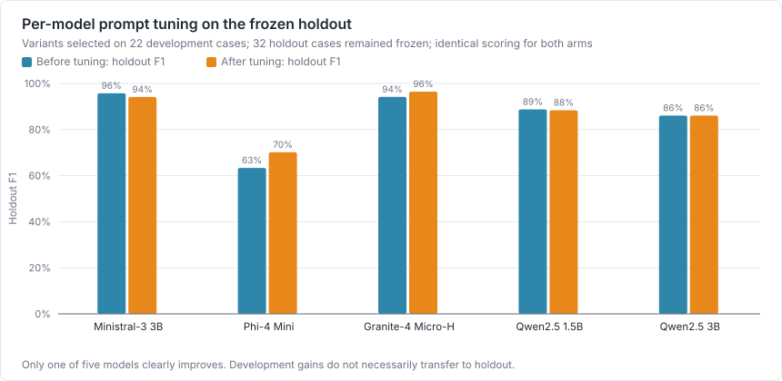
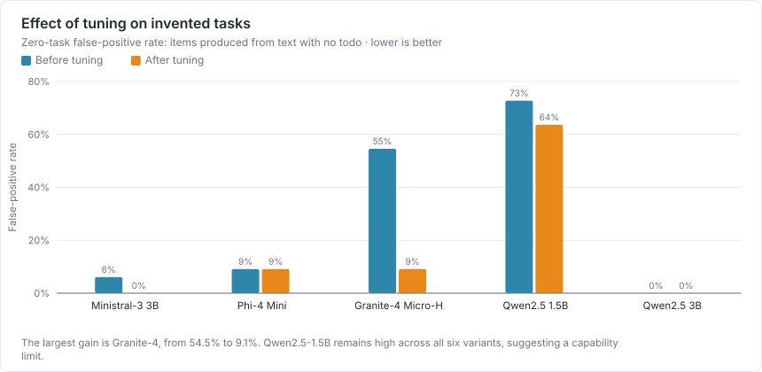
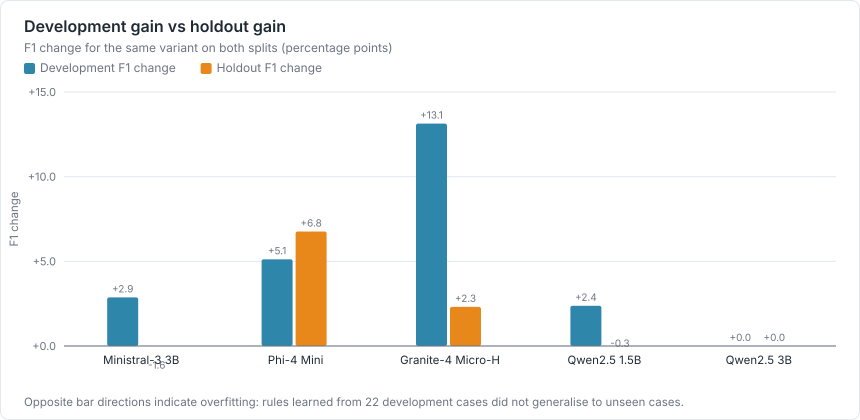

# 本地 LLM 横向扫描

测试日期：2026-09-01 · 生成方式：`npm run bench:sweep -- --with-agent` → `npm run bench:charts` → `npm run bench:report`

对本地优先的产品来说，选型不是「哪个模型最准」，而是**「在这台机器上，哪个模型在真实任务上够用」**。所以这份报告把三件事放在一起看：准确率、推理代价、以及模型到底跑在 GPU 还是 CPU 上。

## 实验设置

| 项目 | 值 |
| --- | --- |
| GPU | NVIDIA GeForce RTX 3060 Laptop GPU, 6144 MiB, 591.86 |
| CPU | 12th Gen Intel(R) Core(TM) i9-12900H |
| 系统 | Windows_NT 10.0.26200 |
| 内存 | 40752.5 MiB |
| 运行时 | Ollama（应用自带） |
| 温度 | 0.1 |
| 轮数 | 3 轮 |
| 待办提取语料 | 与 bench:todo 相同的 54 条用例（dev 22 / holdout 32），语料与判定未改动 |
| Agent 语料 | 80 条固定笔记、90 个任务 × 1 轮 |

**换模型时提示词、语料与判定规则一字未改**，因此 holdout 依然有效，五个模型之间可以直接横向比较。

## 总表

| 模型 | 参数 | 吞吐 tok/s | 首 token | 峰值显存 | GPU 卸载 | 待办 F1（holdout） | 零任务假阳性率 | Agent 完成率 |
| --- | --- | --- | --- | --- | --- | --- | --- | --- |
| `qwen2.5:3b-instruct` | 3.1B | 74.4 | 620 ms | 3927 MiB | 100% | 86.1% | 0.0% | 48.9% |
| `qwen2.5:1.5b-instruct` | 1.5B | 131.6 | 658 ms | 2969 MiB | 100% | 88.7% | 72.7% | 32.2% |
| `phi4-mini:latest` | 3.8B | 57.1 | 881 ms | 4804 MiB | 100% | 63.4% | 9.1% | 36.7% |
| `ministral-3:3b-instruct-2512-q4_K_M` | 3.8B | 60.8 | 873 ms | 5232 MiB | 100% | 95.7% | 6.1% | 62.2% |
| `granite4:micro-h` | 3.2B | 56.8 | 504 ms | 3914 MiB | 100% | 94.2% | 54.5% | 62.2% |

## GPU 与显存



「GPU 卸载比例」= Ollama `/api/ps` 报告的 `size_vram ÷ size`：1 表示整个模型都在显存里，
小于 1 表示显存放不下、部分层回落到 CPU，吞吐会明显下降。显存数字由 `nvidia-smi` 采样交叉验证。

**本轮五个模型全部 100% 跑在 GPU 上。** 占用最多的一个是 5232 MiB，离 6144 MiB 的显存上限还有余量，因此没有观察到 CPU 回落。

**这也意味着本轮测不出显存墙。** 五个模型都在 1.5B–3.8B、体积不超过 3 GB；
要看到「模型大到放不进显存」的拐点，需要再加一个 7B 量级的模型。

## 速度






## 准确率




按待办提取保留集 F1 排序：`ministral-3:3b-instruct-2512-q4_K_M` 95.7%、`granite4:micro-h` 94.2%、`qwen2.5:1.5b-instruct` 88.7%、`qwen2.5:3b-instruct` 86.1%、`phi4-mini:latest` 63.4%。

### 但 F1 会骗人：零任务假阳性率



「零任务假阳性率」= 在「这段话里没有任何待办」的用例上，模型仍然产生了至少一条待办的比例。
对待办应用来说，**凭空往用户清单里塞任务比漏掉一条更糟** —— 前者要用户逐条删，后者只是少一项。

这一列会把 F1 的排名整个翻过来（按假阳性率从低到高）：

- `qwen2.5:3b-instruct`：假阳性率 **0.0%**，F1 86.1%
- `ministral-3:3b-instruct-2512-q4_K_M`：假阳性率 **6.1%**，F1 95.7%
- `phi4-mini:latest`：假阳性率 **9.1%**，F1 63.4%
- `granite4:micro-h`：假阳性率 **54.5%**，F1 94.2%
- `qwen2.5:1.5b-instruct`：假阳性率 **72.7%**，F1 88.7%

**这正是单一聚合指标的危险之处**：F1 把「该抽的抽到了」和「不该抽的没抽」压成一个数，
而这两类错误对用户的代价完全不同。选型时两个数必须一起看。

## Agent：工具调用能力才是分水岭





| 模型 | Agent 完成率（保留集） | Agent 完成率（全部） | 事实覆盖率 | 答案模式准确率 | 平均工具调用 | 平均模型轮数 | 范围违规 |
| --- | --- | --- | --- | --- | --- | --- | --- |
| `granite4:micro-h` | 60.0% | 62.2% | 93.0% | 71.1% | 1.67 | 2.67 | 0.0% |
| `ministral-3:3b-instruct-2512-q4_K_M` | 53.3% | 62.2% | 88.7% | 81.1% | 0.94 | 1.94 | 0.0% |
| `qwen2.5:3b-instruct` | 35.6% | 48.9% | 85.4% | 76.7% | 0.88 | 1.88 | 0.0% |
| `phi4-mini:latest` | 26.7% | 36.7% | 80.7% | 72.2% | 0.01 | 1.00 | 0.0% |
| `qwen2.5:1.5b-instruct` | 20.0% | 32.2% | 78.3% | 76.7% | 0.06 | 1.06 | 0.0% |

**平均工具调用次数几乎完全决定了 Agent 完成率**，而它与参数量无关：

- `granite4:micro-h`（3.2B）：每任务调用工具 1.67 次 → 保留集完成率 60.0%
- `ministral-3:3b-instruct-2512-q4_K_M`（3.8B）：每任务调用工具 0.94 次 → 保留集完成率 53.3%
- `qwen2.5:3b-instruct`（3.1B）：每任务调用工具 0.88 次 → 保留集完成率 35.6%
- `phi4-mini:latest`（3.8B）：每任务调用工具 0.01 次 → 保留集完成率 26.7%
- `qwen2.5:1.5b-instruct`（1.5B）：每任务调用工具 0.06 次 → 保留集完成率 20.0%

几乎不调用工具的模型只能凭上下文作答，检索不到的信息就编、或者干脆不答。
**同一批模型在待办提取和 Agent 上的排名并不一致** —— 单步抽取做得好，不代表会用工具。
选型必须按实际任务类型分别验证，不能用一个「模型能力」总分代替。

## 逐模型提示词调优

上面的对比有一个致命前提：所有模型共用同一套为 `qwen2.5` 调过的提示词。
于是「模型能力差」和「模型不适应这套提示词」分不开。这一节就是来消除它的。

**实验设计**：

- 六个提示词变体，都是在线上提示词上**追加**规则而不是重写（线上那份仍是唯一真实来源，追加内容可 diff）。
- 变体的**选择只在开发集 22 条上做**，脚本里 `--split dev` 是写死的，命令行绕不过去。
- 保留集 32 条在调优期间**完全没有被读取**；选定后冻结，再用它同时评估对照臂和实验臂。
- 选择准则明确写死：`score = dev F1 − 0.5 × zero_task_false_positive_rate；相对 baseline 提升需大于 0.01 才采纳`。

选择准则不单看 F1，是因为待办应用里凭空造任务比漏掉更糟；系数 0.5 是主观的，但它被写出来了，而不是藏在「综合表现最好」这种话里。

| 模型 | 选定变体 | 针对的问题 | 保留集 F1 | 保留集通过率 | 零任务假阳性率 |
| --- | --- | --- | --- | --- | --- |
| `ministral-3:3b-instruct-2512-q4_K_M` | `strict-empty` | 强化「没有待办就返回空数组」，并给出一个反例 | 95.7% → 94.1% | 79.2% → 71.9% | 6.1% → 0.0% |
| `phi4-mini:latest` | `recall-boost` | 强化「每个独立承诺都要单独抽出」，并点名易漏的软性表述 | 63.4% → 70.1% | 25.0% → 18.8% | 9.1% → 9.1% |
| `granite4:micro-h` | `strict-empty` | 强化「没有待办就返回空数组」，并给出一个反例 | 94.2% → 96.5% | 79.2% → 84.4% | 54.5% → 9.1% |
| `qwen2.5:1.5b-instruct` | `json-only` | 收紧输出格式，禁止任何 JSON 以外的内容 | 88.7% → 88.4% | 61.5% → 65.6% | 72.7% → 63.6% |
| `qwen2.5:3b-instruct` | `baseline` | 不追加任何规则，与线上提示词完全一致 | 86.1% → 86.1% | 59.4% → 59.4% | 0.0% → 0.0% |








### 结果是混合的，这本身就是结论

**5 个模型里，保留集 F1 改善 2 个、退步 1 个。**
逐模型调优**没有**普遍提升能力。三件事值得单独说：

1. **只有 `granite4:micro-h` 是明确改善**：F1 +2.3 个点、用例通过率 +5.2 个点，而零任务假阳性率从 54.5% 降到 9.1%。它原本的问题确实是提示词，不是能力。

2. **有 2 个模型出现了对开发集的过拟合** —— 开发集 F1 涨了，保留集反而掉了。`ministral-3` 是最典型的：开发集综合分涨了 0.091，保留集 F1 却掉了 1.6 个点、通过率掉了 7.3 个点。**如果只报开发集的数字，这次调优看起来会是全面成功。**

3. **有些问题提示词治不了**：`qwen2.5:1.5b` 的零任务假阳性率在全部六个变体下都卡在 63–67%，一个都没降到可接受范围。那是能力边界，不是提示词问题。

还有一个跨模型的观察：**同一段追加规则在不同模型上效果可以完全相反**。`strict-empty+json-only` 在开发集上让 `granite4` 得 92.3%，却让 `qwen2.5:3b` 掉到 15.4% —— 77 个百分点的反向摆动。这直接证实了「共用一套提示词的横向对比」确实混着「谁更像 qwen2.5」的成分。

## 本轮结论的边界

- 只覆盖 5 个模型，全部在 1.5B–3.8B 区间、体积不超过 3 GB。这**不是尺寸曲线**，更接近同尺寸的跨架构对比。
- 没有 7B 及以上的模型，因此观察不到显存不足导致的 CPU 回落，也画不出「大到什么程度就不划算」的拐点。
- 只在一台机器（RTX 3060 Laptop 6 GiB）上测。换显卡或纯 CPU 机器，速度与卸载结论都会变。
- 待办提取的输入是干净文本，不含转写错误；真实链路上的表现会更差。
- Agent 的 LLM Judge 未经人类校准，本表引用的是可复核的严格规则判分。
- 逐模型提示词调优只试了 6 个变体、每个变体在开发集上跑 2 轮，**不是充分的提示词搜索**；某个模型仍可能存在没被试到的更好写法。

## 可复现方法

```bash
npm run bench:sweep -- --with-agent   # 速度 + 待办提取 + Agent，逐个模型串行
npm run bench:llm                     # 只测速度、显存与 GPU 卸载
npm run bench:charts
npm run bench:report
```

原始 JSON：`E:\programs\pycharm_programs\speakspace\docs\testing\results\llm-sweep.json`、`E:\programs\pycharm_programs\speakspace\docs\testing\results\llm-runtime.json`
