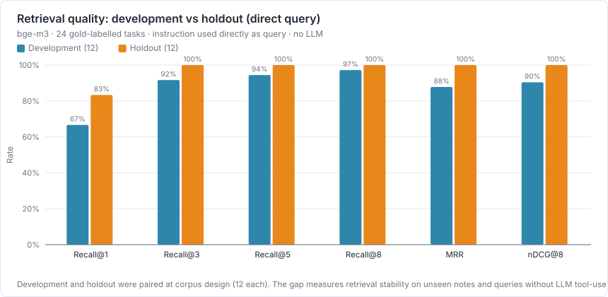
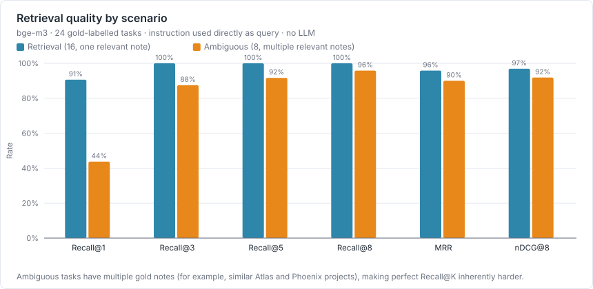
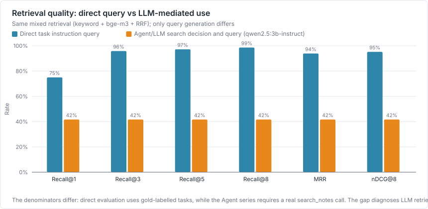

# 检索质量评测（跳过 LLM，直接测混合检索）

测试日期：2026-09-01 · 生成方式：`npm run bench:retrieval` → `npm run bench:charts` → `npm run bench:report`

[Agent 端到端评测](./agent-end-to-end-eval.md) 里的 Recall@K/MRR/nDCG 是「LLM 会不会用检索」——如果 LLM 干脆不调用 `search_notes`，或者拼了个很差的查询词，这些数字全都会被拖差，分不清是检索本身弱还是 LLM 不会用检索。**这份报告反过来**：直接拿任务自带的 instruction 原文当查询词，调用生产环境同一个 `createAgentSearchNotesTool`（关键词匹配 + bge-m3 语义向量，RRF k=60 融合），跳过 `AgentOrchestrator` 和 LLM 那一层，把「查询词写得好不好」这个变量控制住，单独测检索算法本身的召回质量。

## 数据集

复用 [Agent 评测语料](./datasets/agent-eval-corpus.md)（80 笔记、90 任务），不新建语料。90 个任务里 37 个标了 `requiresSearch: true`，其中 24 个有非空的 `relevantNoteKeys` 金标（retrieval 场景 + ambiguous 场景，dev/holdout 各半，语料设计时就是配对的），是这份报告的主体。另外 13 个 `requiresSearch: true` 但金标为空的任务属于 unanswerable 场景——语料库里本来就没有对应笔记，不计入 Recall/MRR/nDCG，只在文末单独看一眼。

## 结果：开发集 vs 保留集



| 子集 | 任务数 | Recall@1 | Recall@3 | Recall@5 | Recall@8 | MRR | nDCG@8 |
| --- | --- | --- | --- | --- | --- | --- | --- |
| dev | 12 | 66.7% | 91.7% | 94.4% | 97.2% | 0.878 | 0.904 |
| holdout | 12 | 83.3% | 100.0% | 100.0% | 100.0% | 1.000 | 1.000 |
| 全部 | 24 | 75.0% | 95.8% | 97.2% | 98.6% | 0.939 | 0.952 |

## 结果：分场景



| 场景 | 任务数 | Recall@8 | MRR | nDCG@8 | 说明 |
| --- | --- | --- | --- | --- | --- |
| retrieval | 16 | 100.0% | 0.958 | 0.969 | 单一正确笔记 |
| ambiguous | 8 | 95.8% | 0.900 | 0.919 | 金标是多条相关笔记（如 Atlas / Phoenix 两个相似项目） |

## 检索算法本身 vs 经 LLM 调用



两组用的是同一套混合检索算法，唯一变量是查询词谁写的：本报告用任务原文，Agent 报告用 LLM 自己决定的查询词（如果它决定要搜索的话）。差距越大，说明产品里更值得优化的不是检索算法，而是让 LLM 更愿意搜索、更会写查询词。

## 附：unanswerable 场景对照

13 条任务的语料库里本来就没有对应笔记（金标为空），不计入上面的指标。这组任务里检索返回的最高置信度分数均值为 0.016（有金标的任务组可以自行对照 tasks 里的 top_score 字段）。分数没有明显走低，说明当前的混合检索在"库里没有答案"时不会主动降低置信度——这不是本次改动范围内的缺陷，只是提醒：不能指望这套检索自己判断"查不到"，判断权始终在下游 LLM 手里。

## 本轮结论的边界

- 样本量小。全部 24 个任务里 retrieval 16 条、ambiguous 8 条，dev/holdout 各 12 条倒是配对的；单个任务翻面就能明显移动整体数字，只作方向性观察。
- 查询词直接用任务 instruction 原文，比真实用户的口语化提问更规整、更贴近关键词；真实查询词的检索质量可能更低。
- 只测了一个 embedding 模型（bge-m3），没有跟其他本地可用的 embedding 模型比较过。
- unanswerable 对照只看了置信度分数是否走低，没有系统评估"检索该不该返回结果"这件事。

## 可复现方法

```bash
npm run bench:agent:seed    # 重建固定笔记库（80 笔记 / 90 任务）
npm run bench:retrieval     # 跳过 LLM，直接测混合检索
npm run bench:charts        # 从上面的 JSON 生成 SVG 图
npm run bench:report        # 生成本文件
```

脚本：[embedding-retrieval-eval.ts](../../scripts/benchmark/embedding-retrieval-eval.ts)，直接调用生产代码 [AgentSearchNotesTool.ts](../../src/main/agent/AgentSearchNotesTool.ts)，未新增或修改任何生产逻辑。

原始逐任务 JSON：`E:\programs\pycharm_programs\speakspace\docs\testing\results\embedding-retrieval.json`
