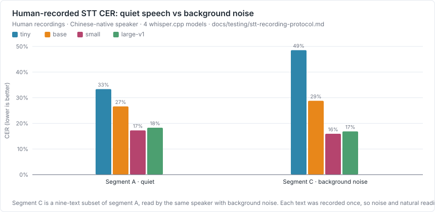
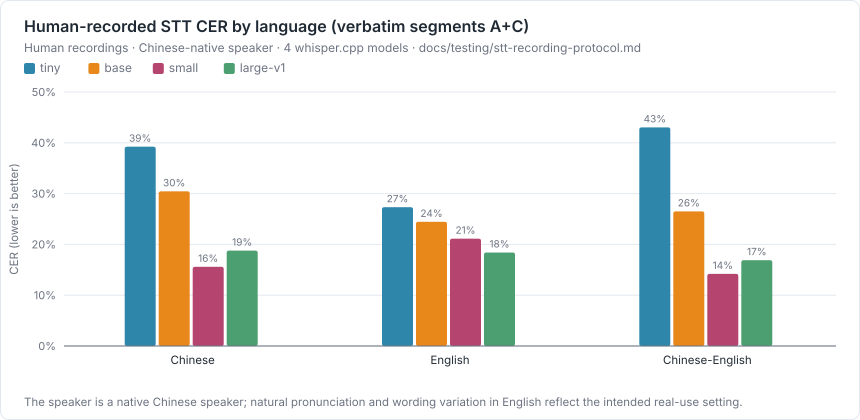
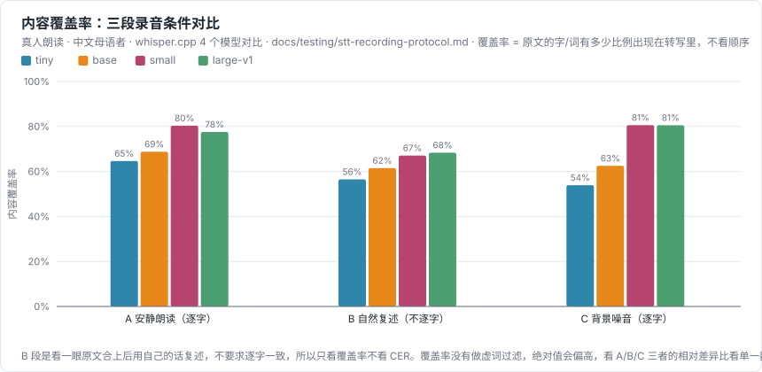
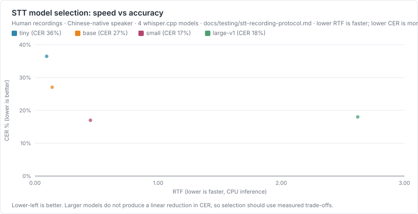

# SpeakSpace Local 真人 STT 准确率评测

测试日期：2026-09-01 · 生成方式：`npm run bench:stt` → `npm run bench:report`

这份报告测的是**真人朗读**的转写准确率，跟 [TTS 基准](./tts-model-benchmark-windows.md) 里「合成语音回转录」的 CER 不是一回事 —— 那是低置信度可懂度代理，这里是真实语音输入。

朗读者是中文母语者。**英文朗读存在自然的发音与用词偏差，这是在测真实使用场景，不是在评判朗读者的英语水平** —— 分语言的 CER 差异要在这个前提下解读，不能直接当作模型在中英文上的能力差。

## 录音方法

按 [stt-recording-protocol.md](./stt-recording-protocol.md) 的协议，复用[TTS / STT 共用语料](./datasets/tts-stt-shared-corpus.md)的 36 条文本，录了 56 段真人朗读，分三段（完整清单见[datasets/stt-human-recordings.md](./datasets/stt-human-recordings.md)）：

| 段 | 内容 | 条数 | 打分方式 |
| --- | --- | --- | --- |
| A | 安静环境，照原文逐字朗读 | 36 | 严格 CER |
| B | 看一眼原文合上后，用自己的话自然复述 | 12 | 仅内容覆盖率（不算 CER） |
| C | 照原文逐字朗读，有轻度背景噪音（键盘声/风扇声） | 9 | 严格 CER |

录音用手机自带录音 App 完成，不是应用内录音功能直接产出 —— 跟应用真实的麦克风采集路径不完全一致，见文末「本轮结论的边界」。原始录音是连续编号的 56 个文件，文件名本身不带文本 ID；映射关系通过 whisper-large-v1 转写锚点文件、核对内容确认，不是单纯按文件顺序猜的，详见 [stt-recording-corpus.ts](../../scripts/benchmark/stt-recording-corpus.ts)。其中一段录音（rec_03）用户连着念完了两条文本才停止，按拼接后的参考文本打分，不影响其余 55 段。

## 测试模型

| 模型 | 体积 | 语言 |
| --- | --- | --- |
| Whisper tiny | 75 MiB | 多语言 |
| Whisper base | 142 MiB | 多语言 |
| Whisper small | 466 MiB | 多语言 |
| Whisper large-v1 | 2.9 GiB | 多语言 |

四档模型体积跨度约 40 倍（75 MiB → 2.9 GiB），用来回答一个具体问题：多花几十倍的下载和内存换来的准确率提升值不值。

## 结果：安静朗读 vs 背景噪音



| 模型 | A 段 CER（安静） | C 段 CER（有噪音） | 差值 |
| --- | --- | --- | --- |
| Whisper tiny | 33.4% | 48.5% | 15.2% |
| Whisper base | 26.6% | 28.8% | 2.2% |
| Whisper small | 17.3% | 15.9% | -1.3% |
| Whisper large-v1 | 18.3% | 16.9% | -1.4% |

C 段的 9 条文本是 A 段 36 条里的一个子集（同一人读），条件差异是背景噪音；但每条只录了一次，差值里混着噪音影响和单次朗读的自然波动，样本量不足以拆开。两个模型（small、large-v1）差值是负的，不能读成"背景噪音提升了准确率"，更合理的解读是：这份录音里用户特意保留的噪音强度还没有严重到压过单次朗读本身的波动。

## 结果：分语言



| 模型 | 中文 CER | 英文 CER | 中英混合 CER |
| --- | --- | --- | --- |
| Whisper tiny | 39.2% | 27.3% | 43.0% |
| Whisper base | 30.5% | 24.4% | 26.5% |
| Whisper small | 15.6% | 21.1% | 14.2% |
| Whisper large-v1 | 18.8% | 18.4% | 16.9% |

英文 CER 明显高于中文，跟朗读者是中文母语者、非母语发音这个前提一致，不能直接解读成"模型的中文能力强于英文能力"。

## 结果：内容覆盖率（含自然复述段）



| 模型 | A 覆盖率 | B 覆盖率（复述） | C 覆盖率 |
| --- | --- | --- | --- |
| Whisper tiny | 64.6% | 56.5% | 53.9% |
| Whisper base | 68.8% | 61.5% | 62.5% |
| Whisper small | 80.3% | 67.1% | 80.6% |
| Whisper large-v1 | 77.6% | 68.4% | 80.6% |

内容覆盖率答的是"原文的字/词有多少出现在了转写里"，不看顺序、不要求逐字一致 —— 这是用户明确要求的宽松打分口径：只要转写贴近原文或者意思对得上就算数，不必完全一致。**没有做虚词过滤**（"的/了/是"这类高频字在任何一句转写里几乎都会出现），绝对值会偏高，看同一模型在 A/B/C 三段之间的相对差异比看单一数值更有意义。

## 结果：速度 vs 准确率



| 模型 | A+C 段 CER | 平均 RTF | 失败条数 |
| --- | --- | --- | --- |
| Whisper tiny | 36.5% | 0.09 | 0 |
| Whisper base | 27.1% | 0.14 | 0 |
| Whisper small | 17.0% | 0.45 | 0 |
| Whisper large-v1 | 18.0% | 2.62 | 0 |

## 本轮结论的边界

- **只有一位朗读者**，且是中文母语者。测出来的准确率代表这一个人的口音、语速，不能代表所有用户，尤其不能代表非中文母语用户或其他中文方言口音。
- **英文 CER 里混杂了发音偏差和模型识别能力两个因素**，两者在这份数据里无法拆开。
- **录音用的是手机自带 App，不是应用内录音功能**，采样率、增益、降噪处理跟应用真实的麦克风采集路径不完全一致，结果不能 1:1 代表应用内录音的转写效果。
- **B 段（自然复述）的参考文本沿用 A 段原文**，复述本来就不要求逐字对应，内容覆盖率只能说明"关键信息是否保留"，不能当成转写准确率使用。
- **内容覆盖率没有做虚词过滤**，绝对值天然偏高，只适合做相对比较。
- **每条文本大多只录了一次**，个别识别失败可能是单次误读而非模型系统性弱点，样本量不足以细分到"某模型在某个具体人名上必然出错"这种结论。
- 语料本身来自会议记录、任务安排这类办公场景，不覆盖医疗、法律等术语密集场景。

## 可复现方法

```bash
npm run bench:stt           # 转写全部录音并计算 CER / 内容覆盖率
npm run bench:charts        # 从上面的 JSON 生成 SVG 图
npm run bench:report        # 生成本文件
```

脚本与语料：

- [stt-recording-protocol.md](./stt-recording-protocol.md) —— 怎么录（环境、语气、设备）
- [datasets/stt-human-recordings.md](./datasets/stt-human-recordings.md) —— 录什么（文本清单、分段）
- [stt-recording-corpus.ts](../../scripts/benchmark/stt-recording-corpus.ts) —— 录音文件到原文的映射
- [stt-human-eval.ts](../../scripts/benchmark/stt-human-eval.ts) —— 评测脚本

原始 JSON 与转写工作目录：`E:\programs\pycharm_programs\speakspace\docs\testing\results`
