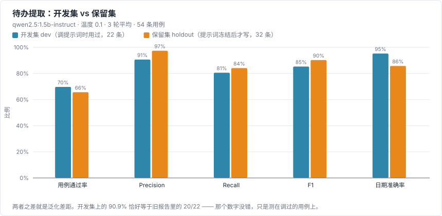
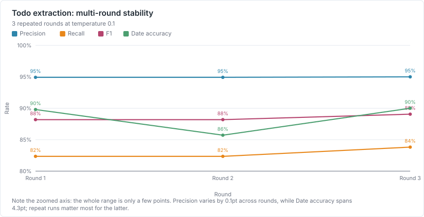
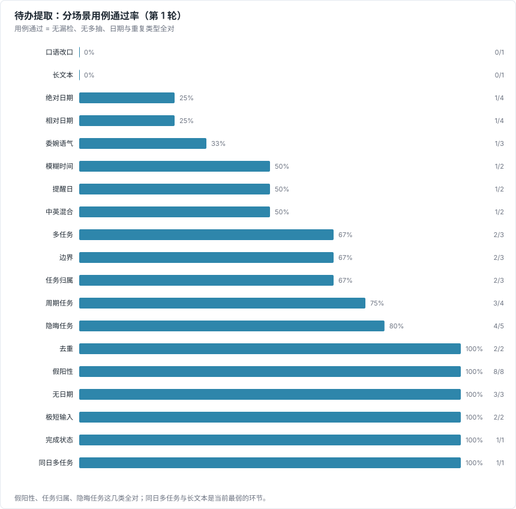
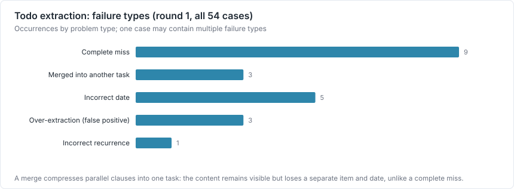

# 待办提取评测（本地 LLM）

测试日期：2026-08-31 · 生成方式：`npm run bench:todo` → `npm run bench:report`

## 实验设置

| 项目 | 值 |
| --- | --- |
| 模型 | `qwen2.5:1.5b-instruct` |
| 模型摘要 | `65ec06548149b04c` |
| 参数量 / 量化 | 1.5B / Q4_K_M |
| 运行时 | Ollama，http://127.0.0.1:11434 |
| 温度 | 0.1 |
| 轮数 | 3 |
| 参考时间 | 2026-08-20T13:30（周四，固定） |
| 系统 | Windows_NT 10.0.26200 |
| CPU | 12th Gen Intel(R) Core(TM) i9-12900H |

评测走的是与线上完全相同的链路：相对日期改写 → 已完成标注 → 同一份提示词 → 同一套 JSON 解析与去重 → 同一道任务归属复核。因此这里的数字等价于用户实际会看到的结果，而不是另接一条评测专用通路。

## 数据集

共 54 条用例，分为两个子集。**拆分是这份报告最重要的一件事**：

- **开发集（dev，22 条）**：调提示词期间反复跑过的用例。提示词就是照着它们改出来的，所以它上面的分数天然偏乐观，只能当回归基线，不能当泛化能力的证据。
- **保留集（holdout，32 条）**：提示词定稿之后才写的用例，写的过程中没有再改动任何提示词。**报告里应该引用的是这一半的数字。**

两个子集都不是公开标准数据集，而是根据产品需求和真实失败案例构建的手工验收集。语料文件：[todo-extraction-corpus.ts](../../scripts/benchmark/todo-extraction-corpus.ts)。

| 场景 | 条数 |
| --- | --- |
| 绝对日期 | 4 |
| 多任务 | 3 |
| 相对日期 | 4 |
| 模糊时间 | 2 |
| 周期任务 | 4 |
| 提醒日 | 2 |
| 去重 | 2 |
| 隐晦任务 | 5 |
| 边界 | 3 |
| 委婉语气 | 3 |
| 假阳性 | 8 |
| 任务归属 | 3 |
| 无日期 | 3 |
| 中英混合 | 2 |
| 口语改口 | 1 |
| 极短输入 | 2 |
| 完成状态 | 1 |
| 长文本 | 1 |
| 同日多任务 | 1 |

## 指标定义

- **匹配规则**：预测任务的标题命中某条金标任务的任一关键词，即视为同一条任务；按金标顺序贪心一一匹配。
- **TP / FP / FN**：匹配上的金标任务为 TP，匹配不上的预测项为 FP，没被匹配到的金标任务为 FN。
- **Precision / Recall / F1**：在全部用例上按条目微平均（micro-average）。
- **日期准确率**：在匹配成功且金标标注了日期的任务上，预测日期与期望日期完全相同的比例。
- **重复类型准确率**：在金标标注了周期类型的任务上，预测的 repeat 是否一致。
- **零任务用例假阳性率**：期望零待办的用例中，产生了至少一条待办的比例。
- **用例通过率**：一条用例只有在无漏检、无多抽、日期与重复类型全对、且未命中禁止日期时才算通过。这是最严格的指标，等价于旧报告里「20/22」那种口径。
- **可选任务**：语义本身有歧义的边界用例（例如「老陈提的那个事，不能再拖了」），抽到不计 FP、不抽也不计 FN，避免把主观判断记成模型缺陷。

## 结果

### 3 轮平均



| 子集 | 用例通过率 | Precision | Recall | F1 | 日期准确率 |
| --- | --- | --- | --- | --- | --- |
| **保留集 holdout** | 65.6% | 97.4% | 84.1% | 90.2% | 85.7% |
| 开发集 dev | 69.7% | 90.6% | 80.6% | 85.3% | 95.2% |
| 全部 | 67.3% | 94.9% | 82.8% | 88.5% | 88.5% |

| 其他指标 | 值 |
| --- | --- |
| 重复类型准确率 | 85.7% |
| 零任务用例假阳性率 | 9.1% |
| 召回失败中属于「合并」而非「漏掉」的比例 | 25.8% |
| 重复条目率 | 0.0% |
| 输出解析失败率 | 0.0% |

### 逐轮结果（稳定性）



| 轮次 | 用例通过 | Precision | Recall | F1 | 日期准确率 | 耗时 |
| --- | --- | --- | --- | --- | --- | --- |
| 1 | 36/54 | 94.9% | 82.4% | 88.2% | 89.8% | 48 s |
| 2 | 35/54 | 94.9% | 82.4% | 88.2% | 85.7% | 45 s |
| 3 | 38/54 | 95.0% | 83.8% | 89.1% | 90.0% | 46 s |

### 分场景（第一轮）



| 场景 | 条数 | 用例通过 | Precision | Recall | F1 |
| --- | --- | --- | --- | --- | --- |
| 绝对日期 | 4 | 1/4 | 100.0% | 66.7% | 80.0% |
| 多任务 | 3 | 2/3 | 100.0% | 88.9% | 94.1% |
| 相对日期 | 4 | 1/4 | 100.0% | 71.4% | 83.3% |
| 模糊时间 | 2 | 1/2 | 100.0% | 80.0% | 88.9% |
| 周期任务 | 4 | 3/4 | 100.0% | 100.0% | 100.0% |
| 提醒日 | 2 | 1/2 | 66.7% | 100.0% | 80.0% |
| 去重 | 2 | 2/2 | 100.0% | 100.0% | 100.0% |
| 隐晦任务 | 5 | 4/5 | 100.0% | 80.0% | 88.9% |
| 边界 | 3 | 2/3 | n/a | 0.0% | n/a |
| 委婉语气 | 3 | 1/3 | 100.0% | 50.0% | 66.7% |
| 假阳性 | 8 | 8/8 | n/a | n/a | n/a |
| 任务归属 | 3 | 2/3 | 66.7% | 100.0% | 80.0% |
| 无日期 | 3 | 3/3 | 100.0% | 100.0% | 100.0% |
| 中英混合 | 2 | 1/2 | 100.0% | 50.0% | 66.7% |
| 口语改口 | 1 | 0/1 | 100.0% | 100.0% | 100.0% |
| 极短输入 | 2 | 2/2 | 100.0% | 100.0% | 100.0% |
| 完成状态 | 1 | 1/1 | 100.0% | 100.0% | 100.0% |
| 长文本 | 1 | 0/1 | 80.0% | 100.0% | 88.9% |
| 同日多任务 | 1 | 1/1 | 100.0% | 100.0% | 100.0% |

### 未通过的用例



| 用例 | 子集 | 失败轮次 | 问题 |
| --- | --- | --- | --- |
| D01 | dev | 2/3 | 漏检: 评审/供应商/会 |
| D03 | dev | 3/3 | 漏检: 法务/合同 |
| D04 | dev | 3/3 | 漏检: 文档/流程 |
| D07 | dev | 3/3 | 多抽 1 条: 九月八号(2026-09-08)之前通知我；多抽 1 条: 准备投标文件 |
| D16 | dev | 3/3 | 多抽 1 条: 客户接待；多抽 1 条: 对接物流 |
| D19 | dev | 3/3 | 漏检: retro/复盘/回顾；漏检: review/PR |
| D20 | dev | 2/3 | 出现了禁止日期 1 次；日期错误: 银行 期望 2026-08-22，得到 2026-08-20 |
| H01 | holdout | 3/3 | 日期错误: 预算 期望 2026-09-01，得到 2026-09-15 |
| H02 | holdout | 3/3 | 日期错误: 体检 期望 2026-08-23，得到 2026-08-20 |
| H03 | holdout | 3/3 | 合并进其他任务: 宽带/续费 → 「更换家庭路由器并续费宽带」；合并进其他任务: 宽带/续费 → 「换路由器并续费宽带」 |
| H05 | holdout | 3/3 | 漏检: 认证/体系 |
| H07 | holdout | 3/3 | 日期错误: 备份 期望 2026-08-20，得到 2026-08-21；重复类型错误: 备份 期望 weekdays，得到 null |
| H16 | holdout | 3/3 | 日期错误: 埋点 期望 2026-08-21，得到 2026-08-15；多抽 1 条: 上周的线上故障复盘 |
| H18 | holdout | 3/3 | 合并进其他任务: 隐私 → 「更新服务条款和隐私政策」 |
| H22 | holdout | 3/3 | 日期错误: 年会 期望 2027-01-05，得到 2027-01-10；合并进其他任务: 演讲稿/演讲 → 「准备行业年会演讲稿」 |
| H25 | holdout | 3/3 | 漏检: 年度总结/总结 |
| H26 | holdout | 3/3 | 漏检: 告警/监控 |
| H28 | holdout | 3/3 | 漏检: 会议室/行政 |
| D21 | dev | 1/3 | 日期错误: 周报 期望 2026-08-21，得到 2026-08-22 |

## 本轮结论的边界

- 本轮只证明：该任务提取流水线在这 54 条内部验收用例、这一个模型（`qwen2.5:1.5b-instruct`）、这一个温度（0.1）下的表现。
- 它**不能**推广成「模型在所有真实会议录音上的准确率」。真实录音还会叠加转写错误，本评测的输入是干净文本。
- 它**不能**代表整个 Agent 的成功率。Agent 涉及检索、工具调用与多步推理，需要单独的端到端评测。
- 金标注由单人编写，关键词匹配规则本身也会引入误差；有歧义的用例已标为可选任务，但主观性无法完全消除。
- 未做跨模型对比。本机只安装了一个指令模型，横向对比需要另外拉取模型后重跑同一套脚本。

## 可复现方法

```bash
npm run bench:todo                    # 默认 3 轮，全部 54 条
npm run bench:todo -- --split holdout # 只跑保留集
npm run bench:charts                  # 生成图
npm run bench:report                  # 生成本文件
```

- [todo-extraction-eval.ts](../../scripts/benchmark/todo-extraction-eval.ts)
- [todo-extraction-corpus.ts](../../scripts/benchmark/todo-extraction-corpus.ts)
- Jest 回归门禁：[todoExtraction.eval.ts](../../src/__tests__/todoExtraction.eval.ts)

原始 JSON：`E:\programs\pycharm_programs\letsvoice\docs\testing\results\todo-extraction-eval.json`
