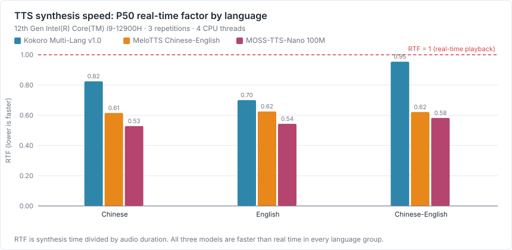
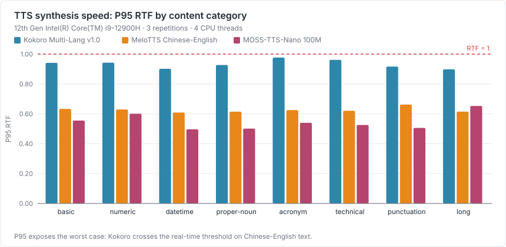
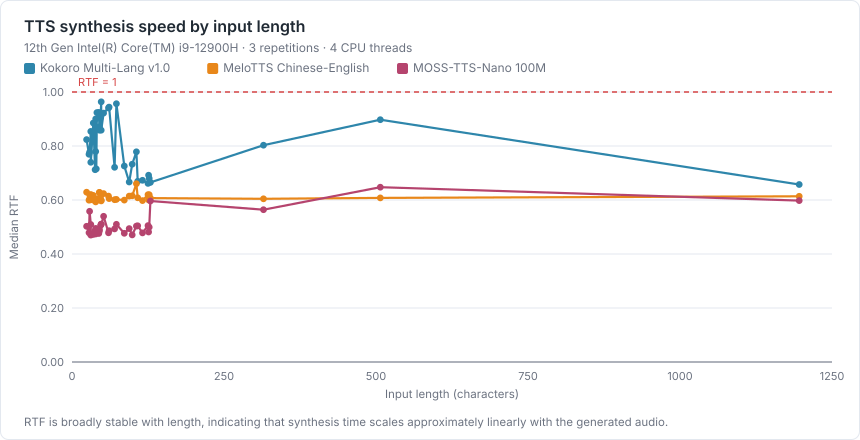
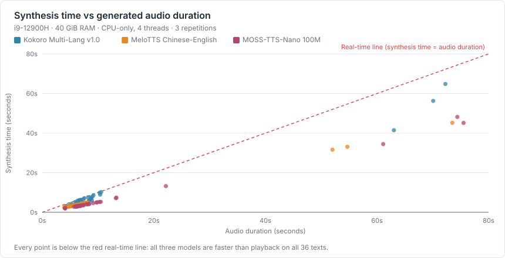
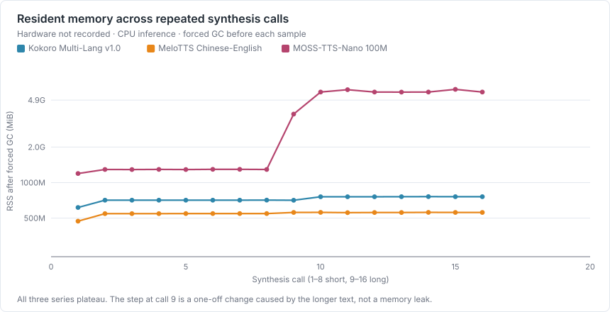
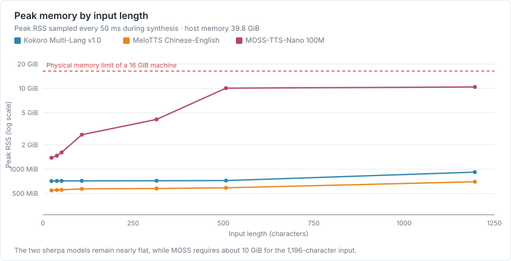
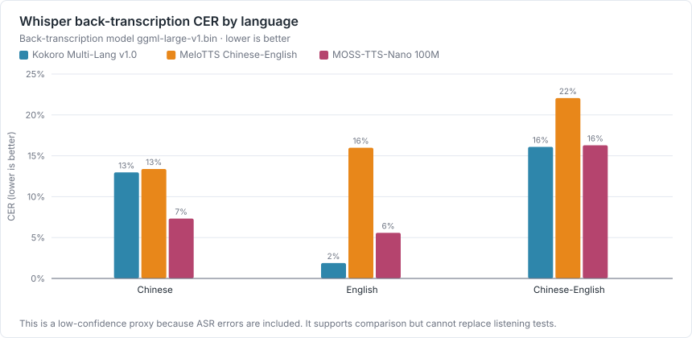
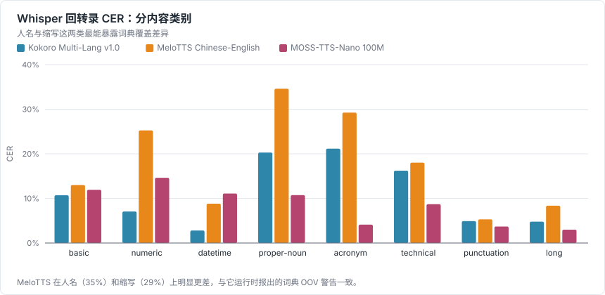
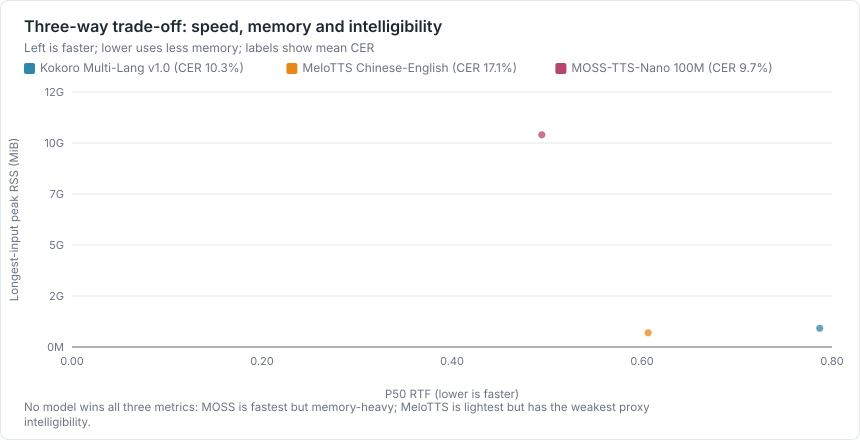

# LetsVoice TTS 模型基准测试（Windows 实测）

测试日期：2026-09-02 · 生成方式：`npm run bench:tts` → `npm run bench:tts:asr` → `npm run bench:report`

本轮全部数据由脚本自动采集，未手工填写。原始 JSON 与 WAV 见文末「可复现方法」。

## 测试环境

| 项目 | 值 |
| --- | --- |
| 系统 | Windows_NT 10.0.26200 |
| 架构 | x64 |
| CPU | 12th Gen Intel(R) Core(TM) i9-12900H |
| 逻辑核心 | 20 |
| 内存 | 40752.5 MiB |
| Node.js | v24.14.0 |
| 推理设备 | CPU |
| 推理线程 | 4（与应用内 SherpaTTSEngine 相同） |
| 重复次数 | 每个模型、每条文本 3 次 |

每个模型在独立子进程内加载一次并跑完全部语料，峰值内存按 100 ms 采样 RSS 取最大值，模型之间互不干扰。

## 测试语料

共 36 条文本，覆盖三种语言与八类内容。语料文件：[tts-corpus.json](../../scripts/benchmark/tts-corpus.json)。

| 语言 | 条数 |
| --- | --- |
| zh | 12 |
| en | 12 |
| zh-en | 12 |

| 类别 | 条数 | 说明 |
| --- | --- | --- |
| basic | 9 | 日常口语句 |
| numeric | 6 | 数字、百分比、金额、编号 |
| datetime | 5 | 日期与时间点 |
| proper-noun | 3 | 中英文人名与地名 |
| acronym | 3 | 英文缩写（OKR / KPI / API） |
| technical | 4 | 专业术语 |
| punctuation | 3 | 问号、感叹号、省略号 |
| long | 3 | 300 字以上长文本 |

## 性能结果

RTF（实时因子）= 合成耗时 ÷ 音频时长，小于 1 表示合成快于实时播放。P50 / P95 在该模型全部文本、全部重复次数上计算。

### 汇总

| 模型 | 引擎 | 模型大小 | 加载 + 首次合成 | 峰值 RSS | P50 RTF | P95 RTF | 平均 RTF | 输出格式 | 失败 |
| --- | --- | --- | --- | --- | --- | --- | --- | --- | --- |
| Kokoro Multi-Lang v1.0 | sherpa-kokoro | 382.2 MiB | 5.54 s | 1377.4 MiB | 0.787 | 0.954 | 0.804 | 24 kHz / 1 声道 | 0/36 |
| MeloTTS Chinese-English | sherpa-vits | 182.4 MiB | 4.78 s | 748.5 MiB | 0.607 | 0.633 | 0.610 | 44.1 kHz / 1 声道 | 0/36 |
| MOSS-TTS-Nano 100M | moss-onnx | 684.2 MiB | 6.35 s | 19048.5 MiB | 0.495 | 0.597 | 0.508 | 48 kHz / 2 声道 | 0/36 |

### 分语言 RTF



| 模型 | 语言 | 条数 | P50 RTF | P95 RTF | 平均 RTF |
| --- | --- | --- | --- | --- | --- |
| Kokoro Multi-Lang v1.0 | zh | 12 | 0.784 | 0.963 | 0.809 |
| Kokoro Multi-Lang v1.0 | en | 12 | 0.678 | 0.779 | 0.696 |
| Kokoro Multi-Lang v1.0 | zh-en | 12 | 0.918 | 0.955 | 0.909 |
| MeloTTS Chinese-English | zh | 12 | 0.602 | 0.629 | 0.605 |
| MeloTTS Chinese-English | en | 12 | 0.611 | 0.659 | 0.613 |
| MeloTTS Chinese-English | zh-en | 12 | 0.608 | 0.630 | 0.611 |
| MOSS-TTS-Nano 100M | zh | 12 | 0.492 | 0.564 | 0.502 |
| MOSS-TTS-Nano 100M | en | 12 | 0.495 | 0.598 | 0.510 |
| MOSS-TTS-Nano 100M | zh-en | 12 | 0.502 | 0.638 | 0.511 |

### 分类别 P95 RTF



| 类别 | Kokoro Multi-Lang v1.0 | MeloTTS Chinese-English | MOSS-TTS-Nano 100M |
| --- | --- | --- | --- |
| basic | 0.941 | 0.633 | 0.555 |
| numeric | 0.943 | 0.629 | 0.601 |
| datetime | 0.901 | 0.609 | 0.497 |
| proper-noun | 0.927 | 0.615 | 0.501 |
| acronym | 0.977 | 0.625 | 0.540 |
| technical | 0.961 | 0.621 | 0.526 |
| punctuation | 0.917 | 0.662 | 0.506 |
| long | 0.898 | 0.615 | 0.653 |

### 速度与文本长度的关系





RTF 与文本长度基本无关，说明合成耗时随文本近似线性增长；散点图里所有点都落在实时线下方。

## 音频有效性与信号检查

| 模型 | 非有限样本 | 最大削波比例 | 最大峰值 | 中位 RMS | 合成失败 |
| --- | --- | --- | --- | --- | --- |
| Kokoro Multi-Lang v1.0 | 0 | 0.0000% | 0.654 | 0.0750 | 0/36 |
| MeloTTS Chinese-English | 0 | 0.0000% | 0.467 | 0.0558 | 0/36 |
| MOSS-TTS-Nano 100M | 0 | 0.0000% | 0.980 | 0.1060 | 0/36 |

## 内存增长探针

上面的「峰值 RSS」是整个进程跑完全部语料后的最大值，它回答不了一个关键问题：那是**单次合成的瞬时开销**，还是**随合成次数不断累积**？两者的部署结论完全不同。

做法：同一个引擎实例连续合成同一段文本 8 次（先短句后长文本），每次之后**强制 GC 再采样 RSS**。强制回收之后仍然单调上升，才能判定为累积占用。

| 模型 | 基线 RSS | 末次 RSS | 释放引擎后 | 后半程每次增长 | 判定 |
| --- | --- | --- | --- | --- | --- |
| Kokoro Multi-Lang v1.0 | 93.9 MiB | 759.0 MiB | 752.6 MiB | 0.2 MiB | 稳定 |
| MOSS-TTS-Nano 100M | 93.5 MiB | 5847.7 MiB | 145.3 MiB | 3.4 MiB | 震荡（不累积） |
| MeloTTS Chinese-English | 93.8 MiB | 558.9 MiB | 549.8 MiB | 0.2 MiB | 稳定 |



<details><summary>Kokoro Multi-Lang v1.0 逐次采样</summary>

| 阶段 | 第几次 | RSS |
| --- | --- | --- |
| short | 1 | 615.2 MiB |
| short | 2 | 709.9 MiB |
| short | 3 | 709.9 MiB |
| short | 4 | 710.0 MiB |
| short | 5 | 710.0 MiB |
| short | 6 | 710.0 MiB |
| short | 7 | 710.0 MiB |
| short | 8 | 710.5 MiB |
| long | 1 | 709.1 MiB |
| long | 2 | 758.3 MiB |
| long | 3 | 758.5 MiB |
| long | 4 | 758.6 MiB |
| long | 5 | 759.4 MiB |
| long | 6 | 760.3 MiB |
| long | 7 | 759.2 MiB |
| long | 8 | 759.0 MiB |

</details>

<details><summary>MOSS-TTS-Nano 100M 逐次采样</summary>

| 阶段 | 第几次 | RSS |
| --- | --- | --- |
| short | 1 | 1193.1 MiB |
| short | 2 | 1291.3 MiB |
| short | 3 | 1290.1 MiB |
| short | 4 | 1292.4 MiB |
| short | 5 | 1290.5 MiB |
| short | 6 | 1294.3 MiB |
| short | 7 | 1294.5 MiB |
| short | 8 | 1291.8 MiB |
| long | 1 | 3803.7 MiB |
| long | 2 | 5845.4 MiB |
| long | 3 | 6120.9 MiB |
| long | 4 | 5849.9 MiB |
| long | 5 | 5844.1 MiB |
| long | 6 | 5849.4 MiB |
| long | 7 | 6166.0 MiB |
| long | 8 | 5847.7 MiB |

</details>

<details><summary>MeloTTS Chinese-English 逐次采样</summary>

| 阶段 | 第几次 | RSS |
| --- | --- | --- |
| short | 1 | 471.3 MiB |
| short | 2 | 545.6 MiB |
| short | 3 | 545.7 MiB |
| short | 4 | 545.7 MiB |
| short | 5 | 546.4 MiB |
| short | 6 | 546.4 MiB |
| short | 7 | 546.4 MiB |
| short | 8 | 546.4 MiB |
| long | 1 | 558.9 MiB |
| long | 2 | 559.7 MiB |
| long | 3 | 556.3 MiB |
| long | 4 | 558.2 MiB |
| long | 5 | 557.8 MiB |
| long | 6 | 559.4 MiB |
| long | 7 | 558.6 MiB |
| long | 8 | 558.9 MiB |

</details>

## 峰值内存 vs 文本长度

上一节说明重复调用不会无限涨，那么真正的变量就是**单次输入的长度**。这一节按长度递增依次合成，合成期间每 50 ms 采样 RSS 取最大值。

| 模型 | zh_short（24 字） | mixed_datetime_01（39 字） | mixed_acronym_01（52 字） | en_acronym_01（108 字） | zh_long_01（315 字） | mixed_long_01（507 字） | en_long_01（1196 字） | 最长 ÷ 最短 |
| --- | --- | --- | --- | --- | --- | --- | --- | --- |
| Kokoro Multi-Lang v1.0 | 711.8 MiB | 713.7 MiB | 716.8 MiB | 717.6 MiB | 718.6 MiB | 720.7 MiB | 917.4 MiB | 1.3× |
| MOSS-TTS-Nano 100M | 1348.3 MiB | 1441.7 MiB | 1595.6 MiB | 2682.6 MiB | 4143.4 MiB | 10053.8 MiB | 10401.2 MiB | 7.7× |
| MeloTTS Chinese-English | 544.4 MiB | 552.3 MiB | 554.0 MiB | 567.0 MiB | 573.9 MiB | 584.6 MiB | 694.6 MiB | 1.3× |



本机内存 40752.5 MiB。最费内存的是 **MOSS-TTS-Nano 100M**：合成 1196 字的一段文本需要 10401.2 MiB。这是**单次请求的瞬时开销**，不是泄漏 —— 但它决定了最低内存门槛，也解释了为什么只用短文本测不出这个问题。

## Whisper 回转录可懂度代理

回转录模型：`ggml-large-v1.bin`，线程 8。CER 在 NFKC 归一化、小写折叠、去除全部空白与标点后按字符计算。

数字与日期类文本的口语读法和书面形式不一致（「百分之十二点五」对 `12.5%`），语料为这些用例提供了可接受的书面变体，取最小 CER，避免把正字法差异算成发音错误。

| 模型 | 计分条数 | 平均 CER | 中文 | 英文 | 中英混合 |
| --- | --- | --- | --- | --- | --- |
| Kokoro Multi-Lang v1.0 | 36 | 10.3% | 13.0% | 1.9% | 16.1% |
| MOSS-TTS-Nano 100M | 36 | 9.7% | 7.3% | 5.6% | 16.3% |
| MeloTTS Chinese-English | 36 | 17.1% | 13.4% | 16.0% | 22.1% |



### 分类别平均 CER



| 类别 | Kokoro Multi-Lang v1.0 | MOSS-TTS-Nano 100M | MeloTTS Chinese-English |
| --- | --- | --- | --- |
| basic | 10.7% | 11.9% | 13.0% |
| numeric | 7.1% | 14.6% | 25.2% |
| datetime | 2.8% | 11.1% | 8.8% |
| proper-noun | 20.3% | 10.7% | 34.6% |
| acronym | 21.2% | 4.1% | 29.2% |
| technical | 16.2% | 8.7% | 18.0% |
| punctuation | 4.9% | 3.7% | 5.3% |
| long | 4.8% | 3.0% | 8.4% |

> 这一节只是**低置信度**代理。Whisper 自身的错误会算进 CER，
> 中英混合尤其容易被高估；它不能替代人工听测，也不等同于 MOS。

## 综合对比

**三个指标的第一名不是同一个模型**，任何只看一张表得出的推荐都是片面的。

| 模型 | P50 RTF | 峰值 RSS（全语料） | 最长文本峰值 RSS | 回转录平均 CER |
| --- | --- | --- | --- | --- |
| Kokoro Multi-Lang v1.0 | 0.787 | 1377.4 MiB | 917.4 MiB | 10.3% |
| MeloTTS Chinese-English | 0.607 | 748.5 MiB | 694.6 MiB | 17.1% |
| MOSS-TTS-Nano 100M | 0.495 | 19048.5 MiB | 10401.2 MiB | 9.7% |



读法：

- **速度**三个模型都够用（P50 RTF 全部小于 1，即快于实时播放），不构成区分点。
- **内存**是硬约束。最长文本上的峰值直接决定最低内存门槛，也是唯一会导致崩溃的指标。
- **可懂度**只是低置信度代理，不能单独定论；但分类别数据（人名、缩写）指向的是词典覆盖差异，这类问题人工听测同样能复现。

选型必须由这三者共同决定，并且要补人工盲听 —— 本轮数据不足以单独给出最终推荐。

## 本轮结论的边界

- 本轮只证明：三个模型在这台 Windows x64 机器上可以离线跑完 36 条文本，并给出了速度、内存与信号有效性的可比数据。
- 本轮**不能**证明谁的自然度和发音质量更好。音质结论需要至少 3–5 人对同一批 WAV 做盲听，按自然度、清晰度、发音准确性、中英切换四个维度打分。
- 本轮只测了一台机器、一种线程配置、每个模型一个音色，换机器或换音色结论可能变化。
- 长文本只有 3 条，长文本失败率的样本量不足以下结论。

## 更早一轮：2026-08-13 macOS（历史，已被本轮取代）

正式扩到 36 条语料之前，先在一台 Mac16,10 / Apple M4 / 16 GiB 上用 3 条短文本（中/英/中英混合各一条，均 40 字以内）跑过一轮。当时的结论：

| 模型 | 加载时间 | 峰值 RSS | 三类文本平均中位 RTF |
| --- | --- | --- | --- |
| Kokoro | 1.260 s | 779.8 MiB | 0.978 |
| MeloTTS | 1.344 s | 663.5 MiB | 0.652 |
| MOSS-TTS-Nano | 4.024 s | 1,248.2 MiB | 0.529 |

速度数据方向上与本轮一致，仍可引用。**MOSS 的峰值 RSS 数字不能再引用**：那一轮三条文本都在 40 字以内，没有暴露出峰值内存随文本长度上升的效应；本轮用含 1196 字长文本的 36 条语料测出同一模型峰值约 10 GiB，见上文「峰值内存 vs 文本长度」。当时使用的脚本（`tts-benchmark-sherpa.js`、`tts-benchmark-moss.py` 等）已被现在的 `tts-benchmark.ts` + `tts-corpus.json` 流程取代并删除。

## 可复现方法

```bash
npm run bench:tts:fetch     # 按应用内 catalog 下载并校验模型
npm run bench:tts           # 性能与信号基准，每模型一个子进程
npm run bench:tts:memory    # 内存增长探针（强制 GC 后采样）
npm run bench:tts:length    # 峰值内存 vs 文本长度
npm run bench:tts:asr       # Whisper 回转录并计算 CER
npm run bench:charts        # 从上面的 JSON 生成 SVG 图
npm run bench:report        # 生成本文件
```

脚本与语料：

- [fetch-tts-models.ts](../../scripts/benchmark/fetch-tts-models.ts)
- [tts-benchmark.ts](../../scripts/benchmark/tts-benchmark.ts)
- [tts-asr-eval.ts](../../scripts/benchmark/tts-asr-eval.ts)
- [tts-corpus.json](../../scripts/benchmark/tts-corpus.json)

原始 JSON 与 WAV：`E:\programs\pycharm_programs\letsvoice\docs\testing\results`
